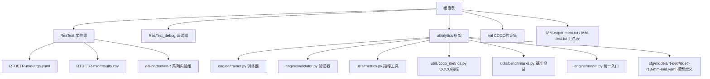
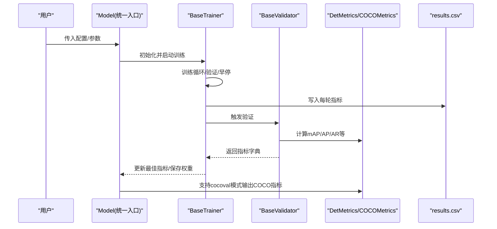
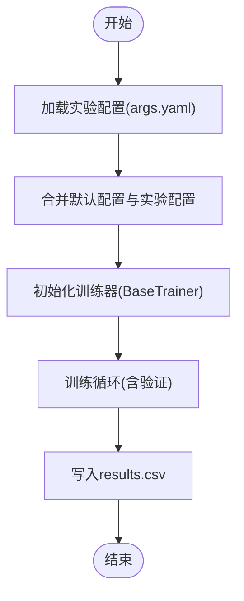
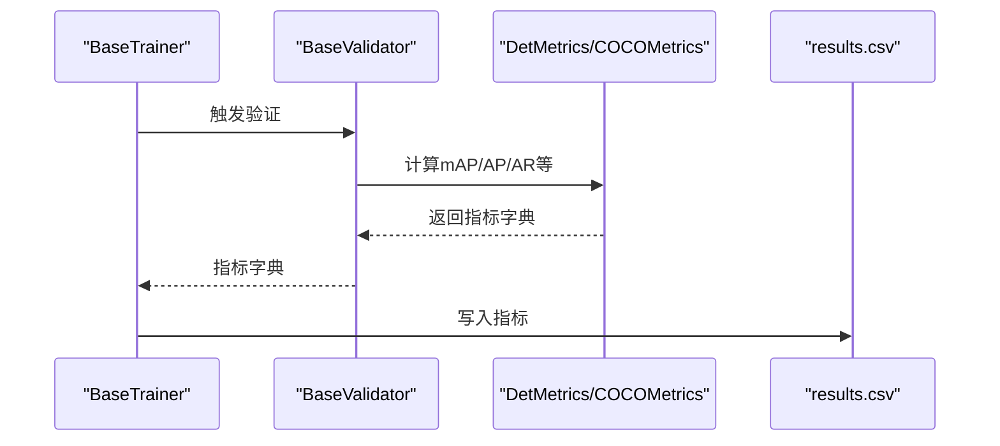
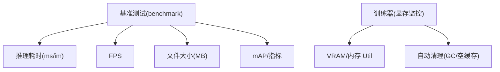
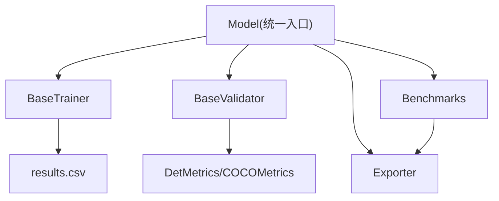

# 实验管理

<cite>
**本文档引用的文件**
- [ResTest/RTDETR-mid/args.yaml](file://ResTest/RTDETR-mid/args.yaml)
- [ResTest/aifi-dattention-CSP-MutilScaleEdgeInformationEnhance-ASF-P2-lite-BackboneFreqFusion2/results.csv](file://ResTest/aifi-dattention-CSP-MutilScaleEdgeInformationEnhance-ASF-P2-lite-BackboneFreqFusion2/results.csv)
- [trainMM.py](file://trainMM.py)
- [valMM.py](file://valMM.py)
- [ultralytics/engine/trainer.py](file://ultralytics/engine/trainer.py)
- [ultralytics/engine/validator.py](file://ultralytics/engine/validator.py)
- [ultralytics/utils/metrics.py](file://ultralytics/utils/metrics.py)
- [ultralytics/utils/coco_metrics.py](file://ultralytics/utils/coco_metrics.py)
- [ultralytics/utils/benchmarks.py](file://ultralytics/utils/benchmarks.py)
- [ultralytics/engine/model.py](file://ultralytics/engine/model.py)
- [ultralytics/cfg/models/rt-detr/rtdetr-r18-mm-mid.yaml](file://ultralytics/cfg/models/rt-detr/rtdetr-r18-mm-mid.yaml)
- [MM-experiment.txt](file://MM-experiment.txt)
- [MM-test.txt](file://MM-test.txt)
</cite>

## 目录
1. [引言](#引言)
2. [项目结构](#项目结构)
3. [核心组件](#核心组件)
4. [架构总览](#架构总览)
5. [详细组件分析](#详细组件分析)
6. [依赖关系分析](#依赖关系分析)
7. [性能考量](#性能考量)
8. [故障排查指南](#故障排查指南)
9. [结论](#结论)
10. [附录](#附录)

## 引言
本操作手册面向多模态检测系统的实验管理，围绕实验配置设计、结果记录与分析、评估体系构建、数据组织与版本控制以及调试实验执行等方面，提供系统化、可复现的操作指南。读者将学会如何基于现有代码框架设计实验组、管理配置文件、记录训练与验证指标、进行统计分析与对比，并掌握性能瓶颈定位与参数调优方法。

## 项目结构
该仓库包含多模态检测实验的完整支撑：训练/验证脚本、配置文件、指标记录CSV、基准测试工具与模型定义等。关键目录与文件如下：
- ResTest：实验结果与配置集合，每个子目录代表一个实验组，包含args.yaml与results.csv
- ResTest_debug：调试实验集合，用于快速验证与问题定位
- ultralytics：多模态检测框架核心，包含训练器、验证器、指标计算、导出与基准测试工具
- val：COCO验证集结果集合，便于跨实验对比
- MM-experiment.txt / MM-test.txt：实验汇总表，包含mAP、FPS、参数量等关键指标

**图表来源**
- [ResTest/RTDETR-mid/args.yaml:1-135](file://ResTest/RTDETR-mid/args.yaml#L1-L135)
- [ultralytics/engine/trainer.py:1-901](file://ultralytics/engine/trainer.py#L1-L901)
- [ultralytics/engine/validator.py:1-371](file://ultralytics/engine/validator.py#L1-L371)
- [ultralytics/utils/metrics.py:1-1467](file://ultralytics/utils/metrics.py#L1-L1467)
- [ultralytics/utils/coco_metrics.py:1-1734](file://ultralytics/utils/coco_metrics.py#L1-L1734)
- [ultralytics/utils/benchmarks.py:1-721](file://ultralytics/utils/benchmarks.py#L1-L721)
- [ultralytics/engine/model.py:1-1366](file://ultralytics/engine/model.py#L1-L1366)
- [ultralytics/cfg/models/rt-detr/rtdetr-r18-mm-mid.yaml:1-66](file://ultralytics/cfg/models/rt-detr/rtdetr-r18-mm-mid.yaml#L1-L66)

**章节来源**
- [ResTest/RTDETR-mid/args.yaml:1-135](file://ResTest/RTDETR-mid/args.yaml#L1-L135)
- [ultralytics/engine/trainer.py:1-901](file://ultralytics/engine/trainer.py#L1-L901)
- [ultralytics/engine/validator.py:1-371](file://ultralytics/engine/validator.py#L1-L371)
- [ultralytics/utils/metrics.py:1-1467](file://ultralytics/utils/metrics.py#L1-L1467)
- [ultralytics/utils/coco_metrics.py:1-1734](file://ultralytics/utils/coco_metrics.py#L1-L1734)
- [ultralytics/utils/benchmarks.py:1-721](file://ultralytics/utils/benchmarks.py#L1-L721)
- [ultralytics/engine/model.py:1-1366](file://ultralytics/engine/model.py#L1-L1366)
- [ultralytics/cfg/models/rt-detr/rtdetr-r18-mm-mid.yaml:1-66](file://ultralytics/cfg/models/rt-detr/rtdetr-r18-mm-mid.yaml#L1-L66)

## 核心组件
- 训练器（BaseTrainer）：负责训练循环、验证、指标保存、断点续训与权重保存
- 验证器（BaseValidator）：负责验证集推理、指标计算、可视化与速度统计
- 指标工具（DetMetrics、COCOMetrics）：提供mAP、AP、AR等标准指标与扩展尺寸指标
- 统一入口（Model）：封装训练、验证、导出、基准测试等统一接口
- 基准测试（benchmarks）：跨格式性能与精度对比，输出FPS、文件大小、指标等

**章节来源**
- [ultralytics/engine/trainer.py:59-503](file://ultralytics/engine/trainer.py#L59-L503)
- [ultralytics/engine/validator.py:42-249](file://ultralytics/engine/validator.py#L42-L249)
- [ultralytics/utils/metrics.py:772-800](file://ultralytics/utils/metrics.py#L772-L800)
- [ultralytics/utils/coco_metrics.py:23-190](file://ultralytics/utils/coco_metrics.py#L23-L190)
- [ultralytics/engine/model.py:29-80](file://ultralytics/engine/model.py#L29-L80)
- [ultralytics/utils/benchmarks.py:52-211](file://ultralytics/utils/benchmarks.py#L52-L211)

## 架构总览
下图展示从配置到训练、验证、指标记录与分析的整体流程：

**图表来源**
- [ultralytics/engine/model.py:625-690](file://ultralytics/engine/model.py#L625-L690)
- [ultralytics/engine/trainer.py:344-503](file://ultralytics/engine/trainer.py#L344-L503)
- [ultralytics/engine/validator.py:130-249](file://ultralytics/engine/validator.py#L130-L249)
- [ultralytics/utils/metrics.py:772-800](file://ultralytics/utils/metrics.py#L772-L800)
- [ultralytics/utils/coco_metrics.py:724-800](file://ultralytics/utils/coco_metrics.py#L724-L800)

## 详细组件分析

### 实验配置设计与管理
- 配置文件组织：每个实验组在独立目录中维护args.yaml与results.csv，args.yaml包含训练超参、数据路径、设备、优化器、增强策略等；results.csv记录每轮训练/验证指标
- 配置项分类：
  - 任务与数据：task、mode、data、imgsz、batch、device、workers
  - 训练策略：epochs、patience、optimizer、amp、cos_lr、warmup_epochs、close_mosaic
  - 多模态增强：use_multimodal_aug、mm_*系列参数（异步几何变换、模态丢弃等）
  - 验证与导出：val、split、save_json、format、nms等
- 配置继承与覆盖：Model统一入口将默认配置与实验配置合并，支持命令行或脚本覆盖

**图表来源**
- [ResTest/RTDETR-mid/args.yaml:1-135](file://ResTest/RTDETR-mid/args.yaml#L1-L135)
- [ultralytics/engine/model.py:238-271](file://ultralytics/engine/model.py#L238-L271)
- [ultralytics/engine/trainer.py:110-177](file://ultralytics/engine/trainer.py#L110-L177)

**章节来源**
- [ResTest/RTDETR-mid/args.yaml:1-135](file://ResTest/RTDETR-mid/args.yaml#L1-L135)
- [ultralytics/engine/model.py:238-271](file://ultralytics/engine/model.py#L238-L271)
- [ultralytics/engine/trainer.py:110-177](file://ultralytics/engine/trainer.py#L110-L177)

### 结果记录与分析流程
- 训练指标记录：BaseTrainer在每次验证后将损失、学习率、指标写入results.csv，字段包括epoch、time、各类loss、metrics/*、val/*、lr/*
- 验证指标获取：BaseValidator返回指标字典，Model.val根据mode选择标准验证或cocoval模式，后者返回COCO标准指标
- 指标计算工具：DetMetrics提供mAP、AP、AR等常用指标；COCOMetrics支持按IoU阈值与目标尺寸细分的指标，便于深入分析

**图表来源**
- [ultralytics/engine/trainer.py:457-462](file://ultralytics/engine/trainer.py#L457-L462)
- [ultralytics/engine/validator.py:227-249](file://ultralytics/engine/validator.py#L227-L249)
- [ultralytics/utils/metrics.py:772-800](file://ultralytics/utils/metrics.py#L772-L800)
- [ultralytics/utils/coco_metrics.py:724-800](file://ultralytics/utils/coco_metrics.py#L724-L800)

**章节来源**
- [ultralytics/engine/trainer.py:542-547](file://ultralytics/engine/trainer.py#L542-L547)
- [ultralytics/engine/validator.py:227-249](file://ultralytics/engine/validator.py#L227-L249)
- [ultralytics/utils/metrics.py:772-800](file://ultralytics/utils/metrics.py#L772-L800)
- [ultralytics/utils/coco_metrics.py:724-800](file://ultralytics/utils/coco_metrics.py#L724-L800)

### 实验评估体系（mAP、FPS、内存占用）
- mAP与COCO指标：支持标准mAP50/75/50-95与按尺寸细分的AP/AR，便于跨模型、跨场景对比
- FPS与延迟：基准测试工具benchmark输出不同格式的推理耗时与FPS，便于部署侧性能评估
- 内存占用：训练器内置显存/内存监控与清理逻辑，避免OOM；可通过参数调整batch、AMP等降低显存压力

**图表来源**
- [ultralytics/utils/benchmarks.py:52-211](file://ultralytics/utils/benchmarks.py#L52-L211)
- [ultralytics/engine/trainer.py:515-541](file://ultralytics/engine/trainer.py#L515-L541)

**章节来源**
- [ultralytics/utils/benchmarks.py:52-211](file://ultralytics/utils/benchmarks.py#L52-L211)
- [ultralytics/engine/trainer.py:515-541](file://ultralytics/engine/trainer.py#L515-L541)

### 实验数据组织与版本控制
- 结果存储：每个实验组独立目录，包含args.yaml与results.csv，便于Git版本控制与对比
- 版本控制建议：将args.yaml纳入版本库，定期提交results.csv快照；对大文件采用Git LFS或外部存储
- 可重复性保障：通过固定seed、deterministic、预训练权重路径与数据划分，确保实验可复现

**章节来源**
- [ResTest/RTDETR-mid/args.yaml:1-135](file://ResTest/RTDETR-mid/args.yaml#L1-L135)
- [ResTest/aifi-dattention-CSP-MutilScaleEdgeInformationEnhance-ASF-P2-lite-BackboneFreqFusion2/results.csv:1-133](file://ResTest/aifi-dattention-CSP-MutilScaleEdgeInformationEnhance-ASF-P2-lite-BackboneFreqFusion2/results.csv#L1-L133)

### 调试实验设计与执行
- 调试组组织：ResTest_debug包含多个probe/*与sanity/*实验，便于快速定位问题
- 典型调试流程：
  - 单步验证：使用valMM.py对特定权重进行验证，检查推理与指标
  - 参数敏感性：冻结层、关闭增强、降低分辨率等逐步简化问题
  - 性能瓶颈：启用profile、查看显存Util、分析各阶段耗时（预处理/推理/后处理）

**章节来源**
- [valMM.py:1-22](file://valMM.py#L1-L22)
- [ultralytics/engine/validator.py:191-249](file://ultralytics/engine/validator.py#L191-L249)

## 依赖关系分析
- 组件耦合：Model作为统一入口，委托训练器、验证器、导出器与基准测试；训练器与验证器通过指标模块交互
- 关键依赖链：
  - Model -> Trainer/Validator -> Metrics/COCOMetrics
  - Trainer -> results.csv
  - Benchmarks -> Exporter -> 不同格式模型

**图表来源**
- [ultralytics/engine/model.py:625-741](file://ultralytics/engine/model.py#L625-L741)
- [ultralytics/engine/trainer.py:542-547](file://ultralytics/engine/trainer.py#L542-L547)
- [ultralytics/engine/validator.py:227-249](file://ultralytics/engine/validator.py#L227-L249)
- [ultralytics/utils/benchmarks.py:723-741](file://ultralytics/utils/benchmarks.py#L723-L741)

**章节来源**
- [ultralytics/engine/model.py:625-741](file://ultralytics/engine/model.py#L625-L741)
- [ultralytics/engine/trainer.py:542-547](file://ultralytics/engine/trainer.py#L542-L547)
- [ultralytics/engine/validator.py:227-249](file://ultralytics/engine/validator.py#L227-L249)
- [ultralytics/utils/benchmarks.py:723-741](file://ultralytics/utils/benchmarks.py#L723-L741)

## 性能考量
- 训练性能：合理设置batch、accumulation、AMP与梯度裁剪；使用EMA与早停；在多卡环境下注意DDP参数一致性
- 推理性能：通过benchmark比较不同格式的FPS与文件大小；结合ONNX/TensorRT加速；注意动态/静态输入与精度设置
- 内存管理：训练器内置显存/内存监控与清理；必要时降低imgsz或batch；启用AMP减少显存占用

**章节来源**
- [ultralytics/engine/trainer.py:281-294](file://ultralytics/engine/trainer.py#L281-L294)
- [ultralytics/utils/benchmarks.py:52-211](file://ultralytics/utils/benchmarks.py#L52-L211)

## 故障排查指南
- 训练中断/异常：
  - 检查args.yaml中的device、batch、imgsz是否与硬件匹配
  - 查看results.csv最后记录，定位崩溃轮次
  - 使用ResTest_debug中的probe实验快速复现
- 验证指标异常：
  - 确认验证split与数据路径一致
  - 使用cocoval模式获取更详细的COCO指标
- 性能瓶颈：
  - 使用benchmark对比不同格式的推理耗时
  - 分析验证器速度统计（预处理/推理/后处理），定位瓶颈阶段

**章节来源**
- [ResTest/aifi-dattention-CSP-MutilScaleEdgeInformationEnhance-ASF-P2-lite-BackboneFreqFusion2/results.csv:1-133](file://ResTest/aifi-dattention-CSP-MutilScaleEdgeInformationEnhance-ASF-P2-lite-BackboneFreqFusion2/results.csv#L1-L133)
- [ultralytics/engine/validator.py:227-249](file://ultralytics/engine/validator.py#L227-L249)
- [ultralytics/utils/benchmarks.py:52-211](file://ultralytics/utils/benchmarks.py#L52-L211)

## 结论
本操作手册提供了多模态检测系统实验管理的完整方法论：从实验配置设计、结果记录与分析，到评估体系构建与调试执行。依托统一的Model入口与训练/验证框架，结合COCO指标与基准测试工具，能够高效地组织实验、对比模型性能并定位问题。建议在实际使用中遵循“配置版本化、结果可追溯、指标标准化”的原则，确保实验的可重复性与可复现性。

## 附录
- 模型定义示例：rtdetr-r18-mm-mid.yaml展示了多模态融合的骨干与头结构
- 实验汇总表：MM-experiment.txt与MM-test.txt提供了跨模型的mAP、FPS、参数量等关键指标，便于横向对比

**章节来源**
- [ultralytics/cfg/models/rt-detr/rtdetr-r18-mm-mid.yaml:1-66](file://ultralytics/cfg/models/rt-detr/rtdetr-r18-mm-mid.yaml#L1-L66)
- [MM-experiment.txt:1-63](file://MM-experiment.txt#L1-L63)
- [MM-test.txt:1-67](file://MM-test.txt#L1-L67)