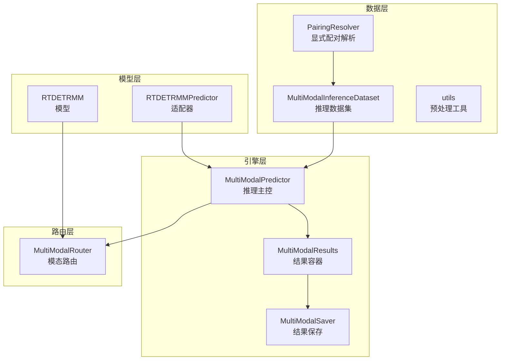
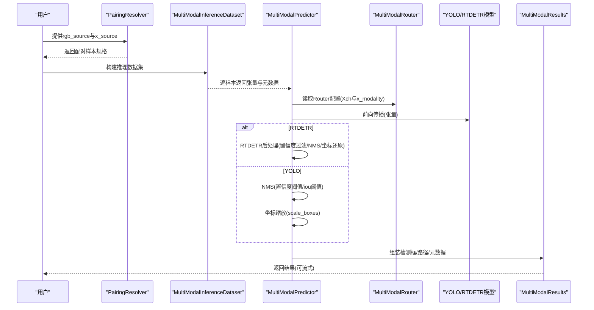
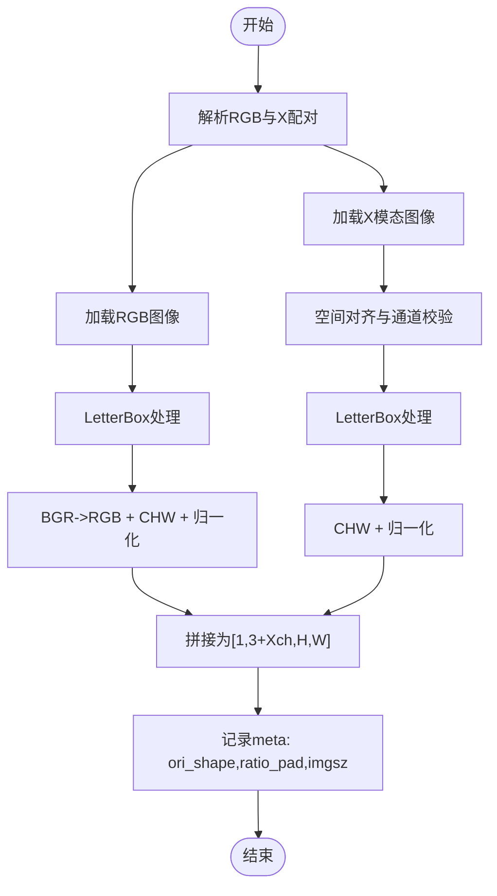
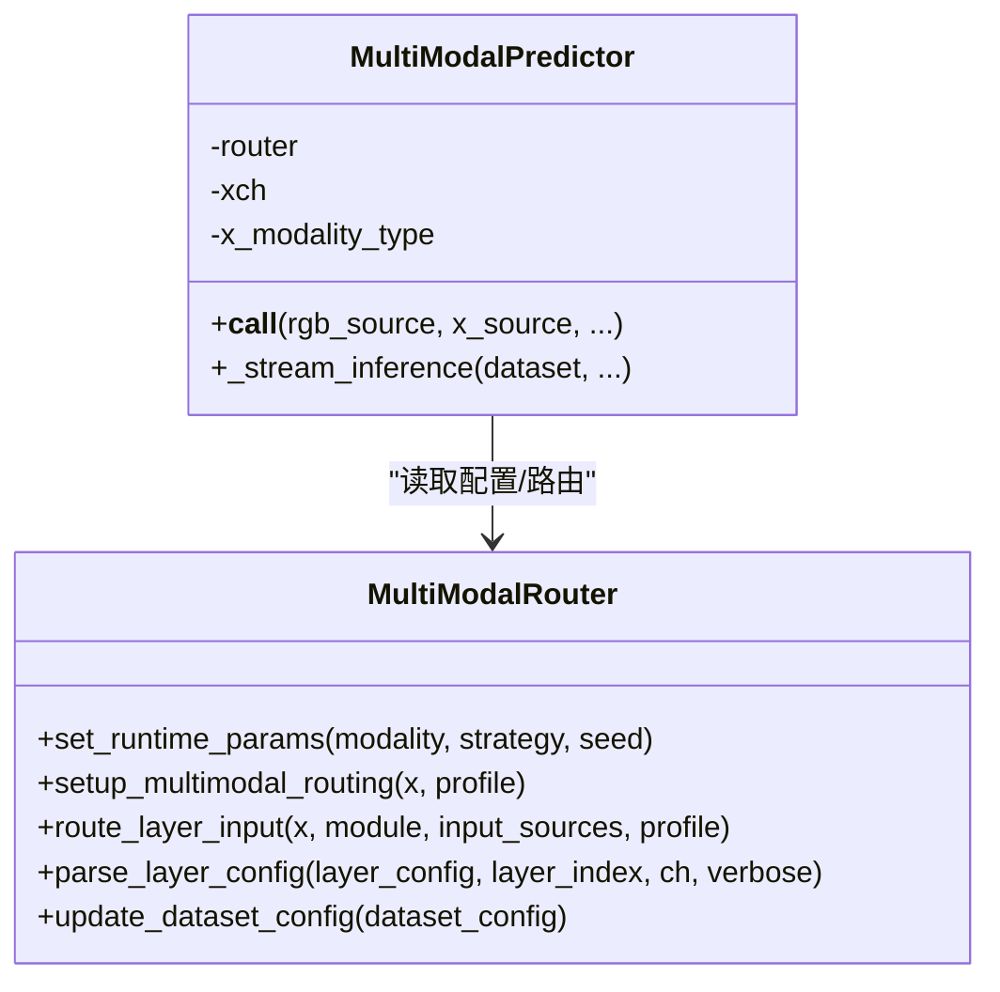
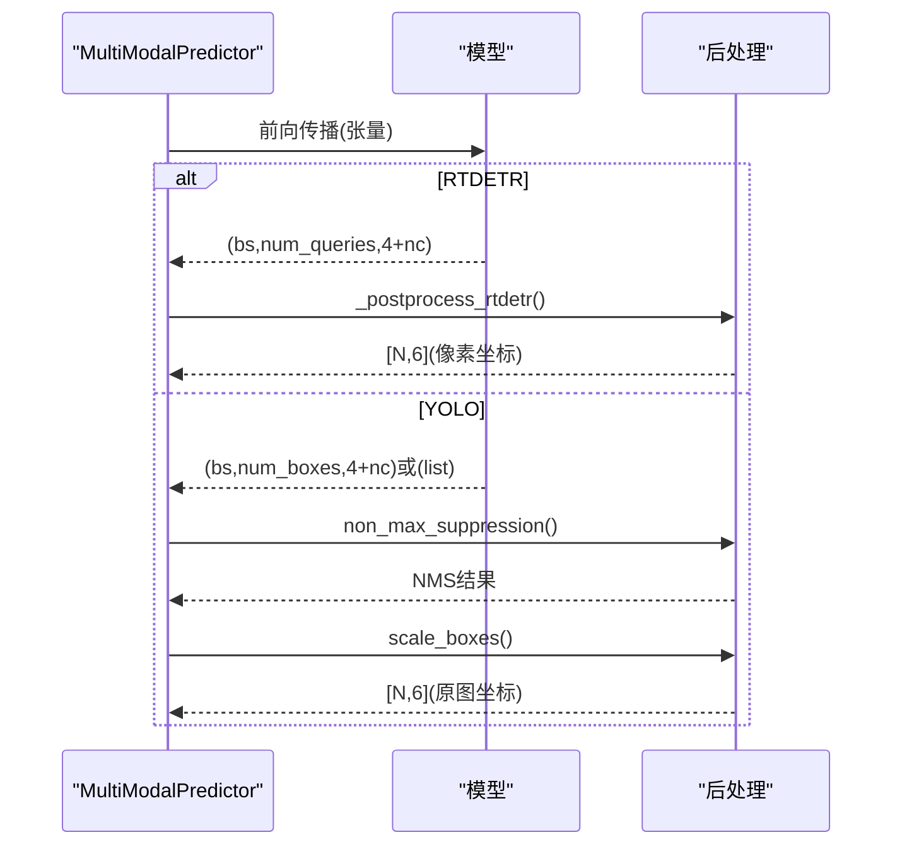
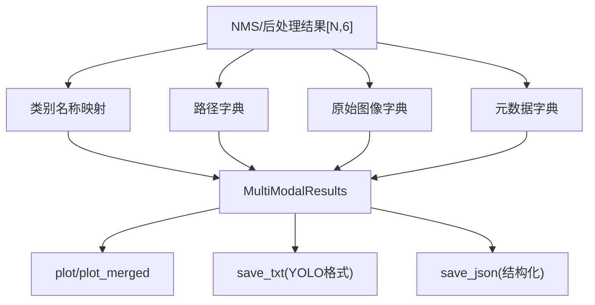
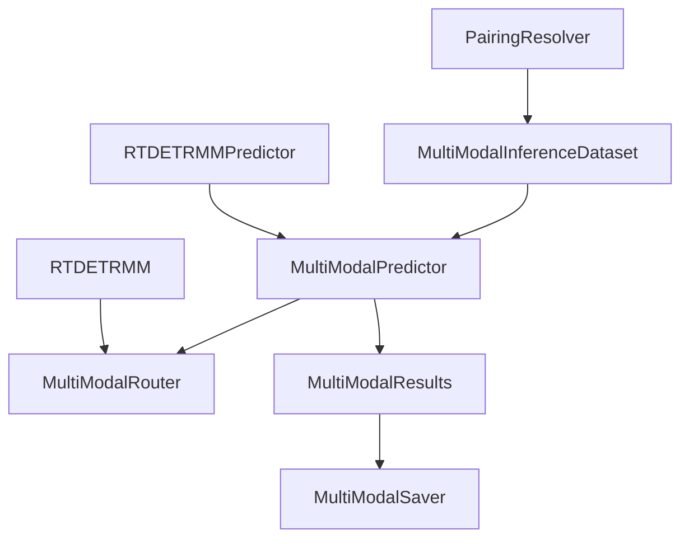

# 推理流程详解

<cite>
**本文档引用的文件**
- [predictor.py](file://ultralytics/engine/multimodal/predictor.py)
- [inference_dataset.py](file://ultralytics/data/multimodal/inference_dataset.py)
- [pairing.py](file://ultralytics/data/multimodal/pairing.py)
- [utils.py](file://ultralytics/data/multimodal/utils.py)
- [results.py](file://ultralytics/engine/multimodal/results.py)
- [saver.py](file://ultralytics/engine/multimodal/saver.py)
- [router.py](file://ultralytics/nn/mm/router.py)
- [mm_predictor.py](file://ultralytics/models/rtdetrmm/mm_predictor.py)
- [model.py](file://ultralytics/models/rtdetrmm/model.py)
- [default.yaml](file://ultralytics/cfg/default.yaml)
- [predictMM.py](file://predictMM.py)
</cite>

## 目录
1. [简介](#简介)
2. [项目结构](#项目结构)
3. [核心组件](#核心组件)
4. [架构概览](#架构概览)
5. [详细组件分析](#详细组件分析)
6. [依赖关系分析](#依赖关系分析)
7. [性能考虑](#性能考虑)
8. [故障排除指南](#故障排除指南)
9. [结论](#结论)
10. [附录](#附录)

## 简介
本指南面向多模态检测系统的推理流程实施，围绕RGB与X模态数据的输入准备、模态路由配置、模型推理、结果后处理以及性能优化展开。系统支持YOLO与RT-DETR两类检测框架，提供批处理、单张图像与视频流三种推理模式，并内置完善的可视化与结果保存能力。

## 项目结构
多模态推理相关代码主要分布在以下模块：
- 引擎层：推理主控、结果封装与保存
- 数据层：配对解析、推理数据集与预处理工具
- 模型层：RTDETRMM适配器与模型定义
- 路由层：RGB/X模态路由与动态通道适配

**图表来源**
- [predictor.py:16-494](file://ultralytics/engine/multimodal/predictor.py#L16-L494)
- [inference_dataset.py:16-252](file://ultralytics/data/multimodal/inference_dataset.py#L16-L252)
- [pairing.py:11-203](file://ultralytics/data/multimodal/pairing.py#L11-L203)
- [utils.py:13-180](file://ultralytics/data/multimodal/utils.py#L13-L180)
- [results.py:14-357](file://ultralytics/engine/multimodal/results.py#L14-L357)
- [saver.py:12-112](file://ultralytics/engine/multimodal/saver.py#L12-L112)
- [mm_predictor.py:18-136](file://ultralytics/models/rtdetrmm/mm_predictor.py#L18-L136)
- [model.py:25-200](file://ultralytics/models/rtdetrmm/model.py#L25-L200)
- [router.py:11-471](file://ultralytics/nn/mm/router.py#L11-L471)

**章节来源**
- [predictor.py:16-494](file://ultralytics/engine/multimodal/predictor.py#L16-L494)
- [inference_dataset.py:16-252](file://ultralytics/data/multimodal/inference_dataset.py#L16-L252)
- [pairing.py:11-203](file://ultralytics/data/multimodal/pairing.py#L11-L203)
- [utils.py:13-180](file://ultralytics/data/multimodal/utils.py#L13-L180)
- [results.py:14-357](file://ultralytics/engine/multimodal/results.py#L14-L357)
- [saver.py:12-112](file://ultralytics/engine/multimodal/saver.py#L12-L112)
- [mm_predictor.py:18-136](file://ultralytics/models/rtdetrmm/mm_predictor.py#L18-L136)
- [model.py:25-200](file://ultralytics/models/rtdetrmm/model.py#L25-L200)
- [router.py:11-471](file://ultralytics/nn/mm/router.py#L11-L471)

## 核心组件
- MultiModalPredictor：多模态推理引擎，负责从模型读取Router配置、构建数据集、执行前向传播、后处理与结果组装。
- MultiModalInferenceDataset：推理专用数据集，加载RGB与X模态图像，执行LetterBox、通道对齐与张量化。
- PairingResolver：显式配对解析器，统一RGB与X模态输入，支持单模态与双模态推理。
- MultiModalResults：结果容器，封装检测框、路径、元数据与类别名称，并提供可视化与保存接口。
- MultiModalSaver：结果保存器，按约定命名规则输出可视化图像、标签文本与JSON结果。
- MultiModalRouter：模态路由核心，支持RGB/X/Dual输入，动态通道适配与空间重置。
- RTDETRMMPredictor：RTDETRMM适配器，桥接BasePredictor接口与新推理引擎。

**章节来源**
- [predictor.py:16-494](file://ultralytics/engine/multimodal/predictor.py#L16-L494)
- [inference_dataset.py:16-252](file://ultralytics/data/multimodal/inference_dataset.py#L16-L252)
- [pairing.py:11-203](file://ultralytics/data/multimodal/pairing.py#L11-L203)
- [results.py:14-357](file://ultralytics/engine/multimodal/results.py#L14-L357)
- [saver.py:12-112](file://ultralytics/engine/multimodal/saver.py#L12-L112)
- [router.py:11-471](file://ultralytics/nn/mm/router.py#L11-L471)
- [mm_predictor.py:18-136](file://ultralytics/models/rtdetrmm/mm_predictor.py#L18-L136)

## 架构概览
推理流程自上而下分为三层：接口层、引擎层与模型层。接口层接收显式RGB与X模态输入；引擎层负责数据准备、前向传播与后处理；模型层通过Router实现模态路由与动态通道适配。

**图表来源**
- [predictor.py:99-243](file://ultralytics/engine/multimodal/predictor.py#L99-L243)
- [inference_dataset.py:94-183](file://ultralytics/data/multimodal/inference_dataset.py#L94-L183)
- [router.py:31-63](file://ultralytics/nn/mm/router.py#L31-L63)
- [results.py:30-60](file://ultralytics/engine/multimodal/results.py#L30-L60)

**章节来源**
- [predictor.py:99-243](file://ultralytics/engine/multimodal/predictor.py#L99-L243)
- [inference_dataset.py:94-183](file://ultralytics/data/multimodal/inference_dataset.py#L94-L183)
- [router.py:31-63](file://ultralytics/nn/mm/router.py#L31-L63)
- [results.py:30-60](file://ultralytics/engine/multimodal/results.py#L30-L60)

## 详细组件分析

### 输入数据准备与预处理
- 显式配对解析：PairingResolver强制要求同时提供RGB与X模态输入，支持单模态与批量推理，确保文件存在性与数量匹配。
- 数据集构建：MultiModalInferenceDataset加载RGB与X模态图像，执行LetterBox并返回ratio_pad，随后将RGB转为RGB格式、X模态保持原通道顺序，最后拼接为[1, 3+Xch, H, W]。
- X模态对齐与校验：align_and_validate_x以RGB为基准进行空间对齐，并在Xch∈{1,3}时允许1↔3转换，其他情况严格要求通道数匹配。
- 通道归一化：to_tensor_rgb将BGR转RGB并归一化；to_tensor_x按数据类型进行0-1归一化。

**图表来源**
- [pairing.py:37-125](file://ultralytics/data/multimodal/pairing.py#L37-L125)
- [inference_dataset.py:111-183](file://ultralytics/data/multimodal/inference_dataset.py#L111-L183)
- [utils.py:13-83](file://ultralytics/data/multimodal/utils.py#L13-L83)
- [utils.py:86-179](file://ultralytics/data/multimodal/utils.py#L86-L179)

**章节来源**
- [pairing.py:37-125](file://ultralytics/data/multimodal/pairing.py#L37-L125)
- [inference_dataset.py:111-183](file://ultralytics/data/multimodal/inference_dataset.py#L111-L183)
- [utils.py:13-83](file://ultralytics/data/multimodal/utils.py#L13-L83)
- [utils.py:86-179](file://ultralytics/data/multimodal/utils.py#L86-L179)

### 模态路由配置与数据格式转换
- Router初始化：从dataset_config读取Xch与x_modality，建立INPUT_SOURCES映射，支持RGB(3)、X(Xch)与Dual(3+Xch)。
- 运行时参数：set_runtime_params允许在推理时指定模态与策略，用于生成占位填充。
- 输入路由：setup_multimodal_routing根据输入通道数判断是否启用多模态路由，并在Dual模式下拆分RGB与X，或在单模态模式下生成占位填充。
- 层级路由：parse_layer_config与route_layer_input依据模块属性将输入路由至RGB、X或Dual，支持空间重置与新输入起点标记。

**图表来源**
- [router.py:31-63](file://ultralytics/nn/mm/router.py#L31-L63)
- [router.py:157-240](file://ultralytics/nn/mm/router.py#L157-L240)
- [router.py:242-317](file://ultralytics/nn/mm/router.py#L242-L317)
- [predictor.py:32-68](file://ultralytics/engine/multimodal/predictor.py#L32-L68)

**章节来源**
- [router.py:31-63](file://ultralytics/nn/mm/router.py#L31-L63)
- [router.py:157-240](file://ultralytics/nn/mm/router.py#L157-L240)
- [router.py:242-317](file://ultralytics/nn/mm/router.py#L242-L317)
- [predictor.py:32-68](file://ultralytics/engine/multimodal/predictor.py#L32-L68)

### 模型推理过程
- 前向传播：MultiModalPredictor在设备上执行模型前向，得到RTDETR或YOLO格式输出。
- 模型类型检测：_detect_rtdetr_model通过类名与头类型判断模型类型，避免依赖输出格式误判。
- RTDETR后处理：_postprocess_rtdetr对归一化cxcywh进行置信度过滤、NMS与坐标还原，最终输出[x1,y1,x2,y2,conf,cls]。
- YOLO后处理：使用non_max_suppression进行NMS，随后scale_boxes将检测框还原到原图尺寸。

**图表来源**
- [predictor.py:167-243](file://ultralytics/engine/multimodal/predictor.py#L167-L243)
- [predictor.py:323-434](file://ultralytics/engine/multimodal/predictor.py#L323-L434)
- [predictor.py:200-230](file://ultralytics/engine/multimodal/predictor.py#L200-L230)

**章节来源**
- [predictor.py:167-243](file://ultralytics/engine/multimodal/predictor.py#L167-L243)
- [predictor.py:323-434](file://ultralytics/engine/multimodal/predictor.py#L323-L434)
- [predictor.py:200-230](file://ultralytics/engine/multimodal/predictor.py#L200-L230)

### 结果后处理与格式化
- MultiModalResults：封装boxes、paths、orig_imgs与meta，支持类别名称映射。
- 可视化：plot绘制RGB标注图，当xch∈{1,3}且X真实存在时绘制X标注图；plot_merged在RGB与X均可视化时进行并排合并。
- 文本与JSON保存：save_txt按YOLO格式写入归一化坐标；save_json输出结构化检测结果与元数据。

**图表来源**
- [results.py:30-60](file://ultralytics/engine/multimodal/results.py#L30-L60)
- [results.py:61-130](file://ultralytics/engine/multimodal/results.py#L61-L130)
- [results.py:235-272](file://ultralytics/engine/multimodal/results.py#L235-L272)
- [results.py:273-356](file://ultralytics/engine/multimodal/results.py#L273-L356)

**章节来源**
- [results.py:30-60](file://ultralytics/engine/multimodal/results.py#L30-L60)
- [results.py:61-130](file://ultralytics/engine/multimodal/results.py#L61-L130)
- [results.py:235-272](file://ultralytics/engine/multimodal/results.py#L235-L272)
- [results.py:273-356](file://ultralytics/engine/multimodal/results.py#L273-L356)

### 推理配置示例
- 批处理推理：通过列表形式提供rgb_source与x_source，MultiModalPredictor返回列表结果。
- 单张图像推理：传入字符串或Path，返回单个MultiModalResult。
- 视频流推理：stream=True启用生成器，逐帧yield结果，实现真正的边迭代边输出。
- 保存选项：save/save_txt/save_dir控制结果保存位置与格式。

**章节来源**
- [predictor.py:99-142](file://ultralytics/engine/multimodal/predictor.py#L99-L142)
- [mm_predictor.py:71-111](file://ultralytics/models/rtdetrmm/mm_predictor.py#L71-L111)
- [saver.py:54-111](file://ultralytics/engine/multimodal/saver.py#L54-L111)

### 性能优化策略
- 设备与精度：合理选择device('cuda'或'cpu')与半精度(half)以平衡速度与精度。
- 输入尺寸：imgsz影响推理时间，建议在精度允许下适当降低分辨率。
- NMS与阈值：调整conf与iou阈值减少冗余检测框，提升下游效率。
- 流式推理：stream=True显著降低内存占用，适合长序列或实时场景。
- 模型量化与导出：利用默认配置中的量化与导出选项，结合ONNX/TensorRT进行部署优化。

**章节来源**
- [default.yaml:59-80](file://ultralytics/cfg/default.yaml#L59-L80)
- [predictor.py:75-88](file://ultralytics/engine/multimodal/predictor.py#L75-L88)

## 依赖关系分析
- MultiModalPredictor依赖Router配置与模型类型检测，确保推理路径正确。
- MultiModalInferenceDataset依赖PairingResolver与预处理工具，保证输入一致性。
- MultiModalResults与MultiModalSaver相互协作，完成可视化与结构化输出。
- RTDETRMMPredictor作为适配器，桥接BasePredictor接口与新引擎。

**图表来源**
- [predictor.py:16-42](file://ultralytics/engine/multimodal/predictor.py#L16-L42)
- [inference_dataset.py:16-40](file://ultralytics/data/multimodal/inference_dataset.py#L16-L40)
- [results.py:14-37](file://ultralytics/engine/multimodal/results.py#L14-L37)
- [saver.py:12-30](file://ultralytics/engine/multimodal/saver.py#L12-L30)
- [mm_predictor.py:18-43](file://ultralytics/models/rtdetrmm/mm_predictor.py#L18-L43)
- [model.py:25-47](file://ultralytics/models/rtdetrmm/model.py#L25-L47)

**章节来源**
- [predictor.py:16-42](file://ultralytics/engine/multimodal/predictor.py#L16-L42)
- [inference_dataset.py:16-40](file://ultralytics/data/multimodal/inference_dataset.py#L16-L40)
- [results.py:14-37](file://ultralytics/engine/multimodal/results.py#L14-L37)
- [saver.py:12-30](file://ultralytics/engine/multimodal/saver.py#L12-L30)
- [mm_predictor.py:18-43](file://ultralytics/models/rtdetrmm/mm_predictor.py#L18-L43)
- [model.py:25-47](file://ultralytics/models/rtdetrmm/model.py#L25-L47)

## 性能考虑
- 内存优化：使用stream=True进行流式推理，避免一次性加载所有结果；合理设置max_det限制检测框数量。
- 计算优化：在GPU上运行，启用半精度(half)；减小imgsz或采用更轻量的模型变体。
- I/O优化：批量处理时尽量减少磁盘访问频率，使用高效存储介质；合理组织保存目录结构。

## 故障排除指南
- 模型类型识别失败：确认使用YOLOMM或RTDETRMM模型，确保模型包含mm_router；检查模型类名与头类型。
- 输入通道不匹配：X模态通道数需与Router配置一致；Xch∈{1,3}时允许1↔3转换，其他情况需严格匹配。
- 文件读取错误：检查RGB与X模态路径是否存在且为文件；X模态支持多种格式(.npy/.npz/.tiff/.tif等)。
- 推理结果为空：检查置信度阈值与NMS阈值设置；确认X模态是否正确对齐与归一化。

**章节来源**
- [predictor.py:61-68](file://ultralytics/engine/multimodal/predictor.py#L61-L68)
- [utils.py:69-83](file://ultralytics/data/multimodal/utils.py#L69-L83)
- [inference_dataset.py:199-245](file://ultralytics/data/multimodal/inference_dataset.py#L199-L245)

## 结论
该多模态检测系统通过显式配对解析、统一数据预处理与灵活的模态路由，实现了RGB与X模态的稳定推理。MultiModalPredictor提供清晰的推理流程与后处理能力，配合RTDETRMMPredictor适配器与丰富的保存选项，能够满足批处理、单张图像与视频流等多种应用场景。通过合理的配置与优化策略，可在保证精度的同时显著提升推理效率。

## 附录
- 示例脚本：predictMM.py展示了双模态、单RGB与单X模态的推理调用方式，可作为快速上手的参考模板。
- 配置文件：default.yaml提供了全局推理参数的默认值与说明，便于按需调整。

**章节来源**
- [predictMM.py:1-40](file://predictMM.py#L1-L40)
- [default.yaml:59-80](file://ultralytics/cfg/default.yaml#L59-L80)