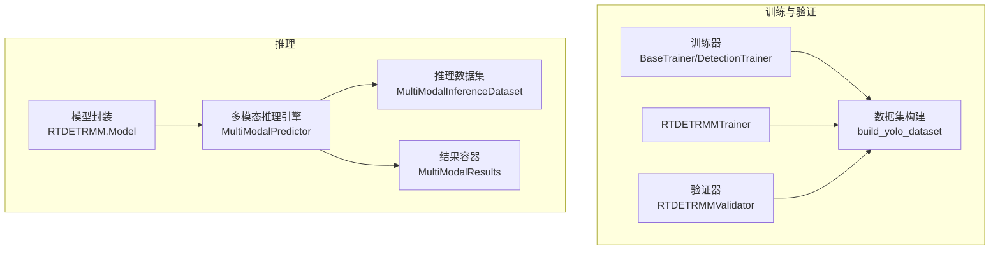
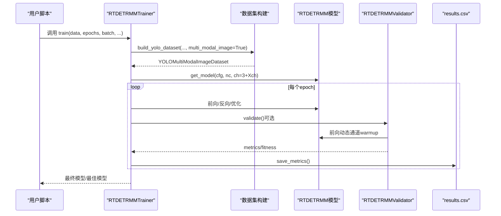
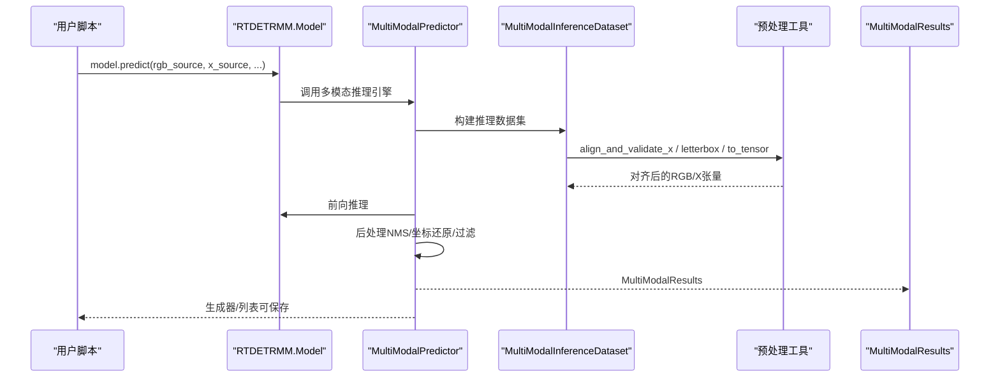
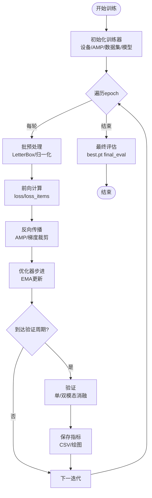
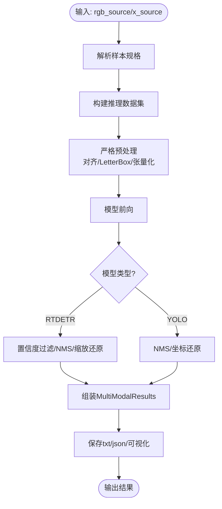
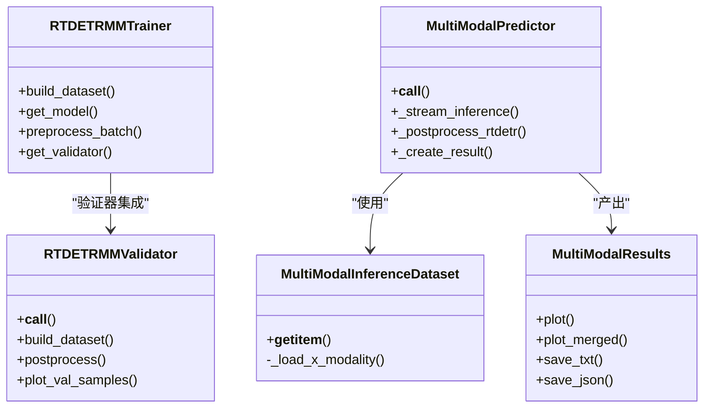
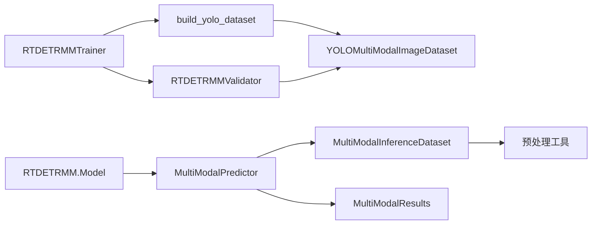

# 训练与推理流程

<cite>
**本文引用的文件**
- [trainMM.py](file://trainMM.py)
- [predictMM.py](file://predictMM.py)
- [ultralytics/engine/trainer.py](file://ultralytics/engine/trainer.py)
- [ultralytics/engine/predictor.py](file://ultralytics/engine/predictor.py)
- [ultralytics/models/rtdetrmm/model.py](file://ultralytics/models/rtdetrmm/model.py)
- [ultralytics/engine/multimodal/predictor.py](file://ultralytics/engine/multimodal/predictor.py)
- [ultralytics/engine/multimodal/results.py](file://ultralytics/engine/multimodal/results.py)
- [ultralytics/data/multimodal/inference_dataset.py](file://ultralytics/data/multimodal/inference_dataset.py)
- [ultralytics/models/rtdetrmm/train.py](file://ultralytics/models/rtdetrmm/train.py)
- [ultralytics/models/rtdetrmm/val.py](file://ultralytics/models/rtdetrmm/val.py)
- [ultralytics/data/build.py](file://ultralytics/data/build.py)
- [ultralytics/data/multimodal/utils.py](file://ultralytics/data/multimodal/utils.py)
</cite>

## 目录
1. [简介](#简介)
2. [项目结构](#项目结构)
3. [核心组件](#核心组件)
4. [架构总览](#架构总览)
5. [详细组件分析](#详细组件分析)
6. [依赖关系分析](#依赖关系分析)
7. [性能考虑](#性能考虑)
8. [故障排查指南](#故障排查指南)
9. [结论](#结论)
10. [附录](#附录)

## 简介
本指南面向多模态检测系统（YOLOMM/RTDETRMM）的训练与推理全流程，覆盖以下要点：
- 训练流程：数据加载与预处理、模型训练过程、损失函数与优化器配置、验证与早停、结果记录与可视化。
- 推理流程：输入准备（RGB+X）、推理执行、后处理与坐标还原、结果保存与可视化。
- 实验管理：实验配置设计、结果记录与分析、性能评估指标。
- 常见问题诊断与性能优化建议。

## 项目结构
该仓库提供了两类主要能力：
- 训练与验证：基于 YOLO/RT-DETR 的检测训练器与验证器，支持多模态（RGB+X）数据集与路由。
- 推理：多模态推理引擎，支持显式双模态输入与单模态回退，输出统一的结果容器并支持保存与可视化。

**图表来源**
- [ultralytics/engine/trainer.py](file://ultralytics/engine/trainer.py)
- [ultralytics/models/rtdetrmm/train.py](file://ultralytics/models/rtdetrmm/train.py)
- [ultralytics/models/rtdetrmm/val.py](file://ultralytics/models/rtdetrmm/val.py)
- [ultralytics/data/build.py](file://ultralytics/data/build.py)
- [ultralytics/models/rtdetrmm/model.py](file://ultralytics/models/rtdetrmm/model.py)
- [ultralytics/engine/multimodal/predictor.py](file://ultralytics/engine/multimodal/predictor.py)
- [ultralytics/data/multimodal/inference_dataset.py](file://ultralytics/data/multimodal/inference_dataset.py)
- [ultralytics/engine/multimodal/results.py](file://ultralytics/engine/multimodal/results.py)

**章节来源**
- [trainMM.py:1-15](file://trainMM.py#L1-L15)
- [predictMM.py:1-40](file://predictMM.py#L1-L40)
- [ultralytics/engine/trainer.py:191-504](file://ultralytics/engine/trainer.py#L191-L504)
- [ultralytics/models/rtdetrmm/train.py:24-105](file://ultralytics/models/rtdetrmm/train.py#L24-L105)
- [ultralytics/models/rtdetrmm/val.py:24-107](file://ultralytics/models/rtdetrmm/val.py#L24-L107)
- [ultralytics/engine/multimodal/predictor.py:16-99](file://ultralytics/engine/multimodal/predictor.py#L16-L99)
- [ultralytics/data/multimodal/inference_dataset.py:16-92](file://ultralytics/data/multimodal/inference_dataset.py#L16-L92)

## 核心组件
- 训练器基类与扩展
  - BaseTrainer：负责训练循环、验证、早停、学习率调度、AMP、梯度累积、权重保存、CSV记录等。
  - DetectionTrainer（RT-DETR）：在检测任务上扩展，提供数据集构建、批预处理、验证器集成等。
  - RTDETRMMTrainer：针对多模态（RGB+X）的训练器，支持单/双模态训练、动态通道数、路由参数注入。
- 验证器
  - RTDETRMMValidator：多模态验证，支持动态通道数warmup、单/双模态消融、统一可视化输出。
- 推理引擎
  - RTDETRMM.Model：多模态模型封装，提供任务映射、路由配置、可视化入口。
  - MultiModalPredictor：独立的多模态推理引擎，显式接收 rgb_source/x_source，流式推理，统一后处理。
  - MultiModalInferenceDataset：推理专用数据集，严格校验与对齐、LetterBox、张量化与归一化。
  - MultiModalResults：结果容器，支持RGB标注、X模态标注、并排合并图、YOLO/JSON格式保存。

**章节来源**
- [ultralytics/engine/trainer.py:59-177](file://ultralytics/engine/trainer.py#L59-L177)
- [ultralytics/models/rtdetrmm/train.py:24-105](file://ultralytics/models/rtdetrmm/train.py#L24-L105)
- [ultralytics/models/rtdetrmm/val.py:24-107](file://ultralytics/models/rtdetrmm/val.py#L24-L107)
- [ultralytics/models/rtdetrmm/model.py:25-57](file://ultralytics/models/rtdetrmm/model.py#L25-L57)
- [ultralytics/engine/multimodal/predictor.py:16-99](file://ultralytics/engine/multimodal/predictor.py#L16-L99)
- [ultralytics/data/multimodal/inference_dataset.py:16-92](file://ultralytics/data/multimodal/inference_dataset.py#L16-L92)
- [ultralytics/engine/multimodal/results.py:14-60](file://ultralytics/engine/multimodal/results.py#L14-L60)

## 架构总览
下面以“训练”和“推理”两条主线展示系统架构与关键交互。

**图表来源**
- [ultralytics/models/rtdetrmm/train.py:116-171](file://ultralytics/models/rtdetrmm/train.py#L116-L171)
- [ultralytics/data/build.py:115-200](file://ultralytics/data/build.py#L115-L200)
- [ultralytics/models/rtdetrmm/val.py:108-264](file://ultralytics/models/rtdetrmm/val.py#L108-L264)
- [ultralytics/engine/trainer.py:542-504](file://ultralytics/engine/trainer.py#L542-L504)

**图表来源**
- [ultralytics/models/rtdetrmm/model.py:25-57](file://ultralytics/models/rtdetrmm/model.py#L25-L57)
- [ultralytics/engine/multimodal/predictor.py:99-143](file://ultralytics/engine/multimodal/predictor.py#L99-L143)
- [ultralytics/data/multimodal/inference_dataset.py:94-184](file://ultralytics/data/multimodal/inference_dataset.py#L94-L184)
- [ultralytics/data/multimodal/utils.py:13-84](file://ultralytics/data/multimodal/utils.py#L13-L84)
- [ultralytics/engine/multimodal/results.py:436-464](file://ultralytics/engine/multimodal/results.py#L436-L464)

## 详细组件分析

### 训练流程详解
- 数据加载与预处理
  - 使用 build_yolo_dataset 构建 YOLOMultiModalImageDataset，支持 multi_modal_image=True，传入 x_modality/x_modality_dir 等参数。
  - 训练器在 setup_model 时根据 data["channels"]（3+Xch）初始化模型输入通道。
  - 批预处理在 DetectionTrainer.preprocess_batch 中完成，多模态场景下由模型内部路由层处理单/双模态消融。
- 模型训练过程
  - BaseTrainer._do_train 主循环：epoch/迭代、warmup、前向/反向、梯度裁剪、优化器步进、EMA 更新。
  - 学习率调度：one_cycle 或线性衰减；梯度累积：accumulate 基于 nbs/batch 计算。
  - AMP：GradScaler 自适应混合精度；内存清理：_clear_memory。
- 损失函数与优化器
  - 优化器：build_optimizer 支持 SGD/Adam/AdamW，权重衰减随 batch/accumulate 缩放。
  - RT-DETR 特定损失：giou_loss、cls_loss、l1_loss（验证器中声明）。
- 验证与早停
  - validate() 调用验证器，支持单/双模态消融；RT-DETR 验证默认 rect=False，避免非方形输入导致的缩放偏差。
  - EarlyStopping 根据 fitness 停止；最终 eval 时恢复 best.pt 并执行 final_eval。
- 结果记录与可视化
  - save_metrics 写入 results.csv；plot_metrics 可视化指标；save_model 保存 last.pt/best.pt。

**图表来源**
- [ultralytics/engine/trainer.py:344-492](file://ultralytics/engine/trainer.py#L344-L492)
- [ultralytics/models/rtdetrmm/train.py:256-292](file://ultralytics/models/rtdetrmm/train.py#L256-L292)
- [ultralytics/models/rtdetrmm/val.py:108-264](file://ultralytics/models/rtdetrmm/val.py#L108-L264)

**章节来源**
- [ultralytics/models/rtdetrmm/train.py:116-171](file://ultralytics/models/rtdetrmm/train.py#L116-L171)
- [ultralytics/engine/trainer.py:229-342](file://ultralytics/engine/trainer.py#L229-L342)
- [ultralytics/engine/trainer.py:542-504](file://ultralytics/engine/trainer.py#L542-L504)

### 推理流程详解
- 输入准备
  - MultiModalPredictor 接收 rgb_source/x_source，通过 PairingResolver 解析为样本规格，再由 MultiModalInferenceDataset 加载与预处理。
  - 预处理严格校验：空间对齐（align_and_validate_x）、LetterBox（letterbox_with_ratio_pad）、张量化（to_tensor_rgb/to_tensor_x）。
- 推理执行
  - 模型前向：im_tensor [1,3+Xch,H,W] 输入，得到模型输出（RTDETR 为 (bs,num_queries,4+nc)，YOLO 为 NMS 前后张量）。
  - 模型类型检测：_detect_rtdetr_model 自动区分 RTDETR/YOLO 后处理路径。
- 结果后处理
  - RTDETR：置信度过滤、NMS、缩放到 letterbox 尺寸、再按 ratio_pad 还原到原图尺寸。
  - YOLO：NMS 过滤、scale_boxes 还原坐标。
- 可视化与保存
  - MultiModalResults.plot/plot_merged：RGB标注、X标注（xch∈{1,3}）、并排合并图。
  - MultiModalSaver 保存 txt/json（YOLO格式坐标归一化到RGB尺寸）。

**图表来源**
- [ultralytics/engine/multimodal/predictor.py:144-244](file://ultralytics/engine/multimodal/predictor.py#L144-L244)
- [ultralytics/data/multimodal/inference_dataset.py:94-184](file://ultralytics/data/multimodal/inference_dataset.py#L94-L184)
- [ultralytics/data/multimodal/utils.py:86-180](file://ultralytics/data/multimodal/utils.py#L86-L180)
- [ultralytics/engine/multimodal/results.py:436-464](file://ultralytics/engine/multimodal/results.py#L436-L464)

**章节来源**
- [ultralytics/engine/multimodal/predictor.py:99-244](file://ultralytics/engine/multimodal/predictor.py#L99-L244)
- [ultralytics/data/multimodal/inference_dataset.py:94-184](file://ultralytics/data/multimodal/inference_dataset.py#L94-L184)
- [ultralytics/data/multimodal/utils.py:13-84](file://ultralytics/data/multimodal/utils.py#L13-L84)
- [ultralytics/engine/multimodal/results.py:61-131](file://ultralytics/engine/multimodal/results.py#L61-L131)

### 类关系与职责

**图表来源**
- [ultralytics/models/rtdetrmm/train.py:24-105](file://ultralytics/models/rtdetrmm/train.py#L24-L105)
- [ultralytics/models/rtdetrmm/val.py:24-107](file://ultralytics/models/rtdetrmm/val.py#L24-L107)
- [ultralytics/engine/multimodal/predictor.py:16-99](file://ultralytics/engine/multimodal/predictor.py#L16-L99)
- [ultralytics/data/multimodal/inference_dataset.py:16-92](file://ultralytics/data/multimodal/inference_dataset.py#L16-L92)
- [ultralytics/engine/multimodal/results.py:14-60](file://ultralytics/engine/multimodal/results.py#L14-L60)

## 依赖关系分析
- 训练侧
  - RTDETRMMTrainer 依赖 build_yolo_dataset 与 YOLOMultiModalImageDataset，通过 multi_modal_image=True 启用多模态图像数据集。
  - 验证器 RTDETRMMValidator 与训练器共享多模态配置，支持动态通道数 warmup。
- 推理侧
  - MultiModalPredictor 依赖 PairingResolver 与 MultiModalInferenceDataset，预处理链路由 align_and_validate_x、letterbox_with_ratio_pad、to_tensor_* 组成。
  - MultiModalResults 依赖绘图工具与命名映射，支持 JSON/YOLO 文本格式输出。

**图表来源**
- [ultralytics/data/build.py:115-200](file://ultralytics/data/build.py#L115-L200)
- [ultralytics/models/rtdetrmm/train.py:160-171](file://ultralytics/models/rtdetrmm/train.py#L160-L171)
- [ultralytics/models/rtdetrmm/val.py:266-322](file://ultralytics/models/rtdetrmm/val.py#L266-L322)
- [ultralytics/engine/multimodal/predictor.py:125-143](file://ultralytics/engine/multimodal/predictor.py#L125-L143)
- [ultralytics/data/multimodal/inference_dataset.py:94-184](file://ultralytics/data/multimodal/inference_dataset.py#L94-L184)

**章节来源**
- [ultralytics/data/build.py:115-200](file://ultralytics/data/build.py#L115-L200)
- [ultralytics/models/rtdetrmm/train.py:160-171](file://ultralytics/models/rtdetrmm/train.py#L160-L171)
- [ultralytics/models/rtdetrmm/val.py:266-322](file://ultralytics/models/rtdetrmm/val.py#L266-L322)
- [ultralytics/engine/multimodal/predictor.py:125-143](file://ultralytics/engine/multimodal/predictor.py#L125-L143)
- [ultralytics/data/multimodal/inference_dataset.py:94-184](file://ultralytics/data/multimodal/inference_dataset.py#L94-L184)

## 性能考虑
- 训练性能
  - AMP：GradScaler 自动混合精度，显著降低显存占用与加速训练。
  - 梯度累积：accumulate 基于 nbs/batch 计算，减少显存峰值。
  - EarlyStopping：防止过拟合，缩短无效训练时间。
  - DDP：多GPU分布式训练，注意 rect 与 batch 的兼容性。
- 推理性能
  - 流式推理：MultiModalPredictor 支持生成器边迭代边 yield，降低内存压力。
  - LetterBox：固定尺寸与中心对齐，避免缩放放大，提升速度与稳定性。
  - 单/双模态消融：通过 mm_router 运行时参数注入，避免本地通道置零，减少冗余计算。
- 数据加载
  - InfiniteDataLoader 与 _RepeatSampler：避免频繁重建 worker，提高训练效率。
  - workers=0 在 CPU 上更快（I/O 主导）。

**章节来源**
- [ultralytics/engine/trainer.py:281-295](file://ultralytics/engine/trainer.py#L281-L295)
- [ultralytics/engine/trainer.py:326-342](file://ultralytics/engine/trainer.py#L326-L342)
- [ultralytics/data/build.py:30-85](file://ultralytics/data/build.py#L30-L85)
- [ultralytics/engine/multimodal/predictor.py:139-143](file://ultralytics/engine/multimodal/predictor.py#L139-L143)

## 故障排查指南
- 训练阶段
  - 多模态模型识别失败：RTDETRMMTrainer/Validator 严格 Fail-Fast，需确保模型 YAML/CKPT 包含 RGB/X/Dual 路由标记。
  - 通道数不匹配：X 模态通道数需与 data["Xch"] 一致；仅当 Xch∈{1,3} 时允许 1↔3 转换。
  - 非方形输入缩放异常：RT-DETR 验证默认 rect=False，避免 bbox 缩放假设导致指标异常。
  - DDP 不兼容：rect 与 batch<1 在多GPU下会被强制调整。
- 推理阶段
  - 输入路径无效：RGB/X 文件不存在或无法读取，抛出 FileNotFoundError/ValueError。
  - X 模态格式：支持 .npy/.npz/.tiff/.tif 等，注意键名与数组形状。
  - 调试模式：MultiModalPredictor(debug=True) 输出中间张量形状与坐标变换过程，便于定位问题。
- 结果保存
  - YOLO 文本格式：坐标归一化到 RGB 尺寸；JSON 包含原图尺寸、模态标识与可视化元信息。

**章节来源**
- [ultralytics/models/rtdetrmm/train.py:106-115](file://ultralytics/models/rtdetrmm/train.py#L106-L115)
- [ultralytics/data/multimodal/inference_dataset.py:185-246](file://ultralytics/data/multimodal/inference_dataset.py#L185-L246)
- [ultralytics/data/multimodal/utils.py:13-84](file://ultralytics/data/multimodal/utils.py#L13-L84)
- [ultralytics/engine/multimodal/predictor.py:170-178](file://ultralytics/engine/multimodal/predictor.py#L170-L178)
- [ultralytics/engine/multimodal/results.py:235-272](file://ultralytics/engine/multimodal/results.py#L235-L272)

## 结论
本指南梳理了多模态检测系统（YOLOMM/RTDETRMM）的训练与推理全链路：从数据加载、模型训练、验证评估，到推理输入准备、后处理与结果保存。通过多模态数据集与推理引擎的解耦设计，系统实现了灵活的双/单模态训练与推理，并提供统一的结果容器与可视化能力。结合 AMP、梯度累积、EarlyStopping 与流式推理等技术，可在保证精度的同时显著提升效率与稳定性。

## 附录
- 实验管理建议
  - 配置设计：data.yaml 中明确 modality_used/models/modality 路径映射，Xch 与 channels 保持一致。
  - 结果记录：关注 results.csv 指标变化，结合 plot_metrics 与验证集可视化评估收敛情况。
  - 指标体系：RT-DETR 验证默认 rect=False，使用 COCO 指标时可调用 cocoval。
- 快速上手
  - 训练：参考 trainMM.py，设置 data、epochs、batch、project/name 等参数。
  - 推理：参考 predictMM.py，传入 rgb_source/x_source，开启 save/debug。

**章节来源**
- [trainMM.py:6-15](file://trainMM.py#L6-L15)
- [predictMM.py:7-40](file://predictMM.py#L7-L40)
- [ultralytics/models/rtdetrmm/model.py:224-269](file://ultralytics/models/rtdetrmm/model.py#L224-L269)