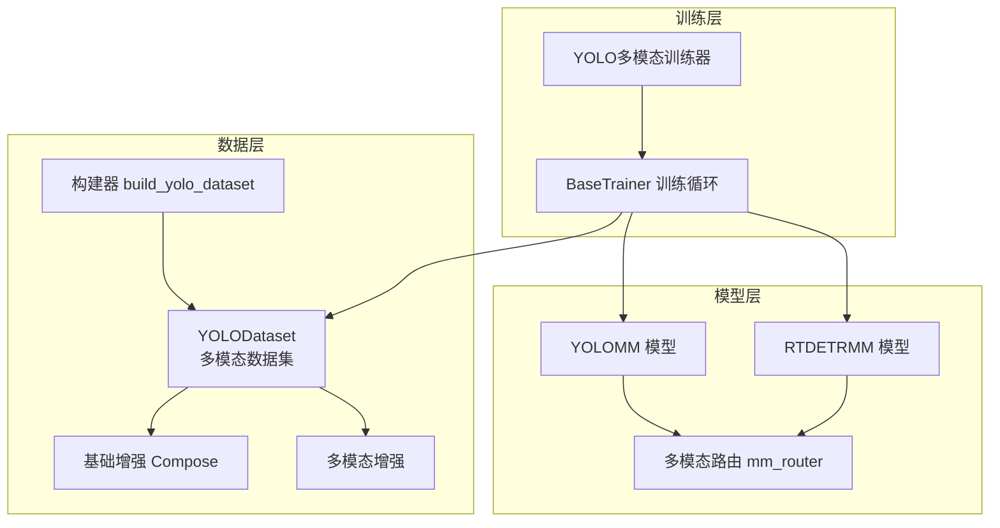
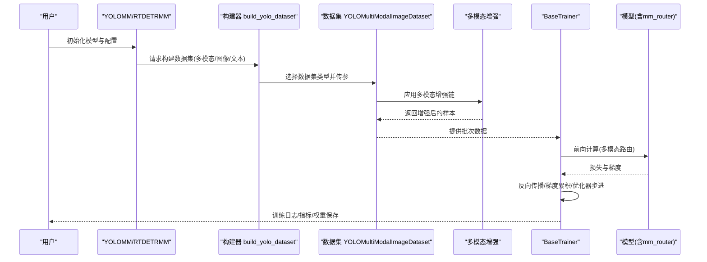
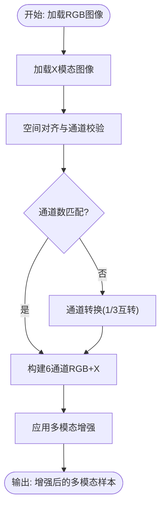
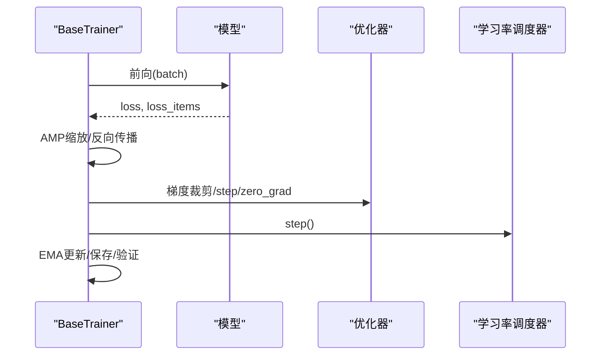
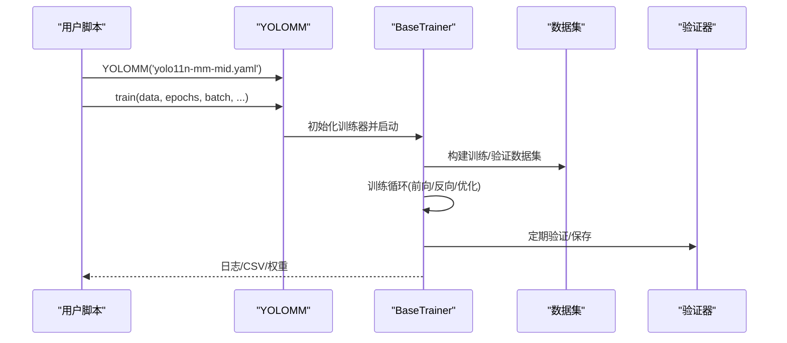
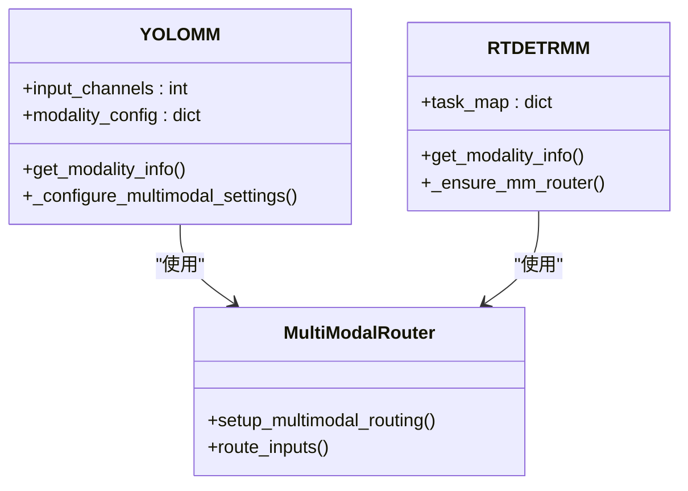
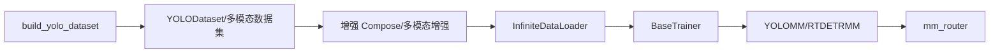

# 训练流程详解

<cite>
**本文引用的文件**
- [ultralytics/engine/trainer.py](file://ultralytics/engine/trainer.py)
- [ultralytics/data/dataset.py](file://ultralytics/data/dataset.py)
- [ultralytics/data/build.py](file://ultralytics/data/build.py)
- [ultralytics/data/augment.py](file://ultralytics/data/augment.py)
- [ultralytics/data/multimodal_augment.py](file://ultralytics/data/multimodal_augment.py)
- [ultralytics/data/multimodal/utils.py](file://ultralytics/data/multimodal/utils.py)
- [ultralytics/models/yolo/model.py](file://ultralytics/models/yolo/model.py)
- [ultralytics/models/rtdetrmm/model.py](file://ultralytics/models/rtdetrmm/model.py)
- [ultralytics/models/yolo/multimodal/train.py](file://ultralytics/models/yolo/multimodal/train.py)
- [ultralytics/engine/model.py](file://ultralytics/engine/model.py)
- [trainMM.py](file://trainMM.py)
- [ultralytics/cfg/models/mm/yolo11n-mm-mid.yaml](file://ultralytics/cfg/models/mm/yolo11n-mm-mid.yaml)
</cite>

## 目录
1. [简介](#简介)
2. [项目结构](#项目结构)
3. [核心组件](#核心组件)
4. [架构总览](#架构总览)
5. [详细组件分析](#详细组件分析)
6. [依赖关系分析](#依赖关系分析)
7. [性能考量](#性能考量)
8. [故障排查指南](#故障排查指南)
9. [结论](#结论)
10. [附录](#附录)

## 简介
本文件面向多模态检测模型的训练流程，系统阐述数据加载与预处理机制（含多模态同步加载、模态填充策略与数据增强）、模型训练过程（损失函数、反向传播、梯度更新与优化器配置）、YOLOMM训练器使用方法与训练参数、回调与监控策略，以及内存管理、GPU利用率优化与训练稳定性保障措施。文档同时提供完整的训练配置示例与最佳实践建议。

## 项目结构
该仓库围绕“数据-模型-训练器”三层组织，多模态能力主要体现在数据层（多模态数据集与增强）、模型层（多模态路由与融合）与训练层（统一训练循环与指标监控）。

**图表来源**
- [ultralytics/data/dataset.py:52-320](file://ultralytics/data/dataset.py#L52-L320)
- [ultralytics/data/build.py:115-257](file://ultralytics/data/build.py#L115-L257)
- [ultralytics/data/augment.py:146-200](file://ultralytics/data/augment.py#L146-L200)
- [ultralytics/data/multimodal_augment.py:1-120](file://ultralytics/data/multimodal_augment.py#L1-L120)
- [ultralytics/models/yolo/model.py:484-737](file://ultralytics/models/yolo/model.py#L484-L737)
- [ultralytics/models/rtdetrmm/model.py:25-189](file://ultralytics/models/rtdetrmm/model.py#L25-L189)
- [ultralytics/engine/trainer.py:191-503](file://ultralytics/engine/trainer.py#L191-L503)
- [ultralytics/models/yolo/multimodal/train.py:607-641](file://ultralytics/models/yolo/multimodal/train.py#L607-L641)

**章节来源**
- [ultralytics/data/dataset.py:52-320](file://ultralytics/data/dataset.py#L52-L320)
- [ultralytics/data/build.py:115-257](file://ultralytics/data/build.py#L115-L257)
- [ultralytics/data/augment.py:146-200](file://ultralytics/data/augment.py#L146-L200)
- [ultralytics/data/multimodal_augment.py:1-120](file://ultralytics/data/multimodal_augment.py#L1-L120)
- [ultralytics/models/yolo/model.py:484-737](file://ultralytics/models/yolo/model.py#L484-L737)
- [ultralytics/models/rtdetrmm/model.py:25-189](file://ultralytics/models/rtdetrmm/model.py#L25-L189)
- [ultralytics/engine/trainer.py:191-503](file://ultralytics/engine/trainer.py#L191-L503)
- [ultralytics/models/yolo/multimodal/train.py:607-641](file://ultralytics/models/yolo/multimodal/train.py#L607-L641)

## 核心组件
- 训练循环与优化：BaseTrainer提供统一训练循环、学习率调度、早停、EMA、梯度累积与优化器配置。
- 数据加载与多模态：YOLODataset与多模态数据集（文本/图像）支持缓存、变换、批合并；多模态图像数据集支持RGB+X同步加载与通道对齐。
- 增强体系：v8增强链与多模态增强（HSV、翻转、Mosaic/MixUp、模态遮挡、IR/深度非几何增强等）。
- 模型与路由：YOLOMM/RTDETRMM识别多模态结构，配置输入通道与模态集合，路由到RGB/X/Dual路径。
- 训练器扩展：YOLO多模态训练器提供多模态指标可视化与标签绘制。

**章节来源**
- [ultralytics/engine/trainer.py:191-503](file://ultralytics/engine/trainer.py#L191-L503)
- [ultralytics/data/dataset.py:52-320](file://ultralytics/data/dataset.py#L52-L320)
- [ultralytics/data/multimodal_augment.py:1-120](file://ultralytics/data/multimodal_augment.py#L1-L120)
- [ultralytics/models/yolo/model.py:484-737](file://ultralytics/models/yolo/model.py#L484-L737)
- [ultralytics/models/rtdetrmm/model.py:25-189](file://ultralytics/models/rtdetrmm/model.py#L25-L189)
- [ultralytics/models/yolo/multimodal/train.py:607-641](file://ultralytics/models/yolo/multimodal/train.py#L607-L641)

## 架构总览
多模态训练采用“配置驱动 + 路由感知”的架构：配置文件定义骨干与头部的模态来源（RGB/X/Dual），数据层在加载阶段完成多模态同步与增强，模型层通过路由将输入分发到对应分支，训练器统一调度优化与监控。

**图表来源**
- [ultralytics/data/build.py:115-257](file://ultralytics/data/build.py#L115-L257)
- [ultralytics/data/dataset.py:423-780](file://ultralytics/data/dataset.py#L423-L780)
- [ultralytics/data/multimodal_augment.py:288-375](file://ultralytics/data/multimodal_augment.py#L288-L375)
- [ultralytics/engine/trainer.py:344-491](file://ultralytics/engine/trainer.py#L344-L491)
- [ultralytics/models/yolo/model.py:484-737](file://ultralytics/models/yolo/model.py#L484-L737)

## 详细组件分析

### 数据加载与预处理机制
- 多模态同步加载
  - 图像多模态：YOLOMultiModalImageDataset在getitem中同步加载RGB与X模态，构建6通道图像，保证通道数与配置一致。
  - 文本多模态：YOLOMultiModalDataset在标签中注入类别文本，配合文本增强。
- 模态填充策略
  - 通道对齐与校验：多模态工具函数对X模态进行空间尺寸与通道数校验，支持1↔3通道转换与严格模式校验。
  - 自体模态生成：当X模态缺失时可启用自体生成，降低数据不完整对训练的影响。
- 数据增强
  - v8增强链：LetterBox、HSV、翻转、Mosaic、MixUp等。
  - 多模态增强：RGB专属HSV、翻转、Albumentations非空间增强；X专属IR/深度非几何增强；模态遮挡(dropout)；异步几何扰动。
  - Mosaic/MixUp兼容：多模态版本重写索引选择，确保所选样本具备完整多模态数据。

**图表来源**
- [ultralytics/data/dataset.py:693-780](file://ultralytics/data/dataset.py#L693-L780)
- [ultralytics/data/multimodal/utils.py:13-83](file://ultralytics/data/multimodal/utils.py#L13-L83)
- [ultralytics/data/multimodal_augment.py:40-147](file://ultralytics/data/multimodal_augment.py#L40-L147)

**章节来源**
- [ultralytics/data/dataset.py:423-780](file://ultralytics/data/dataset.py#L423-L780)
- [ultralytics/data/multimodal/utils.py:13-83](file://ultralytics/data/multimodal/utils.py#L13-L83)
- [ultralytics/data/multimodal_augment.py:288-375](file://ultralytics/data/multimodal_augment.py#L288-L375)

### 模型训练过程
- 损失函数与前向
  - 训练器统一接收模型输出的总损失与各分量损失，记录tloss并用于进度条显示。
- 反向传播与梯度更新
  - AMP混合精度与GradScaler缩放；梯度裁剪；累积梯度；优化器step；EMA更新。
- 学习率调度与优化器
  - 支持余弦退火(one_cycle)与线性退火；权重衰减随batch与累积迭代缩放；warmup动态调整累积步数。
- 早停与验证
  - EarlyStopping结合验证指标；最终评估与best.pt保存。

**图表来源**
- [ultralytics/engine/trainer.py:404-420](file://ultralytics/engine/trainer.py#L404-L420)
- [ultralytics/engine/trainer.py:657-666](file://ultralytics/engine/trainer.py#L657-L666)
- [ultralytics/engine/trainer.py:229-235](file://ultralytics/engine/trainer.py#L229-L235)

**章节来源**
- [ultralytics/engine/trainer.py:344-491](file://ultralytics/engine/trainer.py#L344-L491)
- [ultralytics/engine/trainer.py:229-235](file://ultralytics/engine/trainer.py#L229-L235)

### YOLOMM训练器使用与参数
- 初始化与训练入口
  - 通过YOLOMM类加载配置或权重，train方法接收data、epochs、batch等参数。
- 关键参数
  - data：数据集配置路径；epochs：训练轮数；batch：全局batch；imgsz：输入尺寸；amp/optimizer/lr等。
  - 多模态参数：ch=3/6（RGB-only或RGB+X）；可选modality消融（不建议）。
- 回调与监控
  - 内置回调事件（on_pretrain_routine_start/end、on_train_start/end、on_fit_epoch_end等）；指标CSV记录与可视化。
- 训练示例
  - 参考trainMM.py，展示最小化调用方式与项目/名称组织。

**图表来源**
- [trainMM.py:1-15](file://trainMM.py#L1-L15)
- [ultralytics/models/yolo/model.py:484-737](file://ultralytics/models/yolo/model.py#L484-L737)
- [ultralytics/engine/trainer.py:191-503](file://ultralytics/engine/trainer.py#L191-L503)

**章节来源**
- [trainMM.py:1-15](file://trainMM.py#L1-L15)
- [ultralytics/models/yolo/model.py:484-737](file://ultralytics/models/yolo/model.py#L484-L737)
- [ultralytics/engine/trainer.py:191-503](file://ultralytics/engine/trainer.py#L191-L503)

### 多模态模型与路由
- YOLOMM/RTDETRMM识别多模态结构，解析配置中的模态来源（RGB/X/Dual），自动推断输入通道数与默认模态。
- mm_router负责将输入按层定义的模态来源分发到RGB或X分支，支持早期/中期/晚期融合策略。
- 可视化与指标：多模态训练器提供RGB/X并排对比与标签绘制，辅助调试与监控。

**图表来源**
- [ultralytics/models/yolo/model.py:484-737](file://ultralytics/models/yolo/model.py#L484-L737)
- [ultralytics/models/rtdetrmm/model.py:25-189](file://ultralytics/models/rtdetrmm/model.py#L25-L189)
- [ultralytics/engine/model.py](file://ultralytics/engine/model.py)

**章节来源**
- [ultralytics/models/yolo/model.py:484-737](file://ultralytics/models/yolo/model.py#L484-L737)
- [ultralytics/models/rtdetrmm/model.py:25-189](file://ultralytics/models/rtdetrmm/model.py#L25-L189)

## 依赖关系分析
- 数据层依赖：构建器根据多模态开关选择数据集类型；数据集依赖增强模块与工具函数。
- 模型层依赖：多模态模型依赖mm_router；训练器依赖模型与验证器。
- 训练层依赖：BaseTrainer依赖优化器、调度器、AMP与回调系统。

**图表来源**
- [ultralytics/data/build.py:115-257](file://ultralytics/data/build.py#L115-L257)
- [ultralytics/data/augment.py:146-200](file://ultralytics/data/augment.py#L146-L200)
- [ultralytics/data/multimodal_augment.py:1-120](file://ultralytics/data/multimodal_augment.py#L1-L120)
- [ultralytics/engine/trainer.py:191-503](file://ultralytics/engine/trainer.py#L191-L503)
- [ultralytics/models/yolo/model.py:484-737](file://ultralytics/models/yolo/model.py#L484-L737)

**章节来源**
- [ultralytics/data/build.py:115-257](file://ultralytics/data/build.py#L115-L257)
- [ultralytics/engine/trainer.py:191-503](file://ultralytics/engine/trainer.py#L191-L503)

## 性能考量
- 内存管理
  - 训练中定期清理VRAM（_clear_memory），防止峰值占用；AMP混合精度减少显存占用。
  - 数据加载器InfiniteDataLoader复用worker，减少重复创建开销。
- GPU利用率
  - 自动批大小估算（auto_batch）；分布式训练（DDP）；合理设置workers与pin_memory。
- 训练稳定性
  - warmup动态累积步数；梯度裁剪；EMA；EarlyStopping；学习率余弦退火。
- 多模态特有
  - 严格通道校验避免静默扩展；Mosaic/MixUp索引过滤确保有效样本；IR/深度非几何增强避免几何扰动。

[本节为通用指导，无需具体文件引用]

## 故障排查指南
- 数据不完整/通道不匹配
  - 现象：X模态缺失或通道数不一致。
  - 处理：启用自体模态生成；严格校验通道数；确认Xch配置与实际一致。
- 训练不稳定/NaN
  - 检查AMP启用状态；适当降低学习率；启用梯度裁剪；缩短warmup或调整累积步数。
- OOM/显存不足
  - 降低batch或imgsz；关闭不必要的增强；使用auto_batch；定期清空缓存。
- 验证指标异常
  - RT-DETR默认rect=False避免非方形输入导致缩放误差；确保验证参数与训练一致。

**章节来源**
- [ultralytics/data/dataset.py:693-780](file://ultralytics/data/dataset.py#L693-L780)
- [ultralytics/data/multimodal/utils.py:13-83](file://ultralytics/data/multimodal/utils.py#L13-L83)
- [ultralytics/engine/trainer.py:281-294](file://ultralytics/engine/trainer.py#L281-L294)
- [ultralytics/models/rtdetrmm/model.py:224-234](file://ultralytics/models/rtdetrmm/model.py#L224-L234)

## 结论
本仓库提供了完整的多模态检测训练框架：从数据层的多模态同步与增强，到模型层的路由与融合，再到训练层的统一调度与监控。通过配置驱动与严格的模态校验，既能满足多样化模态组合，又能保障训练稳定性与效率。建议在实际部署中结合任务特点选择合适的融合策略与增强组合，并充分利用回调与可视化工具进行训练过程监控。

[本节为总结性内容，无需具体文件引用]

## 附录

### 训练配置示例与参数说明
- 基本训练命令
  - 使用YOLOMM训练器，指定配置文件与数据集路径、训练轮数与批大小。
- 关键参数
  - data：数据集配置路径
  - epochs/batch/imgsz：训练轮数、全局批大小、输入尺寸
  - amp/optimizer/lr0/momentum/weight_decay：AMP、优化器类型与超参
  - cos_lr/lrf/warmup_epochs/nbs/accumulate：学习率策略与梯度累积
  - patience/save_period/plots/rect：早停、保存周期、绘图、矩形批
  - X模态相关：ch（3或6）、x_modality/x_modality_dir/enable_self_modal_generation
- 参考配置
  - yolo11n-mm-mid.yaml展示了中期融合的骨干与头部结构，定义了RGB/X双路径与P4/P5融合。

**章节来源**
- [trainMM.py:1-15](file://trainMM.py#L1-L15)
- [ultralytics/cfg/models/mm/yolo11n-mm-mid.yaml:1-75](file://ultralytics/cfg/models/mm/yolo11n-mm-mid.yaml#L1-L75)
- [ultralytics/engine/trainer.py:229-235](file://ultralytics/engine/trainer.py#L229-L235)