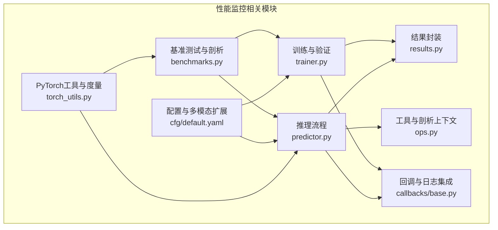
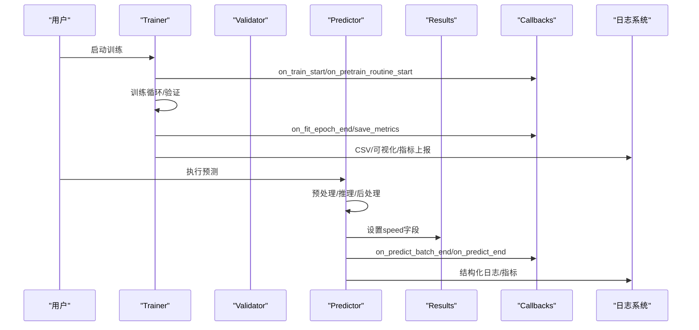
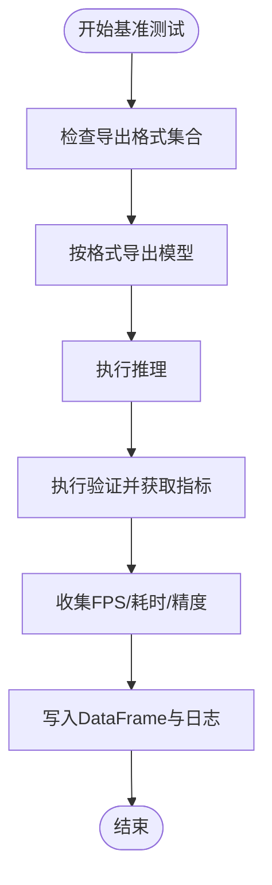
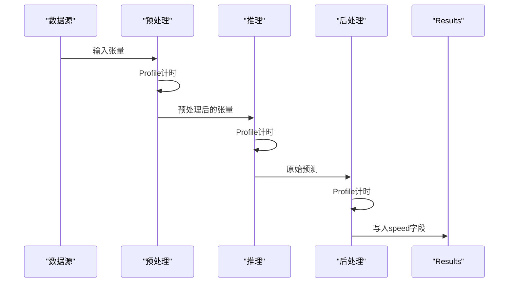
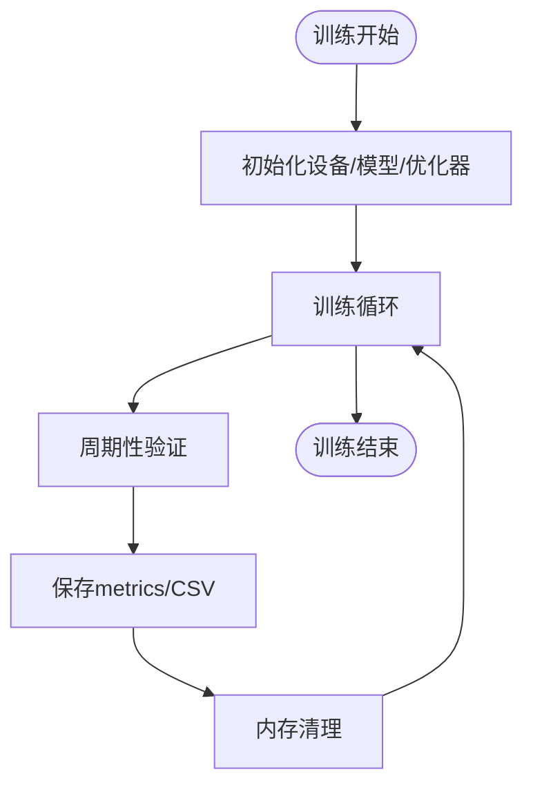
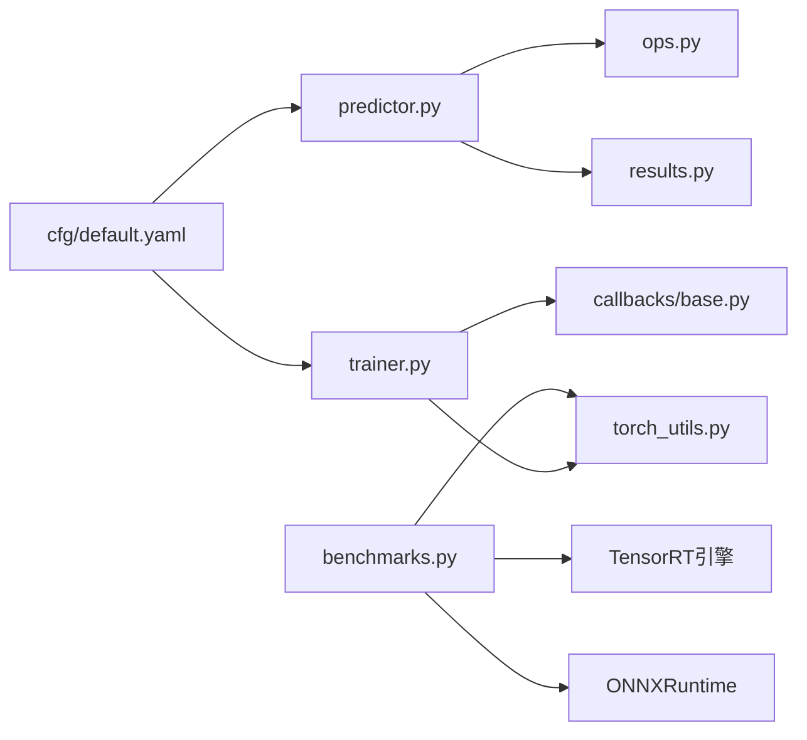

# 性能监控配置

<cite>
**本文档引用的文件**
- [ultralytics/utils/benchmarks.py](file://ultralytics/utils/benchmarks.py)
- [ultralytics/utils/torch_utils.py](file://ultralytics/utils/torch_utils.py)
- [ultralytics/engine/predictor.py](file://ultralytics/engine/predictor.py)
- [ultralytics/engine/trainer.py](file://ultralytics/engine/trainer.py)
- [ultralytics/utils/callbacks/base.py](file://ultralytics/utils/callbacks/base.py)
- [ultralytics/engine/results.py](file://ultralytics/engine/results.py)
- [ultralytics/utils/ops.py](file://ultralytics/utils/ops.py)
- [ultralytics/cfg/default.yaml](file://ultralytics/cfg/default.yaml)
</cite>

## 目录
1. [简介](#简介)
2. [项目结构](#项目结构)
3. [核心组件](#核心组件)
4. [架构总览](#架构总览)
5. [详细组件分析](#详细组件分析)
6. [依赖关系分析](#依赖关系分析)
7. [性能考虑](#性能考虑)
8. [故障排查指南](#故障排查指南)
9. [结论](#结论)
10. [附录](#附录)

## 简介
本指南面向多模态检测系统的性能监控配置，围绕推理延迟、吞吐量、GPU利用率、内存使用率与模型精度等关键指标，结合系统内置的基准测试、性能剖析与回调机制，提供可操作的监控与优化策略。文档同时覆盖日志采集与分析、告警策略设计以及PyTorch Profiler、TensorRT性能分析与系统级调优方法。

## 项目结构
该仓库以Ultralytics框架为基础，提供多模态检测能力。与性能监控直接相关的模块包括：
- 基准测试与性能剖析：ultralytics/utils/benchmarks.py、ultralytics/utils/torch_utils.py
- 推理流程与速度统计：ultralytics/engine/predictor.py、ultralytics/engine/results.py
- 训练与验证流程中的性能度量：ultralytics/engine/trainer.py
- 回调与日志集成：ultralytics/utils/callbacks/base.py
- 工具类与性能剖析上下文：ultralytics/utils/ops.py
- 默认配置与多模态扩展：ultralytics/cfg/default.yaml

图表来源
- [ultralytics/utils/benchmarks.py:52-211](file://ultralytics/utils/benchmarks.py#L52-L211)
- [ultralytics/engine/trainer.py:191-503](file://ultralytics/engine/trainer.py#L191-L503)
- [ultralytics/engine/predictor.py:314-390](file://ultralytics/engine/predictor.py#L314-L390)
- [ultralytics/engine/results.py:280-290](file://ultralytics/engine/results.py#L280-L290)
- [ultralytics/utils/ops.py:18-73](file://ultralytics/utils/ops.py#L18-L73)
- [ultralytics/utils/callbacks/base.py:144-174](file://ultralytics/utils/callbacks/base.py#L144-L174)
- [ultralytics/cfg/default.yaml:134-168](file://ultralytics/cfg/default.yaml#L134-L168)
- [ultralytics/utils/torch_utils.py:327-413](file://ultralytics/utils/torch_utils.py#L327-L413)

章节来源
- [ultralytics/utils/benchmarks.py:52-211](file://ultralytics/utils/benchmarks.py#L52-L211)
- [ultralytics/engine/predictor.py:314-390](file://ultralytics/engine/predictor.py#L314-L390)
- [ultralytics/engine/trainer.py:191-503](file://ultralytics/engine/trainer.py#L191-L503)
- [ultralytics/utils/callbacks/base.py:144-174](file://ultralytics/utils/callbacks/base.py#L144-L174)
- [ultralytics/utils/ops.py:18-73](file://ultralytics/utils/ops.py#L18-L73)
- [ultralytics/cfg/default.yaml:134-168](file://ultralytics/cfg/default.yaml#L134-L168)
- [ultralytics/utils/torch_utils.py:327-413](file://ultralytics/utils/torch_utils.py#L327-L413)

## 核心组件
- 基准测试与速度/精度对比：支持跨格式（ONNX、TensorRT、CoreML等）的速度与精度评测，输出DataFrame并记录日志。
- 推理阶段性能剖析：通过上下文计时器与结果对象speed字段，统计预处理、推理、后处理三段耗时。
- 训练阶段度量：记录显存占用、损失曲线、学习率等，支持保存CSV与可视化。
- 回调与日志：统一事件回调注册，便于接入外部日志平台与可视化工具。
- 配置与多模态扩展：提供多模态推理模式与增强策略开关，支撑异步几何扰动、模态擦除等。

章节来源
- [ultralytics/utils/benchmarks.py:52-211](file://ultralytics/utils/benchmarks.py#L52-L211)
- [ultralytics/engine/predictor.py:314-390](file://ultralytics/engine/predictor.py#L314-L390)
- [ultralytics/engine/trainer.py:432-491](file://ultralytics/engine/trainer.py#L432-L491)
- [ultralytics/utils/callbacks/base.py:144-174](file://ultralytics/utils/callbacks/base.py#L144-L174)
- [ultralytics/cfg/default.yaml:134-168](file://ultralytics/cfg/default.yaml#L134-L168)

## 架构总览
下图展示从训练到推理的关键路径中与性能监控相关的交互：

图表来源
- [ultralytics/engine/trainer.py:191-503](file://ultralytics/engine/trainer.py#L191-L503)
- [ultralytics/engine/predictor.py:314-390](file://ultralytics/engine/predictor.py#L314-L390)
- [ultralytics/engine/results.py:280-290](file://ultralytics/engine/results.py#L280-L290)
- [ultralytics/utils/callbacks/base.py:144-174](file://ultralytics/utils/callbacks/base.py#L144-L174)

## 详细组件分析

### 基准测试与性能剖析（benchmarks.py）
- 功能要点
  - 支持在多种导出格式（ONNX、TensorRT、CoreML等）上进行速度与精度评测。
  - 输出包含格式、状态、大小、指标、推理时间与FPS的DataFrame，并追加日志文件。
  - 提供ProfileModels类，用于对ONNX与TensorRT模型进行性能剖析，支持多次运行与sigma裁剪去噪。
- 关键指标
  - FPS、推理时间（ms/im）、模型大小（MB）、精度（如mAP）。
- 使用建议
  - 在CI/CD中定期执行benchmark，建立基线；变更模型/硬件/导出参数后对比FPS与精度。

图表来源
- [ultralytics/utils/benchmarks.py:52-211](file://ultralytics/utils/benchmarks.py#L52-L211)
- [ultralytics/utils/benchmarks.py:360-490](file://ultralytics/utils/benchmarks.py#L360-L490)

章节来源
- [ultralytics/utils/benchmarks.py:52-211](file://ultralytics/utils/benchmarks.py#L52-L211)
- [ultralytics/utils/benchmarks.py:360-490](file://ultralytics/utils/benchmarks.py#L360-L490)

### 推理阶段性能剖析（predictor.py + results.py + ops.py）
- 功能要点
  - Predictor在流式推理中使用Profile上下文分别统计预处理、推理、后处理耗时，并写入Results.speed字典。
  - Results对象提供speed字段，便于统一记录与后续分析。
  - Profile上下文在CUDA设备上进行同步，保证计时准确性。
- 关键指标
  - 预处理耗时（ms/图像）、推理耗时（ms/图像）、后处理耗时（ms/图像）。
- 使用建议
  - 将Results.speed写入结构化日志，按批次/视频帧聚合统计，识别瓶颈阶段。

图表来源
- [ultralytics/engine/predictor.py:314-390](file://ultralytics/engine/predictor.py#L314-L390)
- [ultralytics/engine/results.py:280-290](file://ultralytics/engine/results.py#L280-L290)
- [ultralytics/utils/ops.py:18-73](file://ultralytics/utils/ops.py#L18-L73)

章节来源
- [ultralytics/engine/predictor.py:314-390](file://ultralytics/engine/predictor.py#L314-L390)
- [ultralytics/engine/results.py:280-290](file://ultralytics/engine/results.py#L280-L290)
- [ultralytics/utils/ops.py:18-73](file://ultralytics/utils/ops.py#L18-L73)

### 训练阶段性能度量（trainer.py + torch_utils.py）
- 功能要点
  - 训练循环中记录显存占用、损失、学习率等，周期性保存metrics与CSV。
  - 提供模型信息与FLOPs统计接口，支持路由感知的多模态GFLOPs计算。
  - 提供内存清理与阈值清理，防止显存碎片导致的性能退化。
- 关键指标
  - 显存占用（GB）、损失值、学习率、epoch耗时、平均epoch耗时。
- 使用建议
  - 在回调中订阅on_fit_epoch_end事件，将指标写入日志系统；结合CSV进行趋势分析。

图表来源
- [ultralytics/engine/trainer.py:344-503](file://ultralytics/engine/trainer.py#L344-L503)
- [ultralytics/utils/torch_utils.py:515-546](file://ultralytics/utils/torch_utils.py#L515-L546)

章节来源
- [ultralytics/engine/trainer.py:344-503](file://ultralytics/engine/trainer.py#L344-L503)
- [ultralytics/utils/torch_utils.py:515-546](file://ultralytics/utils/torch_utils.py#L515-L546)

### 回调与日志集成（callbacks/base.py）
- 功能要点
  - 定义训练、验证、预测、导出各阶段的标准回调事件。
  - 支持动态注入第三方日志/可视化平台（如TensorBoard、Weights & Biases等）。
- 使用建议
  - 在训练/预测启动前注册自定义回调，将关键指标（FPS、显存、loss、精度）推送至集中式日志平台。

章节来源
- [ultralytics/utils/callbacks/base.py:144-174](file://ultralytics/utils/callbacks/base.py#L144-L174)
- [ultralytics/utils/callbacks/base.py:194-235](file://ultralytics/utils/callbacks/base.py#L194-L235)

### 配置与多模态扩展（cfg/default.yaml）
- 功能要点
  - 提供多模态项目版本、推理模式（modality）、增强策略（RGB非几何增强、异步几何扰动、模态擦除）等配置项。
  - 支持profile开关以在训练中启用ONNX/TensorRT速度剖析。
- 使用建议
  - 在多模态场景下，通过modality控制路由；通过增强策略配置实现鲁棒性与泛化性的平衡。

章节来源
- [ultralytics/cfg/default.yaml:134-168](file://ultralytics/cfg/default.yaml#L134-L168)

## 依赖关系分析
- 模块耦合
  - Predictor依赖Profile上下文与Results对象，形成“计时-记录-输出”的闭环。
  - Trainer通过回调与CSV输出形成“训练-度量-持久化”的闭环。
  - Benchmarks与TorchUtils相互配合，前者负责跨格式评测，后者提供模型信息与FLOPs统计。
- 外部依赖
  - ONNXRuntime（用于ONNX性能剖析）、TensorRT（用于引擎性能剖析）、PyTorch Profiler（用于FLOPs与内核级剖析）。

图表来源
- [ultralytics/utils/benchmarks.py:590-641](file://ultralytics/utils/benchmarks.py#L590-L641)
- [ultralytics/utils/torch_utils.py:515-546](file://ultralytics/utils/torch_utils.py#L515-L546)
- [ultralytics/engine/predictor.py:314-390](file://ultralytics/engine/predictor.py#L314-L390)
- [ultralytics/utils/ops.py:18-73](file://ultralytics/utils/ops.py#L18-L73)
- [ultralytics/engine/results.py:280-290](file://ultralytics/engine/results.py#L280-L290)
- [ultralytics/engine/trainer.py:191-503](file://ultralytics/engine/trainer.py#L191-L503)
- [ultralytics/utils/callbacks/base.py:144-174](file://ultralytics/utils/callbacks/base.py#L144-L174)
- [ultralytics/cfg/default.yaml:134-168](file://ultralytics/cfg/default.yaml#L134-L168)

章节来源
- [ultralytics/utils/benchmarks.py:590-641](file://ultralytics/utils/benchmarks.py#L590-L641)
- [ultralytics/utils/torch_utils.py:515-546](file://ultralytics/utils/torch_utils.py#L515-L546)
- [ultralytics/engine/predictor.py:314-390](file://ultralytics/engine/predictor.py#L314-L390)
- [ultralytics/utils/ops.py:18-73](file://ultralytics/utils/ops.py#L18-L73)
- [ultralytics/engine/results.py:280-290](file://ultralytics/engine/results.py#L280-L290)
- [ultralytics/engine/trainer.py:191-503](file://ultralytics/engine/trainer.py#L191-L503)
- [ultralytics/utils/callbacks/base.py:144-174](file://ultralytics/utils/callbacks/base.py#L144-L174)
- [ultralytics/cfg/default.yaml:134-168](file://ultralytics/cfg/default.yaml#L134-L168)

## 性能考虑
- 推理延迟
  - 使用Profile上下文分段计时，定位瓶颈；在高并发场景下评估批大小与并发度对延迟的影响。
  - 对于多模态输入，关注预处理阶段的通道合并与归一化开销。
- 吞吐量
  - 通过基准测试比较不同导出格式（ONNX/TensorRT）的FPS；在生产环境选择最优格式。
  - 控制warmup轮次与采样次数，减少统计噪声。
- GPU利用率与显存
  - 训练中定期清理显存，避免碎片；根据显存占用调整批大小与AMP设置。
  - 关注冻结层与EMA对显存的影响。
- 模型精度
  - 基准测试输出精度指标（如mAP），建立精度-速度权衡曲线。
  - 多模态场景下，通过增强策略提升鲁棒性，同时监控精度变化。

## 故障排查指南
- 推理阶段卡顿
  - 检查预处理是否在CPU上执行；确认设备同步计时（Profile）是否启用。
  - 查看Results.speed中是否存在某一阶段耗时异常升高。
- 训练显存溢出
  - 减小批大小或启用AMP；在训练循环中增加内存清理调用。
  - 检查冻结层与EMA设置是否合理。
- 基准测试失败
  - 确认导出格式支持与设备兼容性；检查日志文件中的错误堆栈。
- 日志缺失
  - 确认回调已注册并订阅相应事件；检查日志系统连接状态。

章节来源
- [ultralytics/engine/predictor.py:314-390](file://ultralytics/engine/predictor.py#L314-L390)
- [ultralytics/engine/trainer.py:458-491](file://ultralytics/engine/trainer.py#L458-L491)
- [ultralytics/utils/benchmarks.py:188-211](file://ultralytics/utils/benchmarks.py#L188-L211)
- [ultralytics/utils/callbacks/base.py:144-174](file://ultralytics/utils/callbacks/base.py#L144-L174)

## 结论
通过基准测试、推理阶段分段计时、训练阶段指标记录与回调集成，可以构建完整的多模态检测系统性能监控体系。结合日志聚合与告警策略，能够及时发现性能退化并指导系统级优化。建议在持续集成中固定基准测试流程，在生产环境中持续跟踪延迟、吞吐量与显存指标，并基于PyTorch Profiler与TensorRT剖析进行深度优化。

## 附录

### 关键性能指标清单
- 推理延迟
  - 预处理耗时（ms/图像）、推理耗时（ms/图像）、后处理耗时（ms/图像）
- 吞吐量
  - FPS（每秒帧数）
- GPU利用率与显存
  - 显存占用（GB）、显存利用率（需外部采集）
- 模型精度
  - mAP、各类别精度与召回

章节来源
- [ultralytics/engine/predictor.py:348-352](file://ultralytics/engine/predictor.py#L348-L352)
- [ultralytics/utils/benchmarks.py:185-187](file://ultralytics/utils/benchmarks.py#L185-L187)
- [ultralytics/engine/trainer.py:432-491](file://ultralytics/engine/trainer.py#L432-L491)

### 日志收集与分析建议
- 结构化日志
  - 将Results.speed、训练metrics、CSV指标统一序列化为JSON/CSV，便于入库与查询。
- 日志聚合
  - 使用集中式日志平台（如ELK/Fluentd）收集容器/主机日志与应用日志。
- 异常检测
  - 基于滑动窗口统计（均值±标准差）识别异常波动；对延迟突增、显存飙升设置阈值告警。

[本节为通用实践建议，不直接分析具体文件]

### 告警策略设计
- 阈值配置
  - 推理延迟：P95/P99超过阈值触发告警；连续N次超阈值升级为严重告警。
  - 吞吐量：低于阈值触发降级告警；持续下降触发恢复失败告警。
  - 显存：超过阈值触发扩容/限流；持续高位触发容量预警。
- 告警级别
  - 信息（INFO）：指标正常但异常波动
  - 警告（WARN）：轻微异常
  - 严重（ERROR）：重大异常或服务不可用
- 通知渠道
  - 邮件、企业微信、钉钉、PagerDuty等；区分紧急与非紧急通道。

[本节为通用实践建议，不直接分析具体文件]

### 性能分析工具使用指南
- PyTorch Profiler
  - 使用torch.profiler.profile统计FLOPs与内核级耗时，定位热点算子。
  - 适用于离线剖析与回归对比，注意开启with_flops选项。
- TensorRT性能分析
  - 使用ProfileModels对TensorRT引擎进行多次采样与sigma裁剪，获得稳定耗时。
  - 对比不同精度（FP32/FP16/INT8）与工作区设置对吞吐量与延迟的影响。
- 系统级调优
  - 批大小与并发度权衡；启用AMP与混合精度；优化数据加载与预处理流水线；合理设置CUDA流与同步点。

章节来源
- [ultralytics/utils/torch_utils.py:515-546](file://ultralytics/utils/torch_utils.py#L515-L546)
- [ultralytics/utils/benchmarks.py:539-576](file://ultralytics/utils/benchmarks.py#L539-L576)