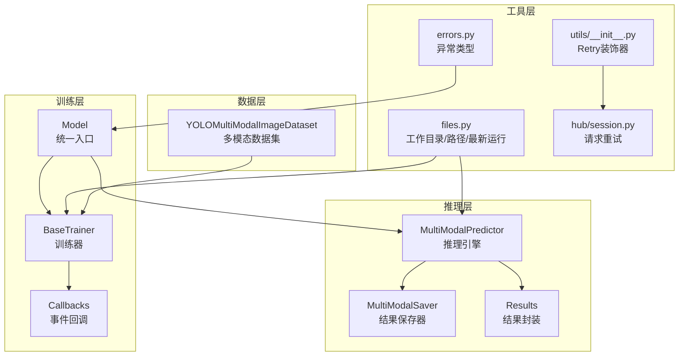
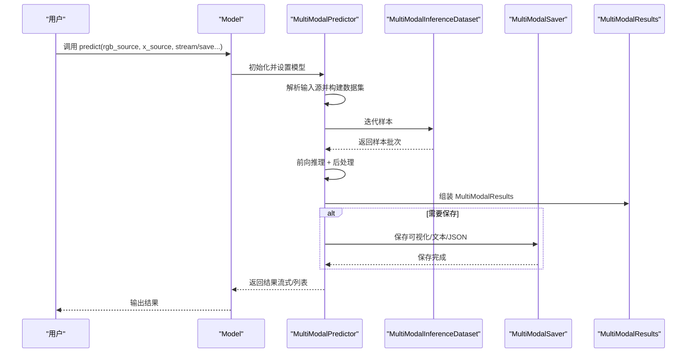
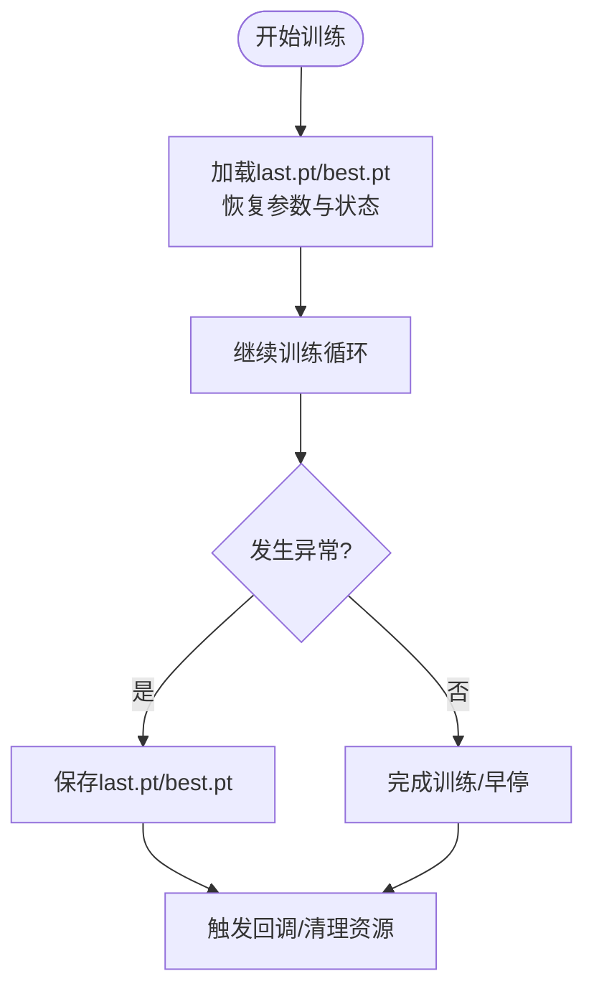
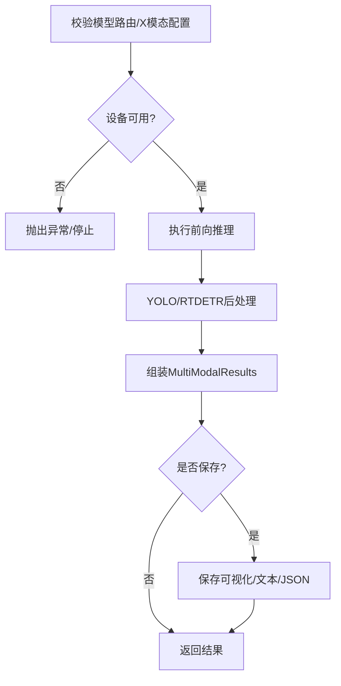
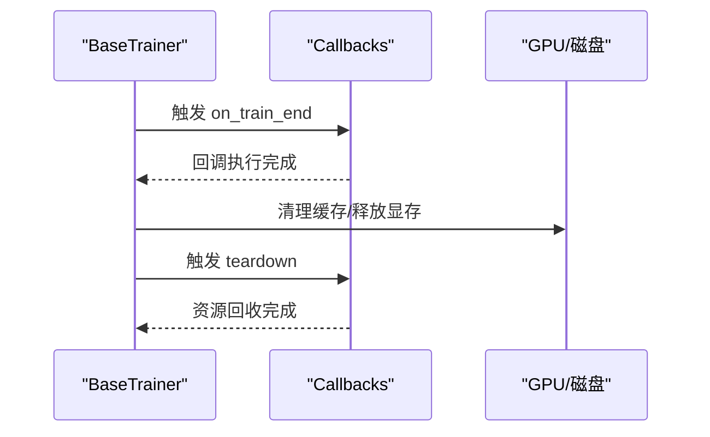
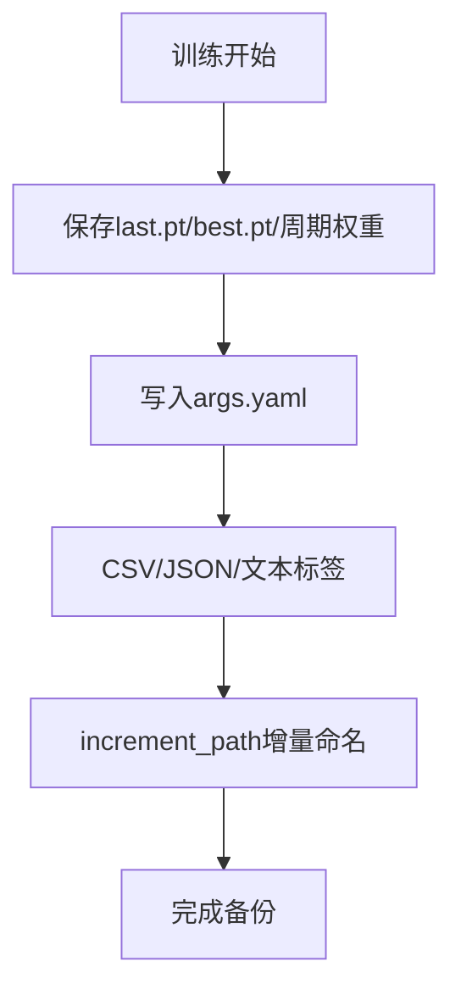
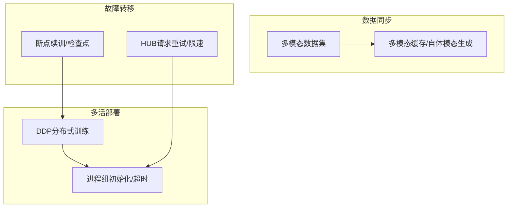
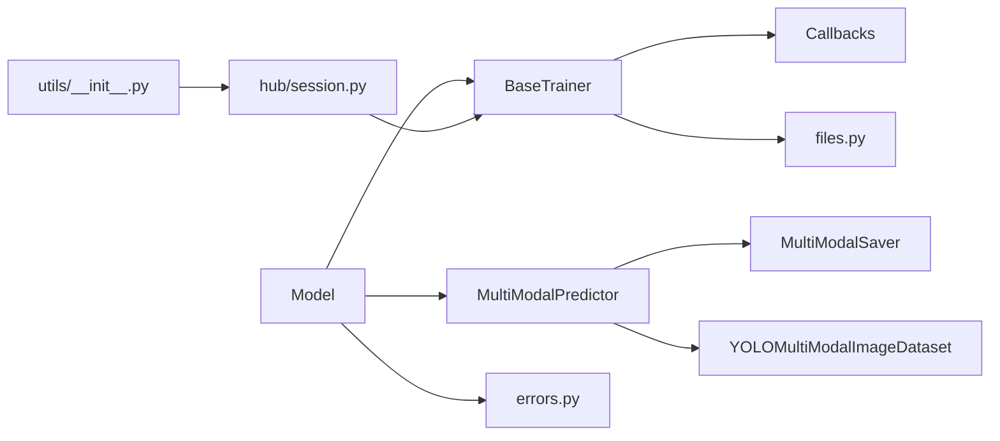

# 故障恢复机制

<cite>
**本文引用的文件**
- [predictor.py](file://ultralytics/engine/multimodal/predictor.py)
- [saver.py](file://ultralytics/engine/multimodal/saver.py)
- [model.py](file://ultralytics/engine/model.py)
- [trainer.py](file://ultralytics/engine/trainer.py)
- [results.py](file://ultralytics/engine/results.py)
- [base.py](file://ultralytics/utils/callbacks/base.py)
- [files.py](file://ultralytics/utils/files.py)
- [errors.py](file://ultralytics/utils/errors.py)
- [dataset.py](file://ultralytics/data/dataset.py)
- [session.py](file://ultralytics/hub/session.py)
- [__init__.py](file://ultralytics/utils/__init__.py)
</cite>

## 目录
1. [简介](#简介)
2. [项目结构](#项目结构)
3. [核心组件](#核心组件)
4. [架构总览](#架构总览)
5. [详细组件分析](#详细组件分析)
6. [依赖关系分析](#依赖关系分析)
7. [性能考虑](#性能考虑)
8. [故障排查指南](#故障排查指南)
9. [结论](#结论)

## 简介
本指南面向多模态检测系统的故障恢复机制，围绕自动重启策略、进程监控、健康检查与优雅关闭流程展开；同时覆盖数据备份与恢复（模型权重、配置、日志与增量备份）、灾难恢复（多活部署、数据同步、故障转移与业务连续性保障），以及应急响应手册（常见故障识别、快速修复步骤、影响评估与事后分析流程）。文档基于仓库中的推理引擎、训练框架、回调系统、工具模块与异常处理等代码进行深入分析，帮助读者建立完善的故障恢复体系。

## 项目结构
多模态检测系统主要由以下层次构成：
- 推理层：多模态推理引擎与结果保存器
- 训练层：训练器与训练回调系统
- 工具层：文件操作、上下文管理、重试与异常处理
- 数据层：多模态数据集与缓存机制
- HUB会话：远程服务交互与重试策略

**图表来源**
- [predictor.py:16-494](file://ultralytics/engine/multimodal/predictor.py#L16-L494)
- [saver.py:12-112](file://ultralytics/engine/multimodal/saver.py#L12-L112)
- [model.py:29-800](file://ultralytics/engine/model.py#L29-L800)
- [trainer.py:59-800](file://ultralytics/engine/trainer.py#L59-L800)
- [base.py:144-191](file://ultralytics/utils/callbacks/base.py#L144-L191)
- [files.py:14-223](file://ultralytics/utils/files.py#L14-L223)
- [errors.py:6-44](file://ultralytics/utils/errors.py#L6-L44)
- [dataset.py:423-800](file://ultralytics/data/dataset.py#L423-L800)
- [session.py:308-368](file://ultralytics/hub/session.py#L308-L368)
- [__init__.py:1180-1237](file://ultralytics/utils/__init__.py#L1180-L1237)

**章节来源**
- [predictor.py:16-494](file://ultralytics/engine/multimodal/predictor.py#L16-L494)
- [saver.py:12-112](file://ultralytics/engine/multimodal/saver.py#L12-L112)
- [model.py:29-800](file://ultralytics/engine/model.py#L29-L800)
- [trainer.py:59-800](file://ultralytics/engine/trainer.py#L59-L800)
- [base.py:144-191](file://ultralytics/utils/callbacks/base.py#L144-L191)
- [files.py:14-223](file://ultralytics/utils/files.py#L14-L223)
- [errors.py:6-44](file://ultralytics/utils/errors.py#L6-L44)
- [dataset.py:423-800](file://ultralytics/data/dataset.py#L423-L800)
- [session.py:308-368](file://ultralytics/hub/session.py#L308-L368)
- [__init__.py:1180-1237](file://ultralytics/utils/__init__.py#L1180-L1237)

## 核心组件
- 多模态推理引擎（MultiModalPredictor）：负责构建数据集、执行推理、后处理与结果组装，支持流式输出与可选保存。
- 结果保存器（MultiModalSaver）：按约定规则保存可视化图像、文本标签与JSON结果。
- 统一模型入口（Model）：提供predict/val/train/export等统一接口，内部委派至具体预测器/验证器/训练器。
- 训练器（BaseTrainer）：训练生命周期管理、断点续训、权重保存、回调触发与资源清理。
- 回调系统（Callbacks）：标准化训练/验证/预测/导出各阶段事件，便于扩展监控与恢复逻辑。
- 工具模块（files、Retry、TryExcept）：路径管理、工作目录切换、增量路径、指数退避重试与异常捕获。
- 数据集（YOLOMultiModalImageDataset）：多模态图像加载、缓存与增强，支撑训练稳定性。
- HUB会话（hub/session）：网络请求重试与速率限制处理，为远程服务交互提供弹性。

**章节来源**
- [predictor.py:16-494](file://ultralytics/engine/multimodal/predictor.py#L16-L494)
- [saver.py:12-112](file://ultralytics/engine/multimodal/saver.py#L12-L112)
- [model.py:498-580](file://ultralytics/engine/model.py#L498-L580)
- [trainer.py:191-503](file://ultralytics/engine/trainer.py#L191-L503)
- [base.py:144-191](file://ultralytics/utils/callbacks/base.py#L144-L191)
- [files.py:108-153](file://ultralytics/utils/files.py#L108-L153)
- [dataset.py:423-800](file://ultralytics/data/dataset.py#L423-L800)
- [session.py:308-368](file://ultralytics/hub/session.py#L308-L368)
- [__init__.py:1180-1237](file://ultralytics/utils/__init__.py#L1180-L1237)

## 架构总览
多模态检测系统采用“统一入口 + 分层职责”的架构设计：
- Model作为统一入口，根据任务类型委派到预测器、验证器或训练器。
- MultiModalPredictor负责多模态推理与结果保存，支持流式与批量两种模式。
- BaseTrainer管理训练生命周期，结合回调系统实现可观测性与可恢复性。
- 工具模块提供路径、工作目录、重试与异常处理能力，支撑稳定运行。

**图表来源**
- [model.py:498-580](file://ultralytics/engine/model.py#L498-L580)
- [predictor.py:99-143](file://ultralytics/engine/multimodal/predictor.py#L99-L143)
- [saver.py:54-112](file://ultralytics/engine/multimodal/saver.py#L54-L112)
- [results.py:190-474](file://ultralytics/engine/results.py#L190-L474)

**章节来源**
- [model.py:498-580](file://ultralytics/engine/model.py#L498-L580)
- [predictor.py:99-143](file://ultralytics/engine/multimodal/predictor.py#L99-L143)
- [saver.py:54-112](file://ultralytics/engine/multimodal/saver.py#L54-L112)
- [results.py:190-474](file://ultralytics/engine/results.py#L190-L474)

## 详细组件分析

### 自动重启策略与进程监控
- 断点续训与检查点管理：训练器在保存last.pt/best.pt时序列化epoch、最佳指标、优化器状态与训练元数据，支持resume恢复。
- 训练循环健壮性：训练器内置早停、学习率调度、内存清理与分布式一致性广播，降低异常中断风险。
- 推理流式输出：MultiModalPredictor支持Generator返回结果，便于在上游监控中实现“消费-失败重试”模式。
- 优雅关闭：训练结束与teardown阶段触发回调，释放资源，避免僵尸进程与句柄泄漏。

**图表来源**
- [trainer.py:556-590](file://ultralytics/engine/trainer.py#L556-L590)
- [trainer.py:493-503](file://ultralytics/engine/trainer.py#L493-L503)
- [trainer.py:765-802](file://ultralytics/engine/trainer.py#L765-L802)

**章节来源**
- [trainer.py:556-590](file://ultralytics/engine/trainer.py#L556-L590)
- [trainer.py:493-503](file://ultralytics/engine/trainer.py#L493-L503)
- [trainer.py:765-802](file://ultralytics/engine/trainer.py#L765-L802)

### 健康检查机制
- 推理健康检查：MultiModalPredictor在推理前校验模型路由配置与设备可用性；后处理分支根据模型类型自动选择YOLO或RTDETR路径，减少因模型类型误判导致的崩溃。
- 数据集健康检查：多模态数据集在构建transform时严格校验X模态通道数与配置一致性，异常即刻抛错，避免静默扩展引发的后续错误。
- 训练健康检查：训练器在关键阶段（预训练、训练批、验证）触发回调，便于外部监控系统采集指标与告警。

**图表来源**
- [predictor.py:60-98](file://ultralytics/engine/multimodal/predictor.py#L60-L98)
- [predictor.py:144-244](file://ultralytics/engine/multimodal/predictor.py#L144-L244)
- [dataset.py:734-780](file://ultralytics/data/dataset.py#L734-L780)

**章节来源**
- [predictor.py:60-98](file://ultralytics/engine/multimodal/predictor.py#L60-L98)
- [predictor.py:144-244](file://ultralytics/engine/multimodal/predictor.py#L144-L244)
- [dataset.py:734-780](file://ultralytics/data/dataset.py#L734-L780)

### 优雅关闭流程
- 训练结束回调：训练器在最终评估与绘图后触发on_train_end与teardown，确保资源回收与状态落盘。
- 推理结束：MultiModalPredictor在流式推理完成后逐样本yield，上层可基于生成器实现“消费完成”信号，配合外部监控进行优雅关闭。
- 文件与目录管理：files模块提供工作目录切换与增量路径生成，避免并发写冲突与路径污染。

**图表来源**
- [trainer.py:493-503](file://ultralytics/engine/trainer.py#L493-L503)
- [base.py:177-191](file://ultralytics/utils/callbacks/base.py#L177-L191)

**章节来源**
- [trainer.py:493-503](file://ultralytics/engine/trainer.py#L493-L503)
- [base.py:177-191](file://ultralytics/utils/callbacks/base.py#L177-L191)

### 数据备份与恢复方案
- 模型权重备份：训练器保存last.pt/best.pt及周期性epoch权重，checkpoint中包含epoch、最佳指标、EMA、优化器状态与训练元数据，便于快速回滚与迁移。
- 配置文件管理：训练器在保存目录写入args.yaml，记录运行参数；Model在CLI模式下自动保存运行参数，便于复现实验。
- 日志数据归档：训练CSV结果与回调系统日志可用于离线分析；MultiModalSaver保存JSON与文本标签，便于审计与二次处理。
- 增量备份策略：files.increment_path提供增量路径生成，避免覆盖；结合定期快照与差异备份，确保历史版本可追溯。

**图表来源**
- [trainer.py:556-590](file://ultralytics/engine/trainer.py#L556-L590)
- [trainer.py:136-137](file://ultralytics/engine/trainer.py#L136-L137)
- [model.py:554-579](file://ultralytics/engine/model.py#L554-L579)
- [saver.py:108-112](file://ultralytics/engine/multimodal/saver.py#L108-L112)
- [files.py:108-153](file://ultralytics/utils/files.py#L108-L153)

**章节来源**
- [trainer.py:556-590](file://ultralytics/engine/trainer.py#L556-L590)
- [trainer.py:136-137](file://ultralytics/engine/trainer.py#L136-L137)
- [model.py:554-579](file://ultralytics/engine/model.py#L554-L579)
- [saver.py:108-112](file://ultralytics/engine/multimodal/saver.py#L108-L112)
- [files.py:108-153](file://ultralytics/utils/files.py#L108-L153)

### 灾难恢复流程
- 多活部署架构：训练器支持DDP分布式训练，具备进程组初始化与超时设置，适合多节点部署；结合外部编排系统实现多活。
- 数据同步机制：多模态数据集支持自体模态生成与缓存，提升数据可用性；训练器在分布式场景下广播停止信号，保证一致性。
- 故障转移策略：利用训练器的断点续训与检查点恢复，结合外部监控与自动重启，实现故障转移；HUB会话的请求重试与速率限制处理为远程依赖提供弹性。
- 业务连续性保障：统一入口Model在预测阶段支持流式输出与可选保存，便于在下游服务中实现“消费-确认-重试”模式，降低单点故障影响。

**图表来源**
- [trainer.py:237-248](file://ultralytics/engine/trainer.py#L237-L248)
- [dataset.py:423-800](file://ultralytics/data/dataset.py#L423-L800)
- [session.py:308-368](file://ultralytics/hub/session.py#L308-L368)

**章节来源**
- [trainer.py:237-248](file://ultralytics/engine/trainer.py#L237-L248)
- [dataset.py:423-800](file://ultralytics/data/dataset.py#L423-L800)
- [session.py:308-368](file://ultralytics/hub/session.py#L308-L368)

### 应急响应手册
- 常见故障类型识别：
  - 模型路由缺失：推理引擎初始化时报错，提示使用YOLOMM/RTDETRMM模型。
  - X模态通道不一致：多模态数据集在严格模式下抛出异常，需修正数据或配置。
  - HUB请求失败：HTTP 429/502/504触发指数退避重试，超过重试次数则记录失败队列。
- 快速修复步骤：
  - 检查模型路由与设备配置；修正X模态通道数与数据路径；重试HUB请求。
- 影响评估方法：
  - 通过训练CSV与回调日志评估损失与指标变化；通过MultiModalSaver输出定位问题样本。
- 事后分析流程：
  - 使用files.get_latest_run定位最近运行；对比args.yaml与checkpoint元数据；复现问题并优化配置。

**章节来源**
- [predictor.py:60-68](file://ultralytics/engine/multimodal/predictor.py#L60-L68)
- [dataset.py:734-780](file://ultralytics/data/dataset.py#L734-L780)
- [session.py:308-368](file://ultralytics/hub/session.py#L308-L368)
- [files.py:180-184](file://ultralytics/utils/files.py#L180-L184)

## 依赖关系分析
- 组件耦合与内聚：
  - Model与Predictor解耦，通过统一接口委派不同任务；Predictor与Saver内聚于推理与保存流程。
  - Trainer与Callbacks高内聚，通过事件驱动实现可观测性与可扩展性。
- 外部依赖与集成点：
  - HUB会话提供网络请求弹性；文件系统与路径管理贯穿训练与推理；异常类型统一由errors模块提供。
- 循环依赖：
  - 代码中未发现直接循环导入；模块间通过函数/类调用形成清晰的单向依赖。

**图表来源**
- [model.py:498-580](file://ultralytics/engine/model.py#L498-L580)
- [predictor.py:99-143](file://ultralytics/engine/multimodal/predictor.py#L99-L143)
- [saver.py:54-112](file://ultralytics/engine/multimodal/saver.py#L54-L112)
- [trainer.py:174-190](file://ultralytics/engine/trainer.py#L174-L190)
- [files.py:14-223](file://ultralytics/utils/files.py#L14-L223)
- [errors.py:6-44](file://ultralytics/utils/errors.py#L6-L44)
- [dataset.py:423-800](file://ultralytics/data/dataset.py#L423-L800)
- [session.py:308-368](file://ultralytics/hub/session.py#L308-L368)
- [__init__.py:1180-1237](file://ultralytics/utils/__init__.py#L1180-L1237)

**章节来源**
- [model.py:498-580](file://ultralytics/engine/model.py#L498-L580)
- [predictor.py:99-143](file://ultralytics/engine/multimodal/predictor.py#L99-L143)
- [saver.py:54-112](file://ultralytics/engine/multimodal/saver.py#L54-L112)
- [trainer.py:174-190](file://ultralytics/engine/trainer.py#L174-L190)
- [files.py:14-223](file://ultralytics/utils/files.py#L14-L223)
- [errors.py:6-44](file://ultralytics/utils/errors.py#L6-L44)
- [dataset.py:423-800](file://ultralytics/data/dataset.py#L423-L800)
- [session.py:308-368](file://ultralytics/hub/session.py#L308-L368)
- [__init__.py:1180-1237](file://ultralytics/utils/__init__.py#L1180-L1237)

## 性能考虑
- 内存与显存管理：训练器在关键阶段调用垃圾回收与显存清空，避免峰值占用导致OOM；推理端使用torch.no_grad减少梯度计算开销。
- 数据加载与缓存：多模态数据集支持缓存与自体模态生成，减少I/O瓶颈；LetterBox与Format统一变换，降低重复计算。
- 并发与重试：指数退避重试与线程化执行提升网络请求稳定性；分布式训练设置超时与广播停止信号，避免死锁。

**章节来源**
- [trainer.py:528-541](file://ultralytics/engine/trainer.py#L528-L541)
- [dataset.py:595-629](file://ultralytics/data/dataset.py#L595-L629)
- [session.py:308-368](file://ultralytics/hub/session.py#L308-L368)
- [__init__.py:1180-1237](file://ultralytics/utils/__init__.py#L1180-L1237)

## 故障排查指南
- 模型加载失败：检查模型路由与设备配置；确认使用YOLOMM/RTDETRMM模型；查看日志与异常类型。
- 数据不一致：核对X模态通道数与配置；启用自体模态生成或修正数据路径；关注多模态完整性比率。
- 网络不稳定：利用HUB会话的重试与限速策略；必要时增加重试次数与退避系数。
- 训练中断：使用断点续训恢复；检查last.pt/best.pt与CSV结果；复现实验参数（args.yaml）。

**章节来源**
- [predictor.py:60-68](file://ultralytics/engine/multimodal/predictor.py#L60-L68)
- [dataset.py:734-780](file://ultralytics/data/dataset.py#L734-L780)
- [session.py:308-368](file://ultralytics/hub/session.py#L308-L368)
- [files.py:180-184](file://ultralytics/utils/files.py#L180-L184)

## 结论
本指南基于仓库中的推理引擎、训练框架、回调系统与工具模块，构建了覆盖自动重启、健康检查、优雅关闭、数据备份与灾难恢复的完整故障恢复体系。通过断点续训、指数退避重试、严格的多模态数据校验与统一的统一入口委派，系统在复杂场景下具备更强的韧性与可维护性。建议在生产环境中结合外部监控与自动化编排，进一步完善多活部署与故障转移策略，确保业务连续性。