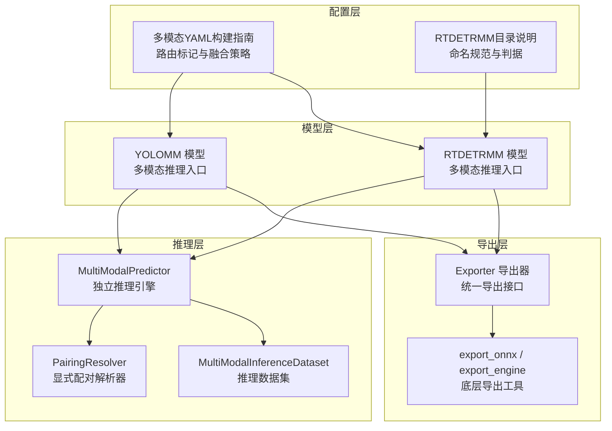
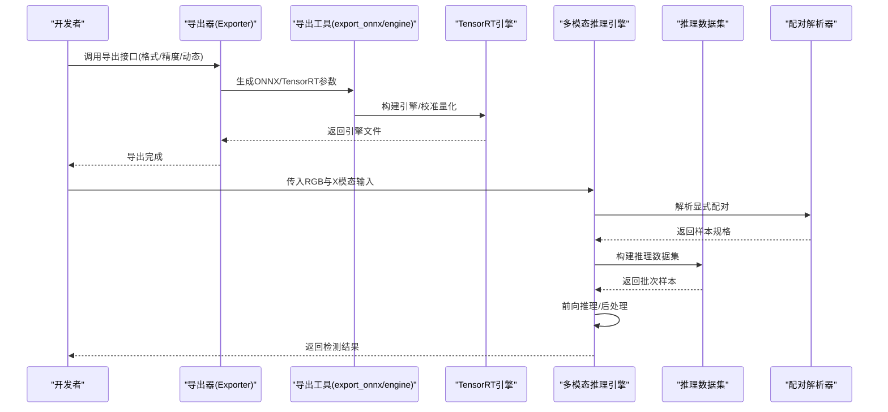
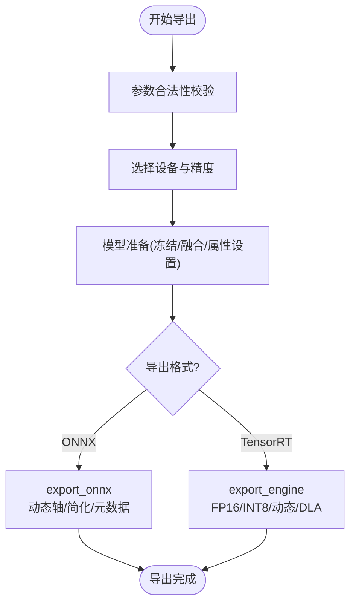
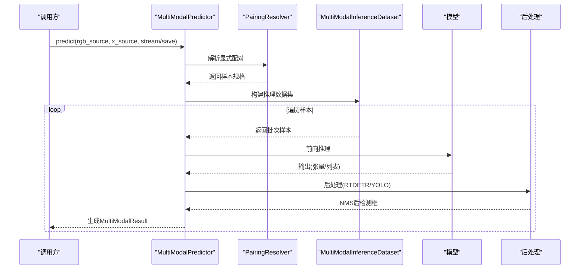
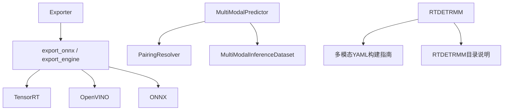

# 生产环境部署

<cite>
**本文档引用的文件**
- [ultralytics/engine/exporter.py](file://ultralytics/engine/exporter.py)
- [ultralytics/utils/export.py](file://ultralytics/utils/export.py)
- [ultralytics/engine/model.py](file://ultralytics/engine/model.py)
- [ultralytics/engine/multimodal/predictor.py](file://ultralytics/engine/multimodal/predictor.py)
- [ultralytics/data/multimodal/inference_dataset.py](file://ultralytics/data/multimodal/inference_dataset.py)
- [ultralytics/data/multimodal/pairing.py](file://ultralytics/data/multimodal/pairing.py)
- [ultralytics/models/rtdetrmm/model.py](file://ultralytics/models/rtdetrmm/model.py)
- [ultralytics/cfg/models/多模态YAML构建指点.md](file://ultralytics/cfg/models/多模态YAML构建指点.md)
- [ultralytics/cfg/models/rtmm/说明.md](file://ultralytics/cfg/models/rtmm/说明.md)
- [ultralytics/data/scripts/download_weights.sh](file://ultralytics/data/scripts/download_weights.sh)
- [ultralytics/utils/checks.py](file://ultralytics/utils/checks.py)
</cite>

## 目录
1. [简介](#简介)
2. [项目结构](#项目结构)
3. [核心组件](#核心组件)
4. [架构概览](#架构概览)
5. [详细组件分析](#详细组件分析)
6. [依赖分析](#依赖分析)
7. [性能考虑](#性能考虑)
8. [故障排除指南](#故障排除指南)
9. [结论](#结论)
10. [附录](#附录)

## 简介
本指南面向多模态检测系统在生产环境中的部署需求，围绕模型导出策略（ONNX格式转换、TensorRT引擎构建、量化优化配置）、容器化部署方案（Docker镜像构建、Kubernetes集群部署、资源限制与自动扩缩容）、负载均衡配置（NVIDIA Jetson设备部署、边缘计算节点配置、GPU资源调度策略）以及高可用架构设计（稳定性、可扩展性、故障隔离能力）进行系统性阐述。文档结合代码库中的导出器、推理引擎、数据集封装与配置规范，提供可操作的实施路径与最佳实践。

## 项目结构
多模态检测系统由以下关键层次构成：
- 模型层：支持YOLO与RT-DETR两类骨干网络的多模态版本（RTDETRMM），具备统一的多模态推理入口与配置驱动的路由机制。
- 导出层：提供统一的导出接口，支持ONNX、TensorRT、OpenVINO、CoreML等多种格式，并内置参数校验与优化流程。
- 推理层：独立的多模态推理引擎，负责样本配对、数据集构建、前向推理、后处理与结果组装。
- 数据层：多模态推理专用数据集，支持RGB与X模态（热成像、深度等）的严格校验与预处理。
- 配置层：多模态YAML构建指南，定义了多模态层路由标记、融合策略与命名规范。

**图表来源**
- [ultralytics/engine/exporter.py:203-534](file://ultralytics/engine/exporter.py#L203-L534)
- [ultralytics/utils/export.py:12-237](file://ultralytics/utils/export.py#L12-L237)
- [ultralytics/engine/multimodal/predictor.py:16-494](file://ultralytics/engine/multimodal/predictor.py#L16-L494)
- [ultralytics/data/multimodal/inference_dataset.py:16-252](file://ultralytics/data/multimodal/inference_dataset.py#L16-L252)
- [ultralytics/data/multimodal/pairing.py:11-203](file://ultralytics/data/multimodal/pairing.py#L11-L203)
- [ultralytics/models/rtdetrmm/model.py:25-269](file://ultralytics/models/rtdetrmm/model.py#L25-L269)
- [ultralytics/cfg/models/多模态YAML构建指点.md:1-239](file://ultralytics/cfg/models/多模态YAML构建指点.md#L1-L239)
- [ultralytics/cfg/models/rtmm/说明.md:1-28](file://ultralytics/cfg/models/rtmm/说明.md#L1-L28)

**章节来源**
- [ultralytics/engine/exporter.py:203-534](file://ultralytics/engine/exporter.py#L203-L534)
- [ultralytics/utils/export.py:12-237](file://ultralytics/utils/export.py#L12-L237)
- [ultralytics/engine/multimodal/predictor.py:16-494](file://ultralytics/engine/multimodal/predictor.py#L16-L494)
- [ultralytics/data/multimodal/inference_dataset.py:16-252](file://ultralytics/data/multimodal/inference_dataset.py#L16-L252)
- [ultralytics/data/multimodal/pairing.py:11-203](file://ultralytics/data/multimodal/pairing.py#L11-L203)
- [ultralytics/models/rtdetrmm/model.py:25-269](file://ultralytics/models/rtdetrmm/model.py#L25-L269)
- [ultralytics/cfg/models/多模态YAML构建指点.md:1-239](file://ultralytics/cfg/models/多模态YAML构建指点.md#L1-L239)
- [ultralytics/cfg/models/rtmm/说明.md:1-28](file://ultralytics/cfg/models/rtmm/说明.md#L1-L28)

## 核心组件
- 导出器（Exporter）：统一管理多格式导出，负责参数校验、设备选择、模型准备与导出流程编排，支持ONNX、TensorRT、OpenVINO等格式。
- 导出工具（export_onnx / export_engine）：提供ONNX与TensorRT的具体实现，包括动态形状、量化校准、元数据写入等。
- 多模态推理引擎（MultiModalPredictor）：独立于基础预测器的推理核心，负责样本配对、数据集构建、前向推理与后处理。
- 推理数据集（MultiModalInferenceDataset）：严格校验与预处理RGB与X模态输入，支持零填充与通道一致性检查。
- 配对解析器（PairingResolver）：显式解析RGB与X模态输入，支持单模态与双模态推理。
- RTDETRMM模型：多模态RT-DETR家族入口，提供任务映射、多模态配置与验证入口。

**章节来源**
- [ultralytics/engine/exporter.py:203-534](file://ultralytics/engine/exporter.py#L203-L534)
- [ultralytics/utils/export.py:12-237](file://ultralytics/utils/export.py#L12-L237)
- [ultralytics/engine/multimodal/predictor.py:16-494](file://ultralytics/engine/multimodal/predictor.py#L16-L494)
- [ultralytics/data/multimodal/inference_dataset.py:16-252](file://ultralytics/data/multimodal/inference_dataset.py#L16-L252)
- [ultralytics/data/multimodal/pairing.py:11-203](file://ultralytics/data/multimodal/pairing.py#L11-L203)
- [ultralytics/models/rtdetrmm/model.py:25-269](file://ultralytics/models/rtdetrmm/model.py#L25-L269)

## 架构概览
生产环境部署采用“导出-运行时-运维”三层架构：
- 导出阶段：通过导出器将PyTorch模型转换为ONNX/TensorRT等目标格式，配置动态形状、量化与简化选项。
- 运行时阶段：多模态推理引擎接收显式RGB与X模态输入，构建数据集并执行前向推理，随后进行后处理与结果组装。
- 运维阶段：结合容器化与Kubernetes实现弹性伸缩与资源调度，利用负载均衡与GPU调度策略保障高可用。

**图表来源**
- [ultralytics/engine/exporter.py:267-534](file://ultralytics/engine/exporter.py#L267-L534)
- [ultralytics/utils/export.py:49-237](file://ultralytics/utils/export.py#L49-L237)
- [ultralytics/engine/multimodal/predictor.py:99-244](file://ultralytics/engine/multimodal/predictor.py#L99-L244)
- [ultralytics/data/multimodal/inference_dataset.py:94-183](file://ultralytics/data/multimodal/inference_dataset.py#L94-L183)
- [ultralytics/data/multimodal/pairing.py:37-125](file://ultralytics/data/multimodal/pairing.py#L37-L125)

## 详细组件分析

### 导出器（Exporter）与导出工具（export_onnx / export_engine）
- 功能职责
  - 统一导出接口：支持ONNX、TensorRT、OpenVINO、CoreML等格式，负责参数校验、设备选择与导出流程编排。
  - 参数兼容性：针对不同格式进行参数合法性检查，如INT8与半精度互斥、NMS与端到端模型的限制等。
  - 模型准备：冻结参数、融合BN、设置导出模块属性（动态形状、NMS、最大检测数等）。
  - TensorRT构建：支持FP16/INT8、动态形状优化、DLA核心（Jetson设备）与校准缓存。
- 关键流程
  - 设备与精度：根据格式与设备能力选择半精度或INT8，确保平台兼容性。
  - ONNX导出：设置输入/输出名称、动态轴、可选简化与元数据写入。
  - TensorRT引擎：解析ONNX、配置优化配置文件、设置工作区与校准器、序列化引擎并写入元数据。

**图表来源**
- [ultralytics/engine/exporter.py:295-476](file://ultralytics/engine/exporter.py#L295-L476)
- [ultralytics/utils/export.py:12-88](file://ultralytics/utils/export.py#L12-L88)

**章节来源**
- [ultralytics/engine/exporter.py:203-534](file://ultralytics/engine/exporter.py#L203-L534)
- [ultralytics/utils/export.py:12-237](file://ultralytics/utils/export.py#L12-L237)

### 多模态推理引擎（MultiModalPredictor）
- 功能职责
  - 从模型读取Router配置（X通道数与模态类型），构建推理数据集并逐样本执行前向推理。
  - 支持RTDETR与YOLO两种后处理路径：RTDETR使用查询输出与NMS，YOLO使用NMS模块。
  - 流式推理：边迭代边产出结果，支持保存可视化与文本标签。
- 关键流程
  - 样本配对：通过PairingResolver解析显式RGB与X模态输入，支持单模态与双模态。
  - 数据集构建：MultiModalInferenceDataset负责严格校验与预处理，支持零填充与通道一致性检查。
  - 前向推理：模型前向得到输出，按模型类型选择后处理路径。
  - 结果组装：还原坐标、组装MultiModalResults并可选保存。

**图表来源**
- [ultralytics/engine/multimodal/predictor.py:99-244](file://ultralytics/engine/multimodal/predictor.py#L99-L244)
- [ultralytics/data/multimodal/pairing.py:37-125](file://ultralytics/data/multimodal/pairing.py#L37-L125)
- [ultralytics/data/multimodal/inference_dataset.py:94-183](file://ultralytics/data/multimodal/inference_dataset.py#L94-L183)

**章节来源**
- [ultralytics/engine/multimodal/predictor.py:16-494](file://ultralytics/engine/multimodal/predictor.py#L16-L494)
- [ultralytics/data/multimodal/pairing.py:11-203](file://ultralytics/data/multimodal/pairing.py#L11-L203)
- [ultralytics/data/multimodal/inference_dataset.py:16-252](file://ultralytics/data/multimodal/inference_dataset.py#L16-L252)

### 多模态数据集（MultiModalInferenceDataset）
- 功能职责
  - 从PairingResolver提供的样本规格构建可迭代样本流，严格校验RGB与X模态的存在性与可读性。
  - 统一预处理：LetterBox + 转tensor + 归一化，支持单模态零填充与通道数校验。
- 关键流程
  - RGB/X加载：支持多种格式（含npy/npz/tiff），缺失时使用零填充。
  - 空间对齐：若RGB存在则对X进行空间对齐与通道校验，否则独立处理X。
  - 拼接输入：将RGB与X拼接为[1, 3+Xch, H, W]张量供模型使用。

**章节来源**
- [ultralytics/data/multimodal/inference_dataset.py:16-252](file://ultralytics/data/multimodal/inference_dataset.py#L16-L252)

### RTDETRMM模型（RTDETR MultiModal）
- 功能职责
  - 基于内容判据识别多模态结构，解析YAML并填充多模态配置，确保mm_router可用。
  - 提供任务映射（predictor/validator/trainer/model），支持验证入口与COCO验证。
- 关键流程
  - 多模态设置：根据YAML识别RGB/X/Dual通道数与可用模态集合。
  - 路由保证：确保底层RTDETRDetectionModel持有mm_router。
  - 验证入口：默认rect=False避免非方形输入导致的mAP异常。

**章节来源**
- [ultralytics/models/rtdetrmm/model.py:25-269](file://ultralytics/models/rtdetrmm/model.py#L25-L269)

## 依赖分析
- 组件耦合
  - 导出器依赖导出工具与平台能力（TensorRT、OpenVINO、ONNX等），并通过参数校验确保格式兼容性。
  - 推理引擎依赖数据集与配对解析器，形成“输入解析-数据准备-推理-后处理”的闭环。
  - RTDETRMM模型通过YAML构建指南与配置目录规范，确保多模态路由标记与融合策略的一致性。
- 外部依赖
  - TensorRT：用于构建高性能推理引擎，支持FP16/INT8与动态形状优化。
  - OpenVINO：用于Intel硬件上的高效推理，支持INT8量化与元数据写入。
  - ONNX：跨平台推理的标准中间格式，支持简化与元数据注入。

**图表来源**
- [ultralytics/engine/exporter.py:203-534](file://ultralytics/engine/exporter.py#L203-L534)
- [ultralytics/utils/export.py:12-237](file://ultralytics/utils/export.py#L12-L237)
- [ultralytics/engine/multimodal/predictor.py:16-494](file://ultralytics/engine/multimodal/predictor.py#L16-L494)
- [ultralytics/data/multimodal/inference_dataset.py:16-252](file://ultralytics/data/multimodal/inference_dataset.py#L16-L252)
- [ultralytics/data/multimodal/pairing.py:11-203](file://ultralytics/data/multimodal/pairing.py#L11-L203)
- [ultralytics/models/rtdetrmm/model.py:25-269](file://ultralytics/models/rtdetrmm/model.py#L25-L269)
- [ultralytics/cfg/models/多模态YAML构建指点.md:1-239](file://ultralytics/cfg/models/多模态YAML构建指点.md#L1-L239)
- [ultralytics/cfg/models/rtmm/说明.md:1-28](file://ultralytics/cfg/models/rtmm/说明.md#L1-L28)

**章节来源**
- [ultralytics/engine/exporter.py:203-534](file://ultralytics/engine/exporter.py#L203-L534)
- [ultralytics/utils/export.py:12-237](file://ultralytics/utils/export.py#L12-L237)
- [ultralytics/engine/multimodal/predictor.py:16-494](file://ultralytics/engine/multimodal/predictor.py#L16-L494)
- [ultralytics/data/multimodal/inference_dataset.py:16-252](file://ultralytics/data/multimodal/inference_dataset.py#L16-L252)
- [ultralytics/data/multimodal/pairing.py:11-203](file://ultralytics/data/multimodal/pairing.py#L11-L203)
- [ultralytics/models/rtdetrmm/model.py:25-269](file://ultralytics/models/rtdetrmm/model.py#L25-L269)
- [ultralytics/cfg/models/多模态YAML构建指点.md:1-239](file://ultralytics/cfg/models/多模态YAML构建指点.md#L1-L239)
- [ultralytics/cfg/models/rtmm/说明.md:1-28](file://ultralytics/cfg/models/rtmm/说明.md#L1-L28)

## 性能考虑
- 导出优化
  - ONNX：启用动态形状与简化，减少冗余节点，提升跨平台兼容性。
  - TensorRT：在支持的设备上启用FP16/INT8，结合动态形状与工作区限制，平衡精度与吞吐。
  - OpenVINO：在Intel平台上使用INT8量化与压缩模型，降低内存占用。
- 推理优化
  - 流式推理：边迭代边产出结果，减少等待时间，适合实时场景。
  - 零填充策略：在单模态场景下使用零填充，避免不必要的分支切换。
  - 设备选择：优先使用GPU进行推理，必要时在CPU上进行导出或轻量推理。
- 资源管理
  - 批次大小：根据GPU显存与延迟目标调整批次大小，避免溢出。
  - 动态形状：在TensorRT中启用动态形状，提升不同分辨率下的适应性。

[本节为通用性能讨论，不直接分析具体文件]

## 故障排除指南
- 导出阶段
  - 参数冲突：INT8与半精度互斥，NMS与端到端模型不兼容，需按导出器的参数校验规则调整。
  - 设备不匹配：TensorRT导出需GPU，IMX导出需检测模型任务类型，Jetson设备需注意DLA配置。
  - 校准数据不足：INT8校准数据集需满足批次大小与样本数量要求，否则抛出异常。
- 推理阶段
  - 输入校验：RGB/X模态文件缺失或不可读将触发异常，需检查路径与权限。
  - 通道不匹配：X模态通道数与配置不一致会导致形状错误，需核对Xch与实际数据。
  - 模型类型识别：RTDETR与YOLO后处理路径不同，需确保模型类型检测逻辑正确。
- 平台与依赖
  - TensorRT版本：不同版本的工作区配置与引擎构建方式存在差异，需按版本选择参数。
  - OpenVINO版本：在特定操作系统上需满足最低版本要求，避免运行时错误。

**章节来源**
- [ultralytics/engine/exporter.py:310-386](file://ultralytics/engine/exporter.py#L310-L386)
- [ultralytics/utils/export.py:108-123](file://ultralytics/utils/export.py#L108-L123)
- [ultralytics/data/multimodal/inference_dataset.py:185-246](file://ultralytics/data/multimodal/inference_dataset.py#L185-L246)
- [ultralytics/engine/multimodal/predictor.py:279-322](file://ultralytics/engine/multimodal/predictor.py#L279-L322)
- [ultralytics/utils/checks.py:115-166](file://ultralytics/utils/checks.py#L115-L166)

## 结论
通过统一的导出器与推理引擎，结合严格的多模态配置与数据集校验，系统能够在生产环境中实现高可靠、高性能的多模态检测服务。配合容器化与Kubernetes的弹性伸缩与GPU调度策略，可进一步提升系统的稳定性与可扩展性。建议在部署前完成导出参数与平台兼容性的充分测试，并建立完善的监控与告警机制以保障高可用。

[本节为总结性内容，不直接分析具体文件]

## 附录
- 模型权重下载脚本：提供一键下载最新模型权重的便捷脚本，便于本地训练与验证。
- 配置指南：多模态YAML构建指南与RTDETRMM目录说明，定义了路由标记、融合策略与命名规范，确保多模态配置的一致性与可维护性。

**章节来源**
- [ultralytics/data/scripts/download_weights.sh:1-19](file://ultralytics/data/scripts/download_weights.sh#L1-L19)
- [ultralytics/cfg/models/多模态YAML构建指点.md:1-239](file://ultralytics/cfg/models/多模态YAML构建指点.md#L1-L239)
- [ultralytics/cfg/models/rtmm/说明.md:1-28](file://ultralytics/cfg/models/rtmm/说明.md#L1-L28)