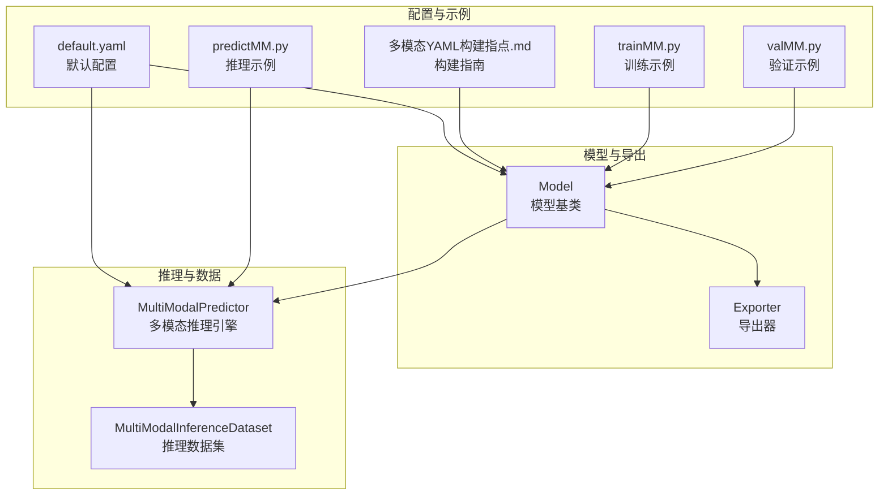
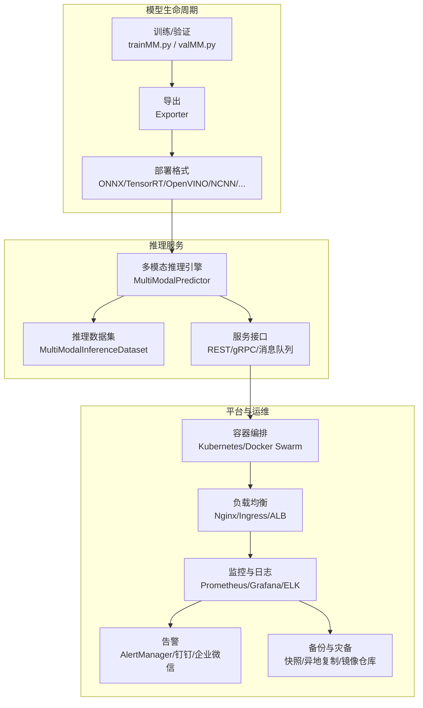
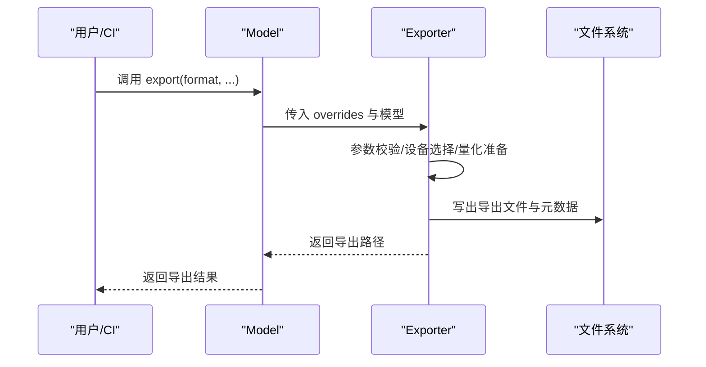
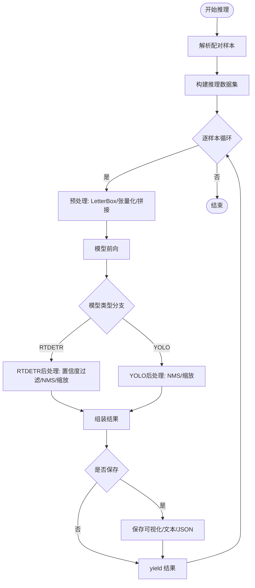
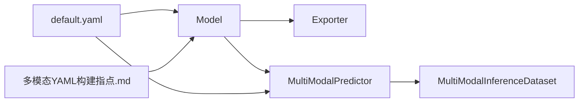

# 部署与运维

<cite>
**本文引用的文件**
- [ultralytics/__init__.py](file://ultralytics/__init__.py)
- [ultralytics/engine/exporter.py](file://ultralytics/engine/exporter.py)
- [ultralytics/engine/model.py](file://ultralytics/engine/model.py)
- [ultralytics/utils/__init__.py](file://ultralytics/utils/__init__.py)
- [ultralytics/engine/multimodal/predictor.py](file://ultralytics/engine/multimodal/predictor.py)
- [ultralytics/models/yolo/model.py](file://ultralytics/models/yolo/model.py)
- [ultralytics/models/rtdetrmm/model.py](file://ultralytics/models/rtdetrmm/model.py)
- [ultralytics/data/multimodal/inference_dataset.py](file://ultralytics/data/multimodal/inference_dataset.py)
- [ultralytics/cfg/default.yaml](file://ultralytics/cfg/default.yaml)
- [ultralytics/cfg/models/多模态YAML构建指点.md](file://ultralytics/cfg/models/多模态YAML构建指点.md)
- [trainMM.py](file://trainMM.py)
- [predictMM.py](file://predictMM.py)
- [valMM.py](file://valMM.py)
</cite>

## 目录
1. [简介](#简介)
2. [项目结构](#项目结构)
3. [核心组件](#核心组件)
4. [架构总览](#架构总览)
5. [详细组件分析](#详细组件分析)
6. [依赖关系分析](#依赖关系分析)
7. [性能考量](#性能考量)
8. [故障排查指南](#故障排查指南)
9. [结论](#结论)
10. [附录](#附录)

## 简介
本指南面向生产环境的多模态检测系统部署与运维，围绕模型导出、容器化部署、负载均衡与高可用、性能监控、故障恢复、版本管理与升级迁移、安全加固与访问控制等方面，结合代码库中的导出器、推理引擎、配置体系与示例脚本，提供可操作的策略与最佳实践。

## 项目结构
- 模型与导出
  - 导出器负责将训练好的模型导出为多种部署格式（ONNX、TensorRT、OpenVINO、NCNN、CoreML 等），并提供参数校验、设备选择、量化与简化等能力。
  - 模型基类统一了训练、验证、预测、导出、基准测试等生命周期方法。
- 推理与数据
  - 多模态推理引擎独立于通用预测器，支持真正的流式推理，内置 RT-DETR 与 YOLO 后处理分支，自动处理 letterbox、NMS、坐标还原等。
  - 多模态推理数据集负责严格校验与预处理，支持单模态零填充、通道一致性与空间对齐。
- 配置与示例
  - 默认配置文件提供训练、验证、预测、导出等关键参数；多模态 YAML 指南明确了“配置驱动 + 第五字段路由”的构建范式。
  - 示例脚本展示了训练、推理与验证的典型用法。

**图示来源**
- [ultralytics/engine/exporter.py](file://ultralytics/engine/exporter.py)
- [ultralytics/engine/model.py](file://ultralytics/engine/model.py)
- [ultralytics/engine/multimodal/predictor.py](file://ultralytics/engine/multimodal/predictor.py)
- [ultralytics/data/multimodal/inference_dataset.py](file://ultralytics/data/multimodal/inference_dataset.py)
- [ultralytics/cfg/default.yaml](file://ultralytics/cfg/default.yaml)
- [ultralytics/cfg/models/多模态YAML构建指点.md](file://ultralytics/cfg/models/多模态YAML构建指点.md)
- [trainMM.py](file://trainMM.py)
- [predictMM.py](file://predictMM.py)
- [valMM.py](file://valMM.py)

**章节来源**
- [ultralytics/engine/exporter.py](file://ultralytics/engine/exporter.py)
- [ultralytics/engine/model.py](file://ultralytics/engine/model.py)
- [ultralytics/engine/multimodal/predictor.py](file://ultralytics/engine/multimodal/predictor.py)
- [ultralytics/data/multimodal/inference_dataset.py](file://ultralytics/data/multimodal/inference_dataset.py)
- [ultralytics/cfg/default.yaml](file://ultralytics/cfg/default.yaml)
- [ultralytics/cfg/models/多模态YAML构建指点.md](file://ultralytics/cfg/models/多模态YAML构建指点.md)
- [trainMM.py](file://trainMM.py)
- [predictMM.py](file://predictMM.py)
- [valMM.py](file://valMM.py)

## 核心组件
- 导出器（Exporter）
  - 支持格式：TorchScript、ONNX、OpenVINO、TensorRT、CoreML、SavedModel、GraphDef、TFLite、Edge TPU、TF.js、PaddlePaddle、MNN、NCNN、IMX、RKNN。
  - 参数校验、设备选择、INT8 校准、NMS 与简化、元数据写入等。
- 模型基类（Model）
  - 统一训练、验证、预测、导出、基准测试入口；支持 HUB 与 Triton Server 模型加载；提供 info/fuse/save 等实用方法。
- 多模态推理引擎（MultiModalPredictor）
  - 独立于通用预测器；支持流式推理；自动区分 RTDETR 与 YOLO 后处理；支持 debug 日志与结果保存。
- 多模态推理数据集（MultiModalInferenceDataset）
  - 严格校验与预处理；支持单模态零填充；通道一致性与空间对齐；支持多种 X 模态格式（npy、npz、tiff、通用图像）。
- 配置体系（default.yaml）
  - 提供训练、验证、预测、导出等关键参数；包含多模态扩展参数（如 modality、use_multimodal_aug、mm_async_geo_* 等）。
- 多模态 YAML 构建指南
  - 明确“第五字段路由”（RGB/X/Dual）与分支书写规范；提供早期/中期/晚期融合模板；强调 Xch 与数据配置的协同。

**章节来源**
- [ultralytics/engine/exporter.py](file://ultralytics/engine/exporter.py)
- [ultralytics/engine/model.py](file://ultralytics/engine/model.py)
- [ultralytics/engine/multimodal/predictor.py](file://ultralytics/engine/multimodal/predictor.py)
- [ultralytics/data/multimodal/inference_dataset.py](file://ultralytics/data/multimodal/inference_dataset.py)
- [ultralytics/cfg/default.yaml](file://ultralytics/cfg/default.yaml)
- [ultralytics/cfg/models/多模态YAML构建指点.md](file://ultralytics/cfg/models/多模态YAML构建指点.md)

## 架构总览
多模态检测系统在生产环境的部署与运维应遵循“模型导出—容器化—服务编排—监控告警—故障恢复—版本管理”的闭环。

**图示来源**
- [ultralytics/engine/exporter.py](file://ultralytics/engine/exporter.py)
- [ultralytics/engine/multimodal/predictor.py](file://ultralytics/engine/multimodal/predictor.py)
- [ultralytics/data/multimodal/inference_dataset.py](file://ultralytics/data/multimodal/inference_dataset.py)
- [trainMM.py](file://trainMM.py)
- [valMM.py](file://valMM.py)

## 详细组件分析

### 组件A：模型导出与部署格式选择
- 导出器职责
  - 格式支持与参数校验、设备与精度选择（半精度/整型）、INT8 校准数据集构建、NMS 与模型简化、元数据写入。
  - 针对不同硬件（Intel、ARM64、Jetson、Rockchip）与运行时（OpenVINO、TensorRT、NCNN、CoreML）提供优化建议与兼容性检查。
- 生产建议
  - CPU 推理优先考虑 OpenVINO；GPU 推理优先考虑 TensorRT；移动端优先考虑 NCNN/TFLite；边缘侧可考虑 ONNX + TensorRT。
  - 导出时启用 simplify 与动态轴（如需），并记录导出参数与版本信息以便回溯。

**图示来源**
- [ultralytics/engine/model.py](file://ultralytics/engine/model.py)
- [ultralytics/engine/exporter.py](file://ultralytics/engine/exporter.py)

**章节来源**
- [ultralytics/engine/exporter.py](file://ultralytics/engine/exporter.py)
- [ultralytics/engine/model.py](file://ultralytics/engine/model.py)

### 组件B：多模态推理引擎与数据集
- 推理引擎
  - 支持真正的流式推理（边迭代边 yield）；自动识别 RTDETR 与 YOLO 输出格式；统一 NMS、坐标还原与结果封装；支持 debug 日志与结果保存。
- 推理数据集
  - 严格校验输入文件存在性与可读性；支持单模态零填充；X 通道数与空间对齐；支持多种 X 模态格式（npy/npz/tiff/通用图像）。
- 生产建议
  - 使用 LetterBox 保持 letterbox 尺寸一致；在 CPU/GPU 上分别设置 device；合理设置 conf/iou/max_det；开启 debug 仅限排障阶段。

**图示来源**
- [ultralytics/engine/multimodal/predictor.py](file://ultralytics/engine/multimodal/predictor.py)
- [ultralytics/data/multimodal/inference_dataset.py](file://ultralytics/data/multimodal/inference_dataset.py)

**章节来源**
- [ultralytics/engine/multimodal/predictor.py](file://ultralytics/engine/multimodal/predictor.py)
- [ultralytics/data/multimodal/inference_dataset.py](file://ultralytics/data/multimodal/inference_dataset.py)

### 组件C：配置与多模态 YAML 构建
- 默认配置
  - 提供训练、验证、预测、导出的关键参数；包含多模态扩展参数（如 modality、use_multimodal_aug、mm_async_geo_* 等）。
- YAML 构建指南
  - 明确“第五字段路由”（RGB/X/Dual）；分支书写规范；早期/中期/晚期融合模板；Xch 与数据配置协同；常见问题排查与最小可用清单。
- 生产建议
  - 使用 data.yaml 的 modality_used/modality/Xch 与 YAML 第五字段保持一致；profile=True 检查路由与形状；遵循最小可用清单逐步上线。

**章节来源**
- [ultralytics/cfg/default.yaml](file://ultralytics/cfg/default.yaml)
- [ultralytics/cfg/models/多模态YAML构建指点.md](file://ultralytics/cfg/models/多模态YAML构建指点.md)

### 组件D：示例脚本与工作流
- 训练示例（trainMM.py）
  - 展示 YOLOMM 训练的基本调用方式，包含数据路径、轮数、批次、项目与实验名等。
- 推理示例（predictMM.py）
  - 展示双模态与单模态推理，支持 debug、保存结果与命名空间组织。
- 验证示例（valMM.py）
  - 展示验证流程，包含设备选择与项目/实验命名。
- 生产建议
  - 将示例脚本改造为参数化与日志化；在 CI/CD 中集成导出与基准测试；使用项目/实验名进行结果归档与对比。

**章节来源**
- [trainMM.py](file://trainMM.py)
- [predictMM.py](file://predictMM.py)
- [valMM.py](file://valMM.py)

## 依赖关系分析
- 模块耦合与内聚
  - 导出器与模型基类解耦，通过统一接口完成导出；推理引擎与数据集解耦，便于替换与扩展。
  - 配置体系贯穿训练、验证、预测、导出全流程，形成强内聚的参数中心。
- 外部依赖与集成点
  - 导出器依赖各格式运行时（OpenVINO、TensorRT、NCNN 等）与量化库（NNCF）。
  - 推理引擎依赖 OpenCV、torchvision NMS、LetterBox 等工具。
- 循环依赖
  - 代码库未发现循环依赖；推理引擎与数据集通过接口解耦。

**图示来源**
- [ultralytics/engine/model.py](file://ultralytics/engine/model.py)
- [ultralytics/engine/exporter.py](file://ultralytics/engine/exporter.py)
- [ultralytics/engine/multimodal/predictor.py](file://ultralytics/engine/multimodal/predictor.py)
- [ultralytics/data/multimodal/inference_dataset.py](file://ultralytics/data/multimodal/inference_dataset.py)
- [ultralytics/cfg/default.yaml](file://ultralytics/cfg/default.yaml)
- [ultralytics/cfg/models/多模态YAML构建指点.md](file://ultralytics/cfg/models/多模态YAML构建指点.md)

**章节来源**
- [ultralytics/engine/model.py](file://ultralytics/engine/model.py)
- [ultralytics/engine/exporter.py](file://ultralytics/engine/exporter.py)
- [ultralytics/engine/multimodal/predictor.py](file://ultralytics/engine/multimodal/predictor.py)
- [ultralytics/data/multimodal/inference_dataset.py](file://ultralytics/data/multimodal/inference_dataset.py)
- [ultralytics/cfg/default.yaml](file://ultralytics/cfg/default.yaml)
- [ultralytics/cfg/models/多模态YAML构建指点.md](file://ultralytics/cfg/models/多模态YAML构建指点.md)

## 性能考量
- 导出与运行时优化
  - 优先选择与硬件匹配的导出格式；TensorRT/NCNN/OpenVINO 提供推理加速；ONNX 可结合 onnxslim 简化图结构。
  - INT8 校准数据集需覆盖典型场景；NMS 与动态轴按需启用。
- 推理性能
  - LetterBox 尺寸与模型输入一致；合理设置 conf/iou/max_det；在 CPU/GPU 上分别选择合适 device。
  - 使用流式推理减少内存占用；批量推理时注意批大小与并发度平衡。
- 基准与监控
  - 使用 benchmark 评估不同格式性能；结合 Prometheus/Grafana 监控吞吐、延迟与资源使用。

[本节为通用指导，无需特定文件引用]

## 故障排查指南
- 导出失败
  - 检查格式支持与依赖安装；核对设备与精度参数；确认 INT8 校准数据集与数据路径。
- 推理异常
  - 检查 RGB/X 文件存在性与可读性；核对 Xch 与数据配置；确认 LetterBox 尺寸与模型一致。
  - 使用 debug 参数输出中间张量形状与 NMS 前后框数量，定位后处理问题。
- 验证指标异常
  - RT-DETR 默认按方形输入假设缩放 bbox，rect 默认关闭；如需 rect 提速需显式开启并评估影响。

**章节来源**
- [ultralytics/engine/exporter.py](file://ultralytics/engine/exporter.py)
- [ultralytics/engine/multimodal/predictor.py](file://ultralytics/engine/multimodal/predictor.py)
- [ultralytics/data/multimodal/inference_dataset.py](file://ultralytics/data/multimodal/inference_dataset.py)
- [ultralytics/models/rtdetrmm/model.py](file://ultralytics/models/rtdetrmm/model.py)

## 结论
通过将导出器、推理引擎、数据集与配置体系有机结合，多模态检测系统可在生产环境中实现高效、稳定与可维护的部署与运维。建议以“格式选择—容器化—服务编排—监控告警—故障恢复—版本管理”为主线，持续优化性能与可靠性。

[本节为总结，无需特定文件引用]

## 附录

### A. 生产环境部署策略
- 模型导出
  - 依据硬件与运行时选择最优格式；启用 simplify 与动态轴；记录导出参数与版本。
- 容器化部署
  - 使用官方或社区提供的运行时镜像；将导出模型与配置打包进镜像；暴露 REST/gRPC 接口。
- 负载均衡与高可用
  - 使用 Nginx/Ingress/ALB 做流量分发；多副本部署；健康检查与自动扩缩容；持久化存储与配置管理。
- 性能监控
  - 指标采集：吞吐、延迟、资源使用；日志：结构化日志与审计日志；告警：阈值与聚合策略；分析：热点与瓶颈定位。
- 故障恢复
  - 自动重启与健康检查；数据备份与快照；灾难恢复演练；应急响应流程与角色分工。
- 版本管理与升级迁移
  - 语义化版本与变更日志；灰度发布与回滚；迁移脚本与兼容性检查；蓝绿/金丝雀发布策略。
- 安全加固与访问控制
  - 最小权限原则；网络隔离与加密传输；认证与授权；敏感信息加密与密钥轮换；定期安全扫描与渗透测试。

[本节为通用指导，无需特定文件引用]