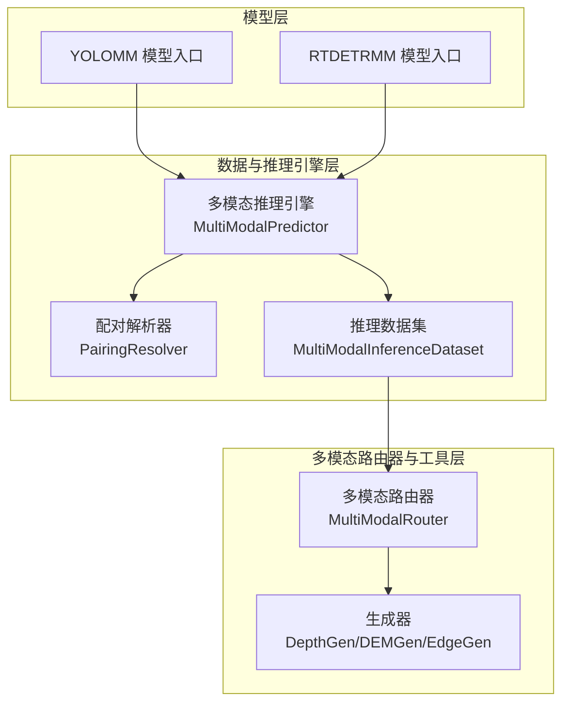
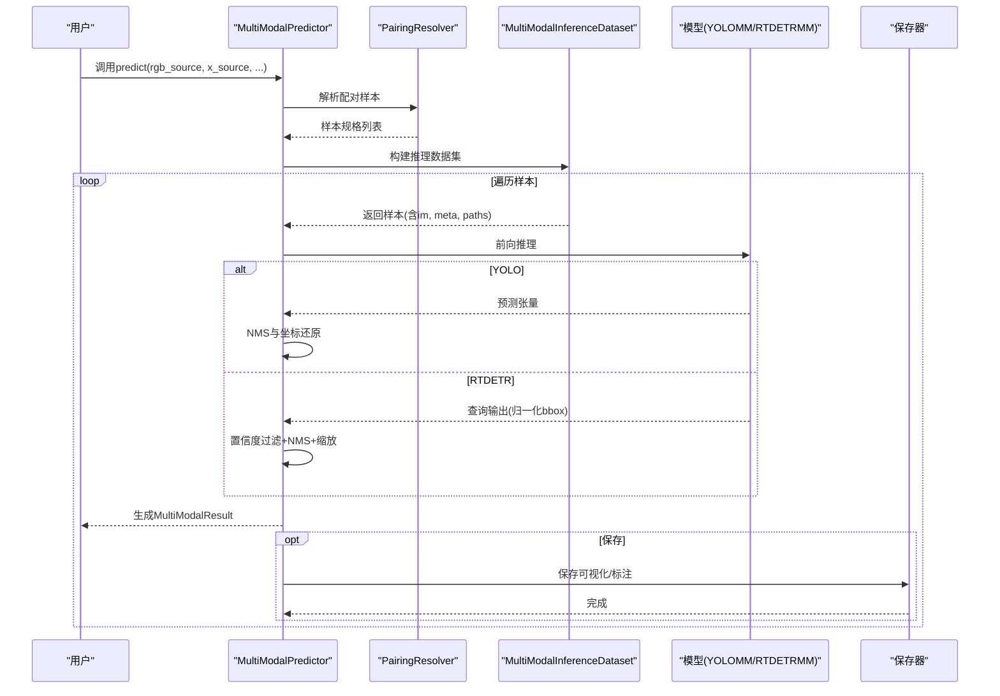
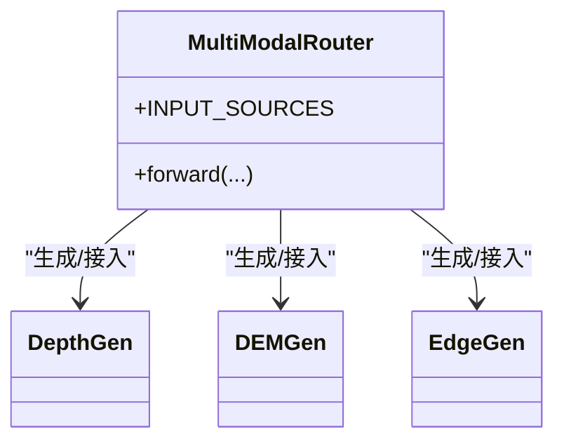
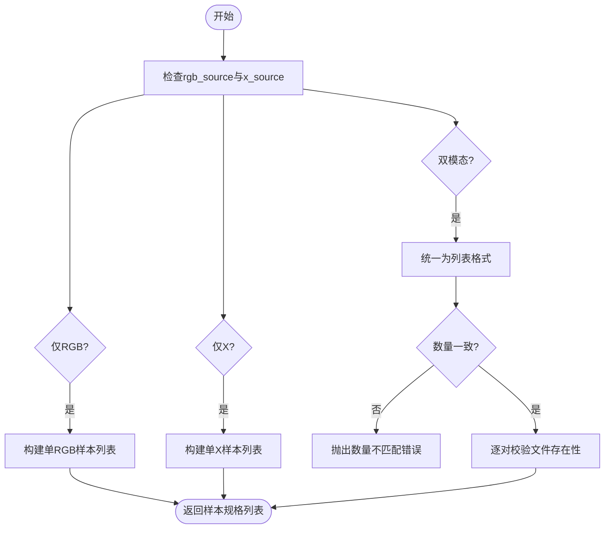
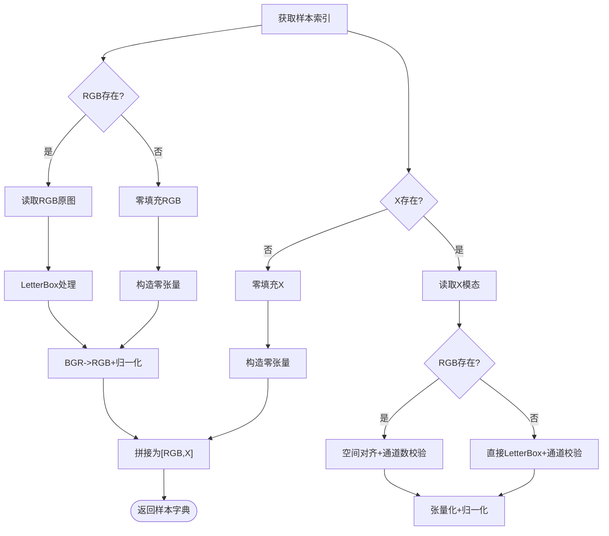
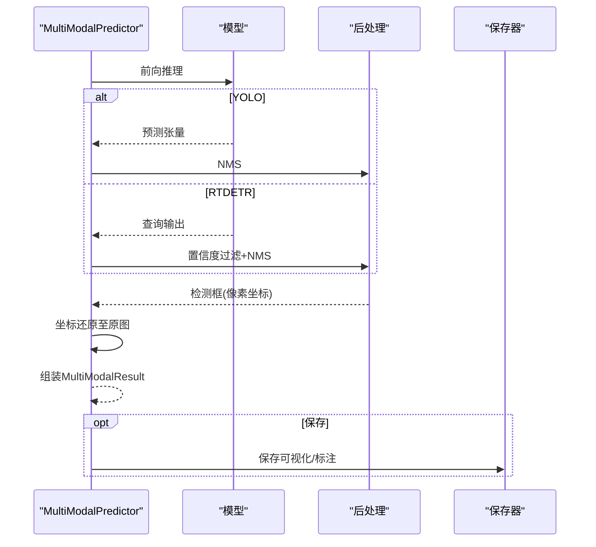
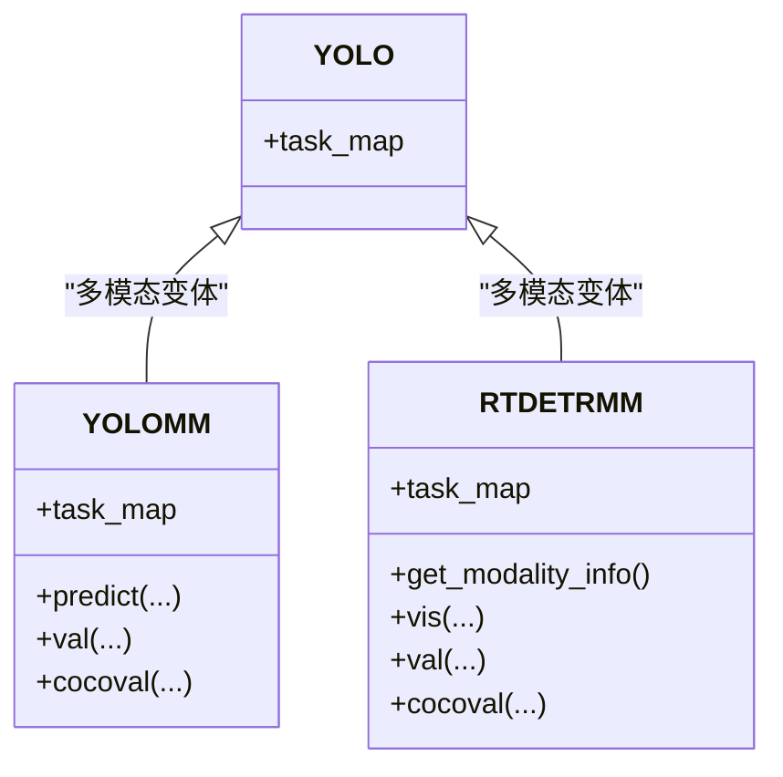
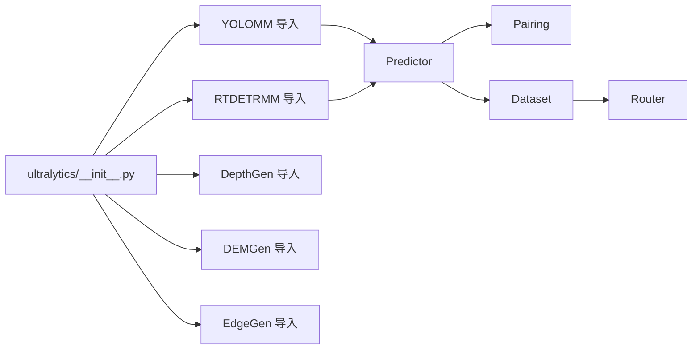

# 应用场景与价值

<cite>
**本文引用的文件**
- [ultralytics/__init__.py](file://ultralytics/__init__.py)
- [ultralytics/models/rtdetrmm/model.py](file://ultralytics/models/rtdetrmm/model.py)
- [ultralytics/engine/multimodal/predictor.py](file://ultralytics/engine/multimodal/predictor.py)
- [ultralytics/data/multimodal/pairing.py](file://ultralytics/data/multimodal/pairing.py)
- [ultralytics/data/multimodal/inference_dataset.py](file://ultralytics/data/multimodal/inference_dataset.py)
- [ultralytics/models/yolo/model.py](file://ultralytics/models/yolo/model.py)
- [ultralytics/nn/mm/__init__.py](file://ultralytics/nn/mm/__init__.py)
- [ResTest/aifi-dattention-CSP-MutilScaleEdgeInformationEnhance-ASF-P2-lite/results.csv](file://ResTest/aifi-dattention-CSP-MutilScaleEdgeInformationEnhance-ASF-P2-lite/results.csv)
- [predictMM.py](file://predictMM.py)
- [valCOCO.py](file://valCOCO.py)
</cite>

## 目录
1. [简介](#简介)
2. [项目结构](#项目结构)
3. [核心组件](#核心组件)
4. [架构总览](#架构总览)
5. [详细组件分析](#详细组件分析)
6. [依赖关系分析](#依赖关系分析)
7. [性能考量](#性能考量)
8. [故障排查指南](#故障排查指南)
9. [结论](#结论)
10. [附录](#附录)

## 简介
本项目围绕“多模态目标检测”展开，通过统一的RGB+X（如热红外、深度、LiDAR等）输入，结合可配置的多模态路由器与推理引擎，实现跨模态融合与推理。项目不仅提供完整的训练、验证与推理管线，还提供了丰富的实验结果与可视化能力，便于在不同领域落地应用。

多模态融合相较单模态检测具有以下优势：
- 提高检测精度：利用互补模态信息（如热成像中的温度差异）增强弱光、遮挡、复杂背景下的目标识别。
- 增强鲁棒性：在单一模态失效（如夜间、烟雾、强光）时，另一模态仍可提供有效线索。
- 扩大适用范围：覆盖可见光不可用或效果差的场景，显著提升系统在真实环境中的稳定性与泛化能力。

## 项目结构
项目采用模块化组织，核心分为三层：
- 模型层：YOLOMM/RTDETRMM等多模态模型入口，负责任务映射与推理调度。
- 数据与推理引擎层：多模态配对解析、推理数据集构建、流式推理执行。
- 多模态路由器与工具层：统一的RGB+X数据路由、配置解析与生成器（Depth/DEM/Edge）。

图表来源
- [ultralytics/models/yolo/model.py](file://ultralytics/models/yolo/model.py)
- [ultralytics/models/rtdetrmm/model.py](file://ultralytics/models/rtdetrmm/model.py)
- [ultralytics/engine/multimodal/predictor.py](file://ultralytics/engine/multimodal/predictor.py)
- [ultralytics/data/multimodal/pairing.py](file://ultralytics/data/multimodal/pairing.py)
- [ultralytics/data/multimodal/inference_dataset.py](file://ultralytics/data/multimodal/inference_dataset.py)
- [ultralytics/nn/mm/__init__.py](file://ultralytics/nn/mm/__init__.py)

章节来源
- [ultralytics/__init__.py](file://ultralytics/__init__.py)
- [ultralytics/models/yolo/model.py](file://ultralytics/models/yolo/model.py)
- [ultralytics/models/rtdetrmm/model.py](file://ultralytics/models/rtdetrmm/model.py)
- [ultralytics/engine/multimodal/predictor.py](file://ultralytics/engine/multimodal/predictor.py)
- [ultralytics/data/multimodal/pairing.py](file://ultralytics/data/multimodal/pairing.py)
- [ultralytics/data/multimodal/inference_dataset.py](file://ultralytics/data/multimodal/inference_dataset.py)
- [ultralytics/nn/mm/__init__.py](file://ultralytics/nn/mm/__init__.py)

## 核心组件
- 多模态路由器（MultiModalRouter）：负责RGB与X模态的通道级路由与拼接，支持零拷贝视图、配置驱动的数据流与线程安全缓存。
- 配对解析器（PairingResolver）：显式解析RGB与X模态输入，支持单模态与双模态推理，严格校验文件存在性与数量一致性。
- 推理数据集（MultiModalInferenceDataset）：加载与预处理RGB/X图像，进行空间对齐与通道数校验，统一LetterBox与张量化流程。
- 多模态推理引擎（MultiModalPredictor）：统一执行推理、后处理（YOLO/NMS或RTDETR专用流程）、坐标还原与结果封装，支持真正的流式推理。
- 模型入口（YOLOMM/RTDETRMM）：自动识别多模态结构，配置输入通道与可用模态集合，提供验证与COCO指标评估入口。

章节来源
- [ultralytics/nn/mm/__init__.py](file://ultralytics/nn/mm/__init__.py)
- [ultralytics/data/multimodal/pairing.py](file://ultralytics/data/multimodal/pairing.py)
- [ultralytics/data/multimodal/inference_dataset.py](file://ultralytics/data/multimodal/inference_dataset.py)
- [ultralytics/engine/multimodal/predictor.py](file://ultralytics/engine/multimodal/predictor.py)
- [ultralytics/models/rtdetrmm/model.py](file://ultralytics/models/rtdetrmm/model.py)

## 架构总览
多模态目标检测系统的关键流程如下：
- 输入阶段：显式提供RGB与X模态路径，解析为配对样本。
- 数据阶段：加载图像、空间对齐、通道校验、LetterBox与张量化，拼接为[RGB,X]输入张量。
- 推理阶段：模型前向得到预测，YOLO使用NMS后处理，RTDETR使用专用后处理与NMS。
- 结果阶段：坐标还原至原图尺寸，封装为多模态结果并可选保存。

图表来源
- [ultralytics/engine/multimodal/predictor.py](file://ultralytics/engine/multimodal/predictor.py)
- [ultralytics/data/multimodal/pairing.py](file://ultralytics/data/multimodal/pairing.py)
- [ultralytics/data/multimodal/inference_dataset.py](file://ultralytics/data/multimodal/inference_dataset.py)
- [ultralytics/models/rtdetrmm/model.py](file://ultralytics/models/rtdetrmm/model.py)

## 详细组件分析

### 多模态路由器与生成器
- 多模态路由器提供统一的RGB+X数据路由，支持零拷贝视图与配置驱动的数据流，适用于YOLO与RTDETR两类架构。
- 生成器模块提供Depth/DEM/Edge等常见X模态的生成与接入能力，简化多模态数据准备流程。

图表来源
- [ultralytics/nn/mm/__init__.py](file://ultralytics/nn/mm/__init__.py)

章节来源
- [ultralytics/nn/mm/__init__.py](file://ultralytics/nn/mm/__init__.py)

### 配对解析器（PairingResolver）
- 职责：接收显式RGB与X输入，校验合法性与数量一致性，生成统一样本规格。
- 特性：支持单模态与双模态推理，严格文件存在性与类型校验，生成样本ID与模态类型。

图表来源
- [ultralytics/data/multimodal/pairing.py](file://ultralytics/data/multimodal/pairing.py)

章节来源
- [ultralytics/data/multimodal/pairing.py](file://ultralytics/data/multimodal/pairing.py)

### 推理数据集（MultiModalInferenceDataset）
- 职责：加载RGB/X图像，进行LetterBox与张量化，严格校验X通道数与空间对齐，支持单模态零填充。
- 特性：支持多种X模态文件格式（如npy/npz/tiff），自动选择加载方式并进行通道数校验。

图表来源
- [ultralytics/data/multimodal/inference_dataset.py](file://ultralytics/data/multimodal/inference_dataset.py)

章节来源
- [ultralytics/data/multimodal/inference_dataset.py](file://ultralytics/data/multimodal/inference_dataset.py)

### 多模态推理引擎（MultiModalPredictor）
- 职责：从模型读取Router配置，构建数据集，执行前向、后处理（YOLO或RTDETR）、坐标还原与结果封装，支持流式推理。
- 特性：区分模型类型，YOLO使用NMS，RTDETR使用置信度过滤+NMS+缩放，支持调试日志与结果保存。

图表来源
- [ultralytics/engine/multimodal/predictor.py](file://ultralytics/engine/multimodal/predictor.py)

章节来源
- [ultralytics/engine/multimodal/predictor.py](file://ultralytics/engine/multimodal/predictor.py)

### 模型入口（YOLOMM/RTDETRMM）
- YOLOMM：在模型文件名包含"-mm"时自动切换到多模态模型，提供统一的任务映射与推理接口。
- RTDETRMM：独立的多模态RT-DETR家族，Fail-Fast识别多模态结构，解析YAML配置，确保mm_router可用，提供验证与COCO评估入口。

图表来源
- [ultralytics/models/yolo/model.py](file://ultralytics/models/yolo/model.py)
- [ultralytics/models/rtdetrmm/model.py](file://ultralytics/models/rtdetrmm/model.py)

章节来源
- [ultralytics/models/yolo/model.py](file://ultralytics/models/yolo/model.py)
- [ultralytics/models/rtdetrmm/model.py](file://ultralytics/models/rtdetrmm/model.py)

## 依赖关系分析
- 模块导出：项目通过主入口条件导入YOLOMM/RTDETRMM与多模态生成器，未安装时保持降级可用。
- 模型依赖：YOLOMM/RTDETRMM分别依赖各自的预测器、验证器与检测模型，推理引擎通过Router与数据集协作。
- 数据依赖：推理引擎依赖配对解析器与推理数据集，后者依赖预处理工具与LetterBox。

图表来源
- [ultralytics/__init__.py](file://ultralytics/__init__.py)
- [ultralytics/engine/multimodal/predictor.py](file://ultralytics/engine/multimodal/predictor.py)
- [ultralytics/data/multimodal/pairing.py](file://ultralytics/data/multimodal/pairing.py)
- [ultralytics/data/multimodal/inference_dataset.py](file://ultralytics/data/multimodal/inference_dataset.py)
- [ultralytics/nn/mm/__init__.py](file://ultralytics/nn/mm/__init__.py)

章节来源
- [ultralytics/__init__.py](file://ultralytics/__init__.py)

## 性能考量
- 训练曲线与指标：实验结果文件展示了训练过程中的损失与mAP指标变化趋势，可用于评估收敛速度与最终性能。例如某变体在多轮训练后，mAP指标逐步提升，表明模型具备良好的学习能力与稳定性。
- 推理效率：推理引擎支持真正的流式推理，边迭代边产出结果，适合视频流或大规模数据批处理场景。
- 模型类型差异：RTDETR与YOLO在后处理上存在差异（RTDETR使用查询输出与NMS，YOLO使用NMS），需根据具体模型类型选择合适的后处理路径。

章节来源
- [ResTest/aifi-dattention-CSP-MutilScaleEdgeInformationEnhance-ASF-P2-lite/results.csv](file://ResTest/aifi-dattention-CSP-MutilScaleEdgeInformationEnhance-ASF-P2-lite/results.csv)
- [ultralytics/engine/multimodal/predictor.py](file://ultralytics/engine/multimodal/predictor.py)

## 故障排查指南
- 输入路径与文件存在性：若出现“文件不存在”或“路径不是文件”的错误，应检查RGB与X模态路径是否正确、文件是否存在且可读。
- 数量不匹配：当RGB与X模态数量不一致时，将抛出明确的错误提示，需确保二者数量相同。
- 通道数不一致：X模态通道数需与Router配置一致，否则会报通道数不匹配错误。
- 设备与精度：推理时需确保设备可用与精度设置合理（如半精度），避免CUDA相关错误。
- 保存路径：保存结果时需确保保存目录存在且可写，避免IO错误。

章节来源
- [ultralytics/data/multimodal/pairing.py](file://ultralytics/data/multimodal/pairing.py)
- [ultralytics/data/multimodal/inference_dataset.py](file://ultralytics/data/multimodal/inference_dataset.py)
- [ultralytics/engine/multimodal/predictor.py](file://ultralytics/engine/multimodal/predictor.py)

## 结论
本项目通过统一的多模态路由器与推理引擎，实现了RGB+X模态的灵活组合与高效推理，具备良好的扩展性与工程化能力。多模态融合在复杂环境下显著提升了检测精度与鲁棒性，适合在工业、安防、交通与地理信息等领域进行规模化部署。配套的实验结果与COCO评估入口，有助于快速验证模型性能并指导调参优化。

## 附录
- 使用示例：提供多模态与单模态推理的参考示例脚本，便于快速上手。
- 验证入口：提供COCO指标评估入口，支持自定义数据集与评估参数。

章节来源
- [predictMM.py](file://predictMM.py)
- [valCOCO.py](file://valCOCO.py)