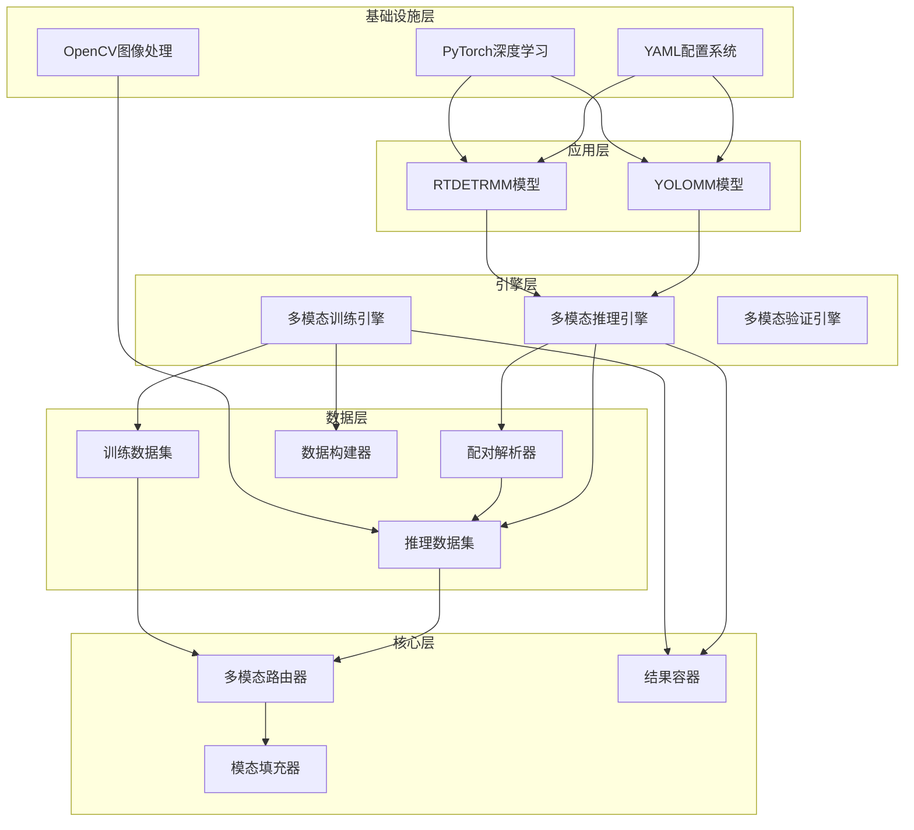
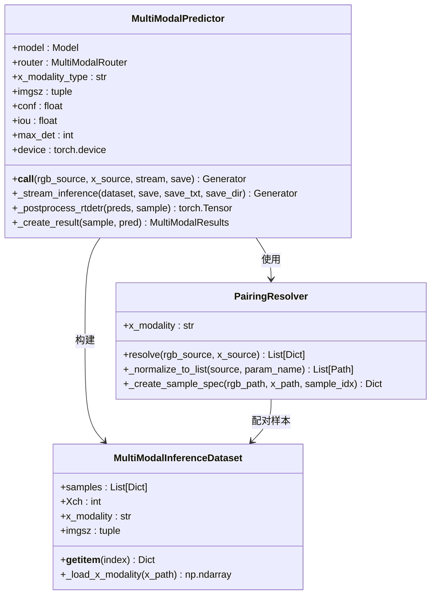
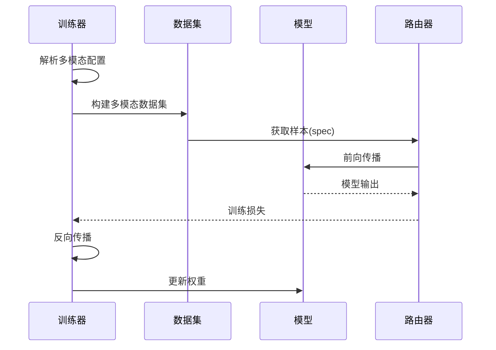
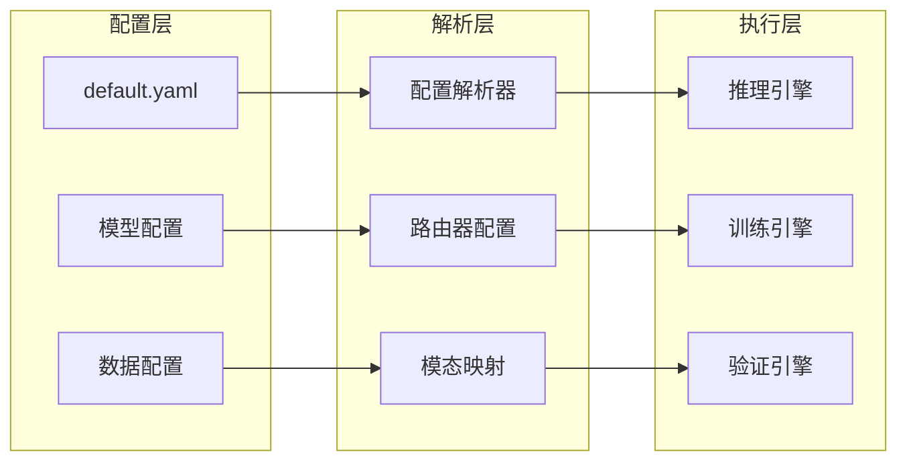
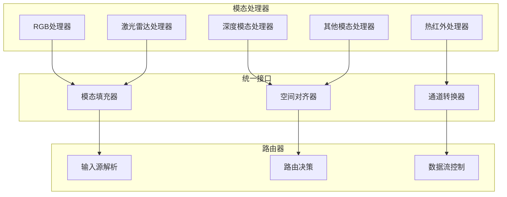
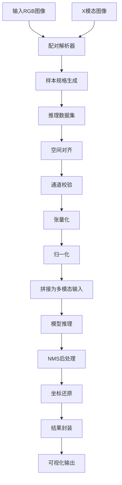
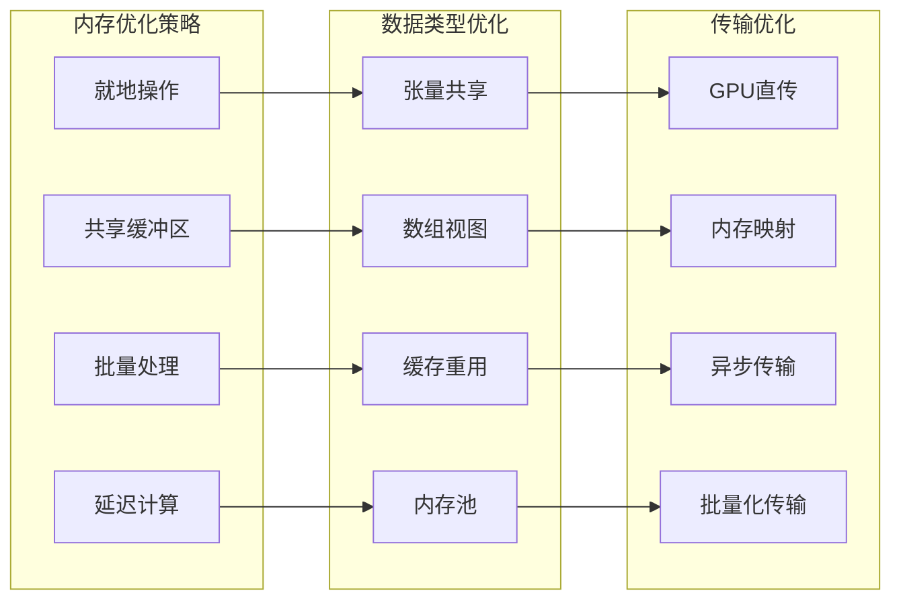
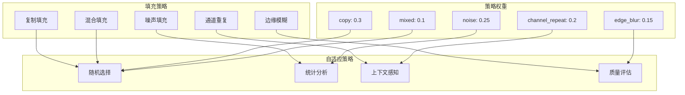
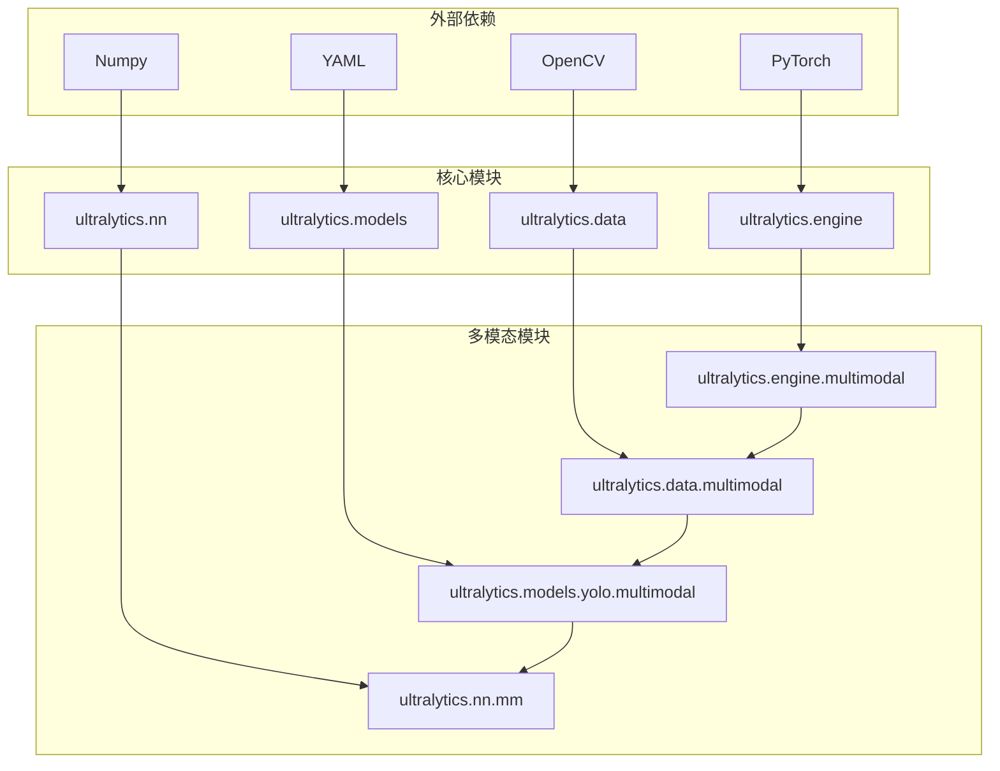

# 技术架构概览

<cite>
**本文档引用的文件**
- [ultralytics/__init__.py](file://ultralytics/__init__.py)
- [ultralytics/cfg/default.yaml](file://ultralytics/cfg/default.yaml)
- [ultralytics/data/multimodal/__init__.py](file://ultralytics/data/multimodal/__init__.py)
- [ultralytics/engine/multimodal/__init__.py](file://ultralytics/engine/multimodal/__init__.py)
- [ultralytics/models/yolo/multimodal/__init__.py](file://ultralytics/models/yolo/multimodal/__init__.py)
- [ultralytics/engine/multimodal/predictor.py](file://ultralytics/engine/multimodal/predictor.py)
- [ultralytics/data/multimodal/inference_dataset.py](file://ultralytics/data/multimodal/inference_dataset.py)
- [ultralytics/models/yolo/multimodal/train.py](file://ultralytics/models/yolo/multimodal/train.py)
- [ultralytics/data/multimodal/pairing.py](file://ultralytics/data/multimodal/pairing.py)
- [ultralytics/data/multimodal/utils.py](file://ultralytics/data/multimodal/utils.py)
- [ultralytics/engine/multimodal/results.py](file://ultralytics/engine/multimodal/results.py)
- [ultralytics/models/rtdetrmm/model.py](file://ultralytics/models/rtdetrmm/model.py)
- [ultralytics/data/build.py](file://ultralytics/data/build.py)
- [ultralytics/nn/mm/filling.py](file://ultralytics/nn/mm/filling.py)
</cite>

## 目录
1. [简介](#简介)
2. [项目结构](#项目结构)
3. [核心组件](#核心组件)
4. [架构概览](#架构概览)
5. [详细组件分析](#详细组件分析)
6. [依赖关系分析](#依赖关系分析)
7. [性能考虑](#性能考虑)
8. [故障排除指南](#故障排除指南)
9. [结论](#结论)

## 简介

本项目是一个基于Ultralytics框架的多模态目标检测系统，专门设计用于处理RGB与各种传感器模态（深度、热红外、激光雷达等）的联合目标检测任务。该系统采用模块化架构设计，通过配置驱动的方式实现灵活的多模态数据流处理，支持插件化的模态处理机制和零拷贝的数据传输优化。

系统的核心设计理念包括：
- **配置驱动架构**：通过YAML配置系统实现完全可配置的多模态处理流程
- **插件化模态处理**：支持任意模态类型的动态扩展和组合
- **零拷贝数据传输**：优化内存使用和数据传输效率
- **模块化组件设计**：清晰的职责分离和可重用的组件架构

## 项目结构

项目采用分层模块化组织结构，主要分为以下几个层次：

**图表来源**
- [ultralytics/__init__.py:12-85](file://ultralytics/__init__.py#L12-L85)
- [ultralytics/engine/multimodal/predictor.py:16-98](file://ultralytics/engine/multimodal/predictor.py#L16-L98)
- [ultralytics/data/multimodal/inference_dataset.py:16-89](file://ultralytics/data/multimodal/inference_dataset.py#L16-L89)

**章节来源**
- [ultralytics/__init__.py:12-85](file://ultralytics/__init__.py#L12-L85)
- [ultralytics/models/yolo/multimodal/__init__.py:32-77](file://ultralytics/models/yolo/multimodal/__init__.py#L32-L77)

## 核心组件

### 多模态推理引擎

MultiModalPredictor是系统的核心推理组件，实现了完全独立的多模态推理流程：

**图表来源**
- [ultralytics/engine/multimodal/predictor.py:16-494](file://ultralytics/engine/multimodal/predictor.py#L16-L494)
- [ultralytics/data/multimodal/pairing.py:11-203](file://ultralytics/data/multimodal/pairing.py#L11-L203)
- [ultralytics/data/multimodal/inference_dataset.py:16-252](file://ultralytics/data/multimodal/inference_dataset.py#L16-L252)

### 多模态训练系统

MultiModalDetectionTrainer提供了完整的多模态训练流程：

**图表来源**
- [ultralytics/models/yolo/multimodal/train.py:16-757](file://ultralytics/models/yolo/multimodal/train.py#L16-L757)
- [ultralytics/data/build.py:115-200](file://ultralytics/data/build.py#L115-L200)

**章节来源**
- [ultralytics/engine/multimodal/predictor.py:16-494](file://ultralytics/engine/multimodal/predictor.py#L16-L494)
- [ultralytics/models/yolo/multimodal/train.py:16-757](file://ultralytics/models/yolo/multimodal/train.py#L16-L757)

## 架构概览

系统采用分层架构设计，每层都有明确的职责和边界：

### 配置驱动架构

系统通过YAML配置系统实现完全可配置的多模态处理：

**图表来源**
- [ultralytics/cfg/default.yaml:134-168](file://ultralytics/cfg/default.yaml#L134-L168)
- [ultralytics/models/yolo/multimodal/train.py:109-263](file://ultralytics/models/yolo/multimodal/train.py#L109-L263)

### 插件化模态处理

系统支持任意模态类型的动态扩展：

**图表来源**
- [ultralytics/models/yolo/multimodal/__init__.py:90-92](file://ultralytics/models/yolo/multimodal/__init__.py#L90-L92)
- [ultralytics/nn/mm/filling.py:14-175](file://ultralytics/nn/mm/filling.py#L14-L175)

**章节来源**
- [ultralytics/cfg/default.yaml:134-168](file://ultralytics/cfg/default.yaml#L134-L168)
- [ultralytics/models/yolo/multimodal/__init__.py:90-116](file://ultralytics/models/yolo/multimodal/__init__.py#L90-L116)

## 详细组件分析

### 多模态数据流处理

系统实现了完整的多模态数据流处理管道：

**图表来源**
- [ultralytics/data/multimodal/pairing.py:37-125](file://ultralytics/data/multimodal/pairing.py#L37-L125)
- [ultralytics/data/multimodal/inference_dataset.py:94-183](file://ultralytics/data/multimodal/inference_dataset.py#L94-L183)

### 零拷贝数据传输机制

系统通过智能的数据处理策略实现零拷贝优化：

**图表来源**
- [ultralytics/data/multimodal/utils.py:130-179](file://ultralytics/data/multimodal/utils.py#L130-L179)
- [ultralytics/engine/multimodal/predictor.py:163-243](file://ultralytics/engine/multimodal/predictor.py#L163-L243)

**章节来源**
- [ultralytics/data/multimodal/utils.py:13-83](file://ultralytics/data/multimodal/utils.py#L13-L83)
- [ultralytics/engine/multimodal/predictor.py:163-243](file://ultralytics/engine/multimodal/predictor.py#L163-L243)

### 模态填充策略

系统提供了多种模态填充策略以处理缺失模态的情况：

**图表来源**
- [ultralytics/nn/mm/filling.py:21-49](file://ultralytics/nn/mm/filling.py#L21-L49)
- [ultralytics/nn/mm/filling.py:141-148](file://ultralytics/nn/mm/filling.py#L141-L148)

**章节来源**
- [ultralytics/nn/mm/filling.py:14-175](file://ultralytics/nn/mm/filling.py#L14-L175)

## 依赖关系分析

系统采用了清晰的依赖层次结构：

**图表来源**
- [ultralytics/__init__.py:12-85](file://ultralytics/__init__.py#L12-L85)
- [ultralytics/models/rtdetrmm/model.py:16-22](file://ultralytics/models/rtdetrmm/model.py#L16-L22)

**章节来源**
- [ultralytics/__init__.py:12-85](file://ultralytics/__init__.py#L12-L85)
- [ultralytics/models/rtdetrmm/model.py:25-57](file://ultralytics/models/rtdetrmm/model.py#L25-L57)

## 性能考虑

系统在多个层面进行了性能优化：

### 内存优化策略
- **零拷贝数据传输**：通过共享内存和就地操作减少数据复制
- **批量处理**：利用PyTorch的批处理能力提高GPU利用率
- **缓存机制**：合理使用内存缓存减少I/O操作

### 计算优化策略
- **异步处理**：支持异步几何扰动和模态增强
- **模型融合**：支持早期、中期和晚期融合策略
- **自适应推理**：根据模态类型选择最优推理路径

### 系统优化策略
- **模块化设计**：便于独立优化各个组件
- **配置驱动**：支持运行时参数调整
- **插件化架构**：便于扩展新的模态类型

## 故障排除指南

### 常见问题及解决方案

**模态配置错误**
- 检查YAML配置文件中的模态定义
- 验证模态路径映射的正确性
- 确认X模态通道数配置

**数据加载问题**
- 验证图像文件的完整性和可读性
- 检查空间对齐和通道转换
- 确认数据集构建参数

**推理性能问题**
- 检查设备配置和CUDA设置
- 验证批处理大小和内存使用
- 优化数据预处理流程

**章节来源**
- [ultralytics/engine/multimodal/predictor.py:66-68](file://ultralytics/engine/multimodal/predictor.py#L66-L68)
- [ultralytics/data/multimodal/inference_dataset.py:115-118](file://ultralytics/data/multimodal/inference_dataset.py#L115-L118)

## 结论

本多模态目标检测系统通过基于Ultralytics框架的扩展架构，实现了高度模块化和可配置的多模态处理能力。系统的核心优势包括：

1. **配置驱动的灵活性**：通过YAML配置系统实现完全可配置的多模态处理流程
2. **插件化的扩展性**：支持任意模态类型的动态扩展和组合
3. **零拷贝的性能优化**：通过智能的数据处理策略实现高效的内存使用
4. **模块化的架构设计**：清晰的职责分离和良好的可维护性

该系统为多模态目标检测任务提供了强大的基础设施，支持从基础的RGB单模态到复杂的多模态融合场景，为开发者提供了灵活而强大的技术平台。