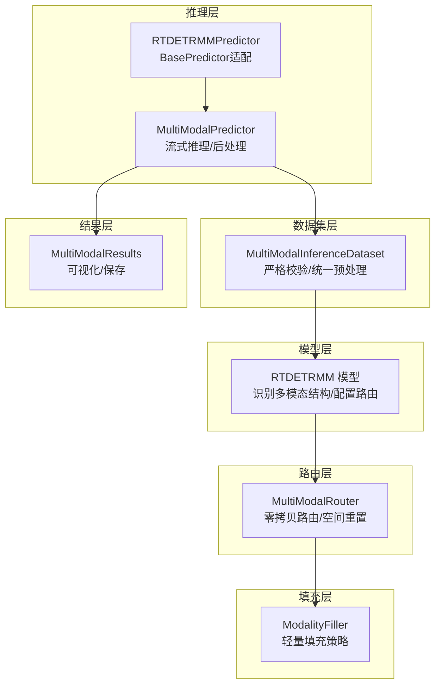
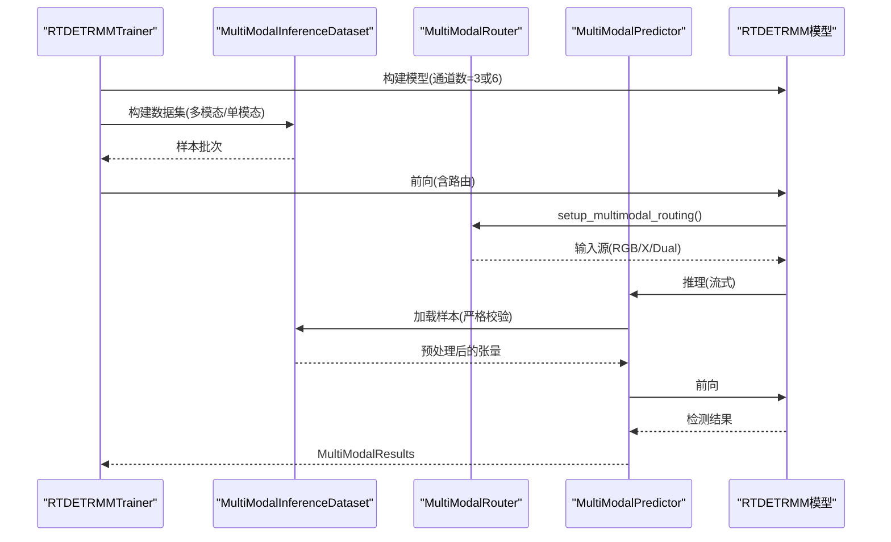
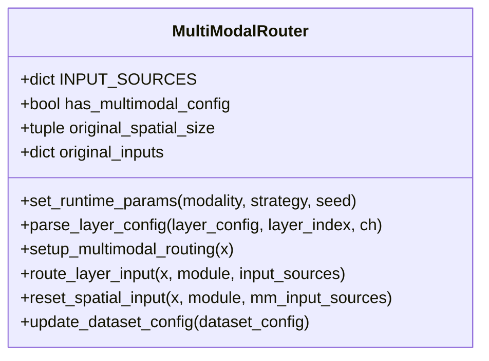
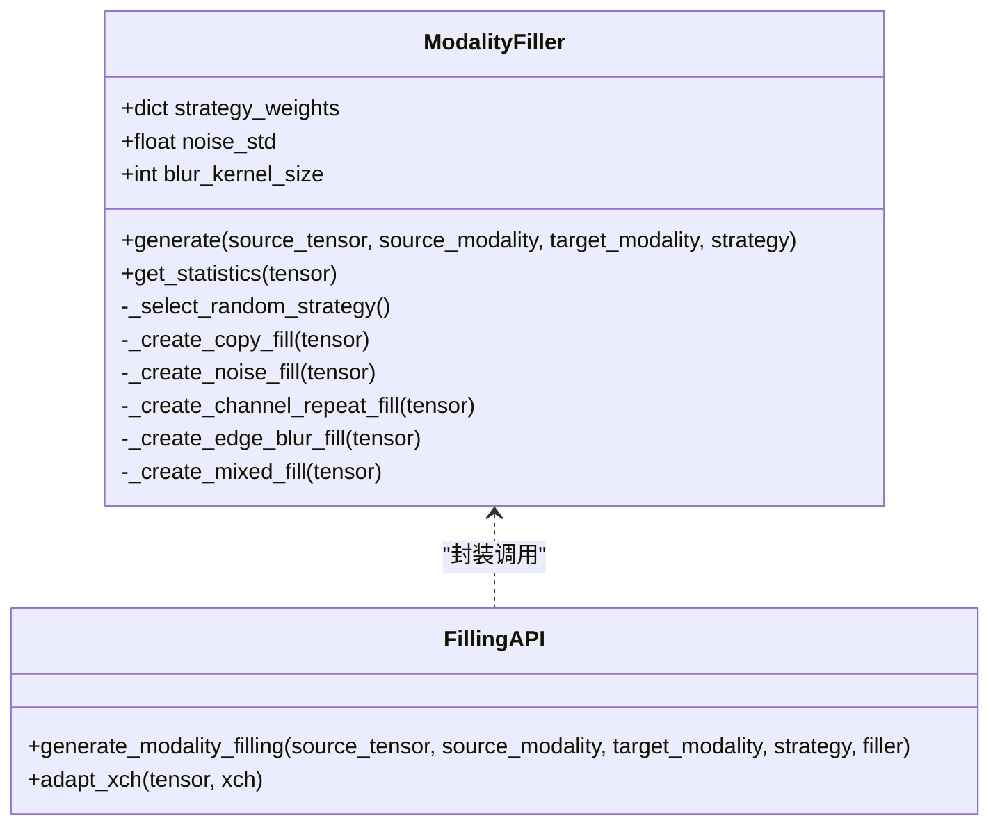
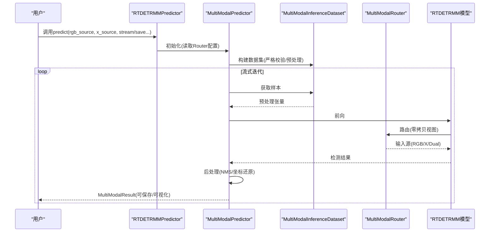
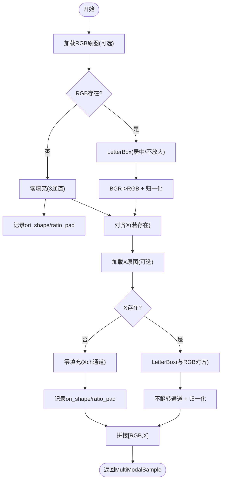
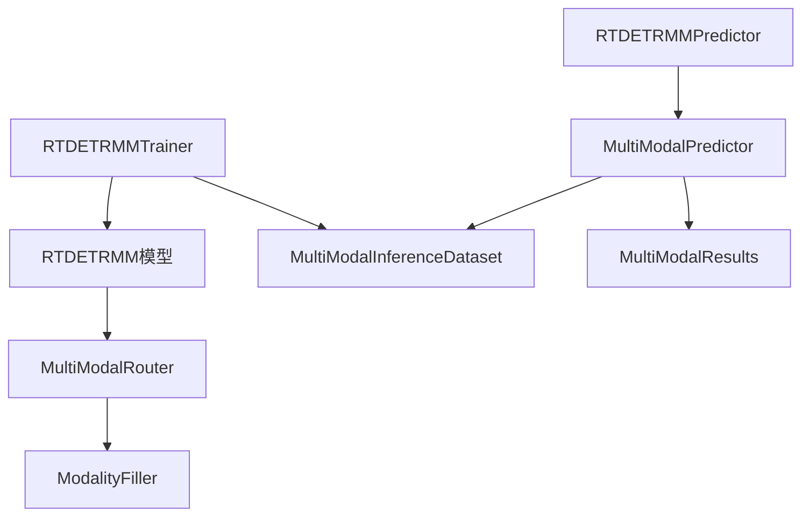

# 核心功能特性

<cite>
**本文档引用的文件**
- [ultralytics/models/rtdetrmm/model.py](file://ultralytics/models/rtdetrmm/model.py)
- [ultralytics/nn/mm/router.py](file://ultralytics/nn/mm/router.py)
- [ultralytics/nn/mm/filling.py](file://ultralytics/nn/mm/filling.py)
- [ultralytics/engine/multimodal/predictor.py](file://ultralytics/engine/multimodal/predictor.py)
- [ultralytics/engine/multimodal/results.py](file://ultralytics/engine/multimodal/results.py)
- [ultralytics/data/multimodal/inference_dataset.py](file://ultralytics/data/multimodal/inference_dataset.py)
- [ultralytics/models/rtdetrmm/mm_predictor.py](file://ultralytics/models/rtdetrmm/mm_predictor.py)
- [ultralytics/models/rtdetrmm/train.py](file://ultralytics/models/rtdetrmm/train.py)
</cite>

## 目录
1. [简介](#简介)
2. [项目结构](#项目结构)
3. [核心组件](#核心组件)
4. [架构总览](#架构总览)
5. [详细组件分析](#详细组件分析)
6. [依赖关系分析](#依赖关系分析)
7. [性能考量](#性能考量)
8. [故障排查指南](#故障排查指南)
9. [结论](#结论)
10. [附录](#附录)

## 简介
本项目围绕“多模态目标检测”构建，提供一套完整的多模态数据路由、智能填充与推理流水线。核心特性包括：
- 多模态目标检测能力：支持RGB与X（如深度、热红外等）模态的联合检测，既可双模态输入，也可单模态训练/推理。
- 智能模态路由机制：MultiModalRouter在模型内部实现零拷贝张量视图路由，按层配置动态选择RGB/X或Dual输入，支持空间重置与新输入起点标记。
- 模态填充策略：ModalityFiller提供多种轻量填充策略（复制、加噪、通道重复、边缘模糊、混合），在单模态场景下合成缺失模态，保证通道数与空间一致。
- 多种模态生成器：项目提供深度图、数字高程模型（DEM）、边缘图等生成器的接口与工具，便于扩展更多X模态类型。

这些特性协同工作，形成从数据准备、模型推理到结果可视化的完整多模态检测解决方案，帮助用户根据任务需求灵活选择模态组合与填充策略。

## 项目结构
项目采用模块化组织，核心围绕“模型-路由-填充-推理-数据集-结果”六大层面展开：
- 模型层：RTDETRMM独立家族模型，负责Fail-Fast识别多模态结构、配置输入通道与可用模态集合，并确保底层存在mm_router。
- 路由层：MultiModalRouter解析层配置中的第5字段（RGB/X/Dual），实现零拷贝张量视图路由、空间重置与新输入起点标记。
- 填充层：ModalityFiller提供多种轻量填充策略，统一生成与源张量同形状的合成X模态，支持通道适配。
- 推理层：MultiModalPredictor与RTDETRMMPredictor桥接BasePredictor接口，执行流式推理、后处理与结果封装。
- 数据集层：MultiModalInferenceDataset负责严格校验与统一预处理（LetterBox、转张量、归一化），支持单模态零填充。
- 结果层：MultiModalResults封装检测框、路径、原图与元数据，提供RGB/X可视化与JSON/YOLO格式导出。

**图表来源**
- [ultralytics/models/rtdetrmm/model.py:25-188](file://ultralytics/models/rtdetrmm/model.py#L25-L188)
- [ultralytics/nn/mm/router.py:11-471](file://ultralytics/nn/mm/router.py#L11-L471)
- [ultralytics/nn/mm/filling.py:14-175](file://ultralytics/nn/mm/filling.py#L14-L175)
- [ultralytics/engine/multimodal/predictor.py:16-494](file://ultralytics/engine/multimodal/predictor.py#L16-L494)
- [ultralytics/models/rtdetrmm/mm_predictor.py:18-136](file://ultralytics/models/rtdetrmm/mm_predictor.py#L18-L136)
- [ultralytics/data/multimodal/inference_dataset.py:16-252](file://ultralytics/data/multimodal/inference_dataset.py#L16-L252)
- [ultralytics/engine/multimodal/results.py:14-357](file://ultralytics/engine/multimodal/results.py#L14-L357)

**章节来源**
- [ultralytics/models/rtdetrmm/model.py:25-188](file://ultralytics/models/rtdetrmm/model.py#L25-L188)
- [ultralytics/nn/mm/router.py:11-471](file://ultralytics/nn/mm/router.py#L11-L471)
- [ultralytics/nn/mm/filling.py:14-175](file://ultralytics/nn/mm/filling.py#L14-L175)
- [ultralytics/engine/multimodal/predictor.py:16-494](file://ultralytics/engine/multimodal/predictor.py#L16-L494)
- [ultralytics/models/rtdetrmm/mm_predictor.py:18-136](file://ultralytics/models/rtdetrmm/mm_predictor.py#L18-L136)
- [ultralytics/data/multimodal/inference_dataset.py:16-252](file://ultralytics/data/multimodal/inference_dataset.py#L16-L252)
- [ultralytics/engine/multimodal/results.py:14-357](file://ultralytics/engine/multimodal/results.py#L14-L357)

## 核心组件
- 多模态目标检测能力
  - RTDETRMM模型通过Fail-Fast机制识别多模态结构，自动推断输入通道（3或6）与可用模态集合（RGB、X、Dual），并在必要时补建mm_router。
  - 支持双模态（RGB+X）与单模态（RGB或X-only）训练/推理，训练器在构建数据集与模型时同步更新通道数与路由配置。
- 智能模态路由机制
  - MultiModalRouter解析层配置的第5字段（RGB/X/Dual），在setup_multimodal_routing阶段根据输入张量通道数与运行时参数决定RGB/X或Dual输入，并缓存原始输入用于空间重置。
  - 路由到具体层时，依据模块属性（_mm_input_source、_mm_new_input_start等）进行零拷贝视图切换与空间重置，确保X模态新输入起点的正确性。
- 模态填充策略
  - ModalityFiller提供多种轻量策略：复制、加噪、通道重复、边缘模糊、混合，随机选择策略权重可实现确定性或随机性填充；同时提供adapt_xch进行通道数适配（3↔1或通用投影）。
- 多种模态生成器
  - 项目提供深度图、DEM、边缘图等生成器接口与工具，便于扩展更多X模态类型，满足不同场景下的模态合成需求。

**章节来源**
- [ultralytics/models/rtdetrmm/model.py:25-188](file://ultralytics/models/rtdetrmm/model.py#L25-L188)
- [ultralytics/nn/mm/router.py:11-471](file://ultralytics/nn/mm/router.py#L11-L471)
- [ultralytics/nn/mm/filling.py:14-175](file://ultralytics/nn/mm/filling.py#L14-L175)
- [ultralytics/models/rtdetrmm/train.py:24-568](file://ultralytics/models/rtdetrmm/train.py#L24-L568)

## 架构总览
多模态检测系统的关键流程如下：
- 训练阶段：RTDETRMMTrainer基于YAML/CKPT内容判据识别多模态结构，构建多模态数据集与模型，训练期间通过MultiModalRouter的运行时参数进行单模态消融与智能填充。
- 推理阶段：RTDETRMMPredictor适配BasePredictor接口，调用MultiModalPredictor执行流式推理；MultiModalInferenceDataset严格校验与统一预处理；MultiModalResults封装结果并支持可视化与保存。
- 路由阶段：MultiModalRouter在模型内部解析层配置，按需进行零拷贝张量视图路由与空间重置，确保X模态新输入起点的正确性。

**图表来源**
- [ultralytics/models/rtdetrmm/train.py:116-315](file://ultralytics/models/rtdetrmm/train.py#L116-L315)
- [ultralytics/data/multimodal/inference_dataset.py:94-183](file://ultralytics/data/multimodal/inference_dataset.py#L94-L183)
- [ultralytics/nn/mm/router.py:157-240](file://ultralytics/nn/mm/router.py#L157-L240)
- [ultralytics/engine/multimodal/predictor.py:144-243](file://ultralytics/engine/multimodal/predictor.py#L144-L243)
- [ultralytics/models/rtdetrmm/model.py:25-188](file://ultralytics/models/rtdetrmm/model.py#L25-L188)

## 详细组件分析

### MultiModalRouter（零拷贝数据路由）
- 功能要点
  - 解析层配置第5字段（RGB/X/Dual），为模块设置_mm_input_source、_mm_layer_index等属性，实现按层路由。
  - setup_multimodal_routing根据输入通道数与运行时参数（modality、strategy、seed）决定RGB/X或Dual输入，并缓存原始输入用于空间重置。
  - route_layer_input在路由到具体层时进行零拷贝视图切换，支持X模态新输入起点与空间重置标记。
- 技术实现
  - 通过INPUT_SOURCES字典维护RGB、X、Dual通道数，结合dataset_config中的Xch与x_modality类型动态适配。
  - 在X模态新输入起点处，强制使用X输入并进行通道数校验，确保后续层接收正确的X模态张量。
- 应用场景
  - 双模态训练/推理：RGB+X拼接输入，按层路由到RGB或X分支。
  - 单模态消融：通过运行时参数选择仅使用RGB或仅使用X，其他模态通过ModalityFiller合成。

**图表来源**
- [ultralytics/nn/mm/router.py:11-471](file://ultralytics/nn/mm/router.py#L11-L471)

**章节来源**
- [ultralytics/nn/mm/router.py:11-471](file://ultralytics/nn/mm/router.py#L11-L471)

### ModalityFiller（智能填充算法）
- 功能要点
  - 提供多种轻量填充策略：复制、加噪、通道重复、边缘模糊、混合，策略权重可配置，默认策略偏向复制。
  - adapt_xch支持3通道与单通道之间的相互转换与通用投影，保证X模态通道数与目标一致。
- 技术实现
  - _create_edge_blur_fill使用Sobel核计算边缘并进行高斯模糊，_create_mixed_fill对候选策略加权混合，提升鲁棒性。
  - 通道适配通过线性投影实现（B,C,H,W到B,H,W,C再矩阵乘法），保证不同通道数间的连续性。
- 应用场景
  - 单模态训练/推理：在RGB-only或X-only场景下，合成缺失模态，维持模型输入通道数一致。
  - 模态消融实验：通过运行时策略与种子控制，实现可控的随机性或确定性填充。

**图表来源**
- [ultralytics/nn/mm/filling.py:14-175](file://ultralytics/nn/mm/filling.py#L14-L175)

**章节来源**
- [ultralytics/nn/mm/filling.py:14-175](file://ultralytics/nn/mm/filling.py#L14-L175)

### MultiModalPredictor（推理引擎）
- 功能要点
  - 从模型读取Router配置（Xch与x_modality），构建MultiModalInferenceDataset并迭代样本。
  - 对每个样本执行前向、NMS（YOLO）或RTDETR专用后处理、坐标还原与结果组装，支持真正的流式返回。
- 技术实现
  - 自动检测模型类型（RTDETR或YOLO），分别执行不同的后处理路径；RTDETR分支将归一化cxcywh转换为像素xyxy并应用NMS。
  - 使用PairingResolver解析RGB与X的配对关系，确保严格输入契约与一致性。
- 应用场景
  - 流式视频/图片序列推理：边迭代边yield，降低内存占用。
  - 多模态可视化与保存：支持RGB与X的标注与合并输出。

**图表来源**
- [ultralytics/models/rtdetrmm/mm_predictor.py:18-136](file://ultralytics/models/rtdetrmm/mm_predictor.py#L18-L136)
- [ultralytics/engine/multimodal/predictor.py:16-494](file://ultralytics/engine/multimodal/predictor.py#L16-L494)
- [ultralytics/data/multimodal/inference_dataset.py:94-183](file://ultralytics/data/multimodal/inference_dataset.py#L94-L183)
- [ultralytics/nn/mm/router.py:157-240](file://ultralytics/nn/mm/router.py#L157-L240)
- [ultralytics/models/rtdetrmm/model.py:25-188](file://ultralytics/models/rtdetrmm/model.py#L25-L188)

**章节来源**
- [ultralytics/models/rtdetrmm/mm_predictor.py:18-136](file://ultralytics/models/rtdetrmm/mm_predictor.py#L18-L136)
- [ultralytics/engine/multimodal/predictor.py:16-494](file://ultralytics/engine/multimodal/predictor.py#L16-L494)
- [ultralytics/data/multimodal/inference_dataset.py:94-183](file://ultralytics/data/multimodal/inference_dataset.py#L94-L183)

### MultiModalInferenceDataset（严格预处理）
- 功能要点
  - 严格校验RGB与X的存在性与可读性，X通道数一致性；支持单模态零填充。
  - 统一预处理：LetterBox（不放大、居中对齐）、BGR/RGB转换、归一化，确保输入尺寸与通道数符合模型要求。
- 技术实现
  - 对RGB与X分别进行LetterBox与张量化，RGB通道翻转为RGB并归一化，X保持原通道顺序并归一化。
  - 当RGB缺失时，X独立进行LetterBox与通道校验；当X缺失时，使用零张量填充。
- 应用场景
  - 推理模式：不走标签缓存，不要求标签目录存在，严格输入契约，适合生产环境的稳健性要求。

**图表来源**
- [ultralytics/data/multimodal/inference_dataset.py:94-183](file://ultralytics/data/multimodal/inference_dataset.py#L94-L183)

**章节来源**
- [ultralytics/data/multimodal/inference_dataset.py:94-183](file://ultralytics/data/multimodal/inference_dataset.py#L94-L183)

### MultiModalResults（结果容器与可视化）
- 功能要点
  - 封装检测框、路径、原图与元数据，支持RGB与X的标注与可视化；当xch∈{1,3}时允许X可视化。
  - 提供plot、plot_merged与保存方法（txt/json），支持YOLO格式标签与JSON结构化输出。
- 技术实现
  - plot始终返回RGB标注图，当X可可视化且存在时返回X标注图；plot_merged在RGB与X均存在时进行并排合并。
  - save_txt按YOLO格式归一化到RGB尺寸，save_json包含模态标识与可视化元信息。
- 应用场景
  - 多模态可视化：在RGB上叠加检测框，必要时输出X标注图或并排合并图。
  - 结果导出：支持txt标签与JSON报告，便于下游分析与评估。

**章节来源**
- [ultralytics/engine/multimodal/results.py:14-357](file://ultralytics/engine/multimodal/results.py#L14-L357)

### 模态生成器（DepthGen、DEMGen、EdgeGen等）
- 功能要点
  - 项目提供深度图、数字高程模型（DEM）、边缘图等生成器接口与工具，便于扩展更多X模态类型。
  - 通过统一的生成器接口，用户可将外部传感器数据或仿真数据转换为模型可用的X模态张量。
- 应用场景
  - 深度图生成：适用于RGBD场景，增强近距离目标检测能力。
  - DEM生成：适用于地形/高程相关的遥感目标检测。
  - 边缘图生成：增强边界与轮廓信息，提升复杂背景下的检测精度。

[本节为概念性说明，不直接分析具体文件，故无“章节来源”]

## 依赖关系分析
- 组件耦合与内聚
  - RTDETRMM模型与MultiModalRouter强耦合：模型负责Fail-Fast识别与mm_router补建，确保路由可用。
  - MultiModalRouter与ModalityFiller弱耦合：填充逻辑通过API调用，保持策略可插拔。
  - MultiModalPredictor与MultiModalInferenceDataset强耦合：前者依赖后者严格输入契约与统一预处理。
  - RTDETRMMPredictor作为适配层，与MultiModalPredictor松耦合，仅负责参数桥接与调用。
- 外部依赖与集成点
  - 训练阶段依赖YOLO数据管线（build_yolo_dataset、YOLOMultiModalImageDataset），并通过require_multimodal进行内容判据识别。
  - 推理阶段依赖OpenCV（图像读取/标注）、torchvision（NMS）与自定义LetterBox工具。

**图表来源**
- [ultralytics/models/rtdetrmm/model.py:25-188](file://ultralytics/models/rtdetrmm/model.py#L25-L188)
- [ultralytics/nn/mm/router.py:11-471](file://ultralytics/nn/mm/router.py#L11-L471)
- [ultralytics/nn/mm/filling.py:14-175](file://ultralytics/nn/mm/filling.py#L14-L175)
- [ultralytics/models/rtdetrmm/mm_predictor.py:18-136](file://ultralytics/models/rtdetrmm/mm_predictor.py#L18-L136)
- [ultralytics/engine/multimodal/predictor.py:16-494](file://ultralytics/engine/multimodal/predictor.py#L16-L494)
- [ultralytics/data/multimodal/inference_dataset.py:16-252](file://ultralytics/data/multimodal/inference_dataset.py#L16-L252)
- [ultralytics/engine/multimodal/results.py:14-357](file://ultralytics/engine/multimodal/results.py#L14-L357)
- [ultralytics/models/rtdetrmm/train.py:24-568](file://ultralytics/models/rtdetrmm/train.py#L24-L568)

**章节来源**
- [ultralytics/models/rtdetrmm/model.py:25-188](file://ultralytics/models/rtdetrmm/model.py#L25-L188)
- [ultralytics/models/rtdetrmm/train.py:24-568](file://ultralytics/models/rtdetrmm/train.py#L24-L568)
- [ultralytics/models/rtdetrmm/mm_predictor.py:18-136](file://ultralytics/models/rtdetrmm/mm_predictor.py#L18-L136)
- [ultralytics/engine/multimodal/predictor.py:16-494](file://ultralytics/engine/multimodal/predictor.py#L16-L494)
- [ultralytics/data/multimodal/inference_dataset.py:16-252](file://ultralytics/data/multimodal/inference_dataset.py#L16-L252)
- [ultralytics/engine/multimodal/results.py:14-357](file://ultralytics/engine/multimodal/results.py#L14-L357)
- [ultralytics/nn/mm/router.py:11-471](file://ultralytics/nn/mm/router.py#L11-L471)
- [ultralytics/nn/mm/filling.py:14-175](file://ultralytics/nn/mm/filling.py#L14-L175)

## 性能考量
- 零拷贝路由
  - MultiModalRouter在路由到具体层时采用张量视图切换，避免额外内存分配与数据复制，显著降低推理开销。
- 轻量填充策略
  - ModalityFiller策略均为轻量操作（加噪、卷积、矩阵乘），不引入重型依赖，适合实时推理场景。
- 流式推理
  - MultiModalPredictor支持真正的流式返回，边迭代边yield，有效降低内存峰值，适合长序列或大规模数据集。
- LetterBox与通道适配
  - 统一的LetterBox与通道适配减少预处理差异带来的误差，提高模型稳定性与泛化能力。

[本节为一般性指导，不直接分析具体文件，故无“章节来源”]

## 故障排查指南
- 模型未识别为多模态
  - 现象：RTDETRMM初始化时报错或提示不支持输入通道。
  - 排查：确认模型权重或YAML包含多模态路由标记（RGB/X/Dual），或使用require_multimodal进行内容判据识别。
- 路由失败或X模态新输入起点错误
  - 现象：日志提示X模态新输入起点需要X输入源或通道数不匹配。
  - 排查：检查层配置第5字段是否正确设置为X，确保X输入通道数与dataset_config中的Xch一致。
- 单模态消融不生效
  - 现象：单模态训练时仍使用Dual输入。
  - 排查：确认训练器preprocess_batch中已设置Router运行时参数（modality、strategy、seed），并在模型前向中生效。
- 推理结果为空
  - 现象：NMS过滤后无检测框。
  - 排查：调整conf与iou阈值，检查后处理分支（YOLO vs RTDETR），确认坐标还原参数（ratio_pad、ori_shape）正确。

**章节来源**
- [ultralytics/models/rtdetrmm/model.py:148-180](file://ultralytics/models/rtdetrmm/model.py#L148-L180)
- [ultralytics/nn/mm/router.py:266-317](file://ultralytics/nn/mm/router.py#L266-L317)
- [ultralytics/engine/multimodal/predictor.py:196-234](file://ultralytics/engine/multimodal/predictor.py#L196-L234)
- [ultralytics/models/rtdetrmm/train.py:276-291](file://ultralytics/models/rtdetrmm/train.py#L276-L291)

## 结论
本项目通过MultiModalRouter的零拷贝数据路由、ModalityFiller的智能填充策略，以及MultiModalPredictor的流式推理与严格预处理，形成了完整的多模态目标检测解决方案。配合RTDETRMM模型的Fail-Fast识别与训练器的单/双模态支持，用户可根据任务需求灵活选择模态组合与填充策略，实现高效、稳健的多模态检测。

[本节为总结性内容，不直接分析具体文件，故无“章节来源”]

## 附录
- 使用建议
  - 双模态场景：优先使用RGB+X拼接输入，确保层配置第5字段正确标注RGB/X/Dual。
  - 单模态消融：通过训练器运行时参数启用智能填充，结合策略权重与种子控制随机性。
  - 可视化与保存：利用MultiModalResults的plot与save接口，快速生成标注图与JSON报告。
- 扩展方向
  - 模态生成器：基于项目提供的生成器接口，扩展更多X模态类型（如LiDAR、多光谱等）。
  - 路由优化：在复杂网络中进一步细化路由策略，支持更细粒度的模态选择与融合。

[本节为一般性内容，不直接分析具体文件，故无“章节来源”]