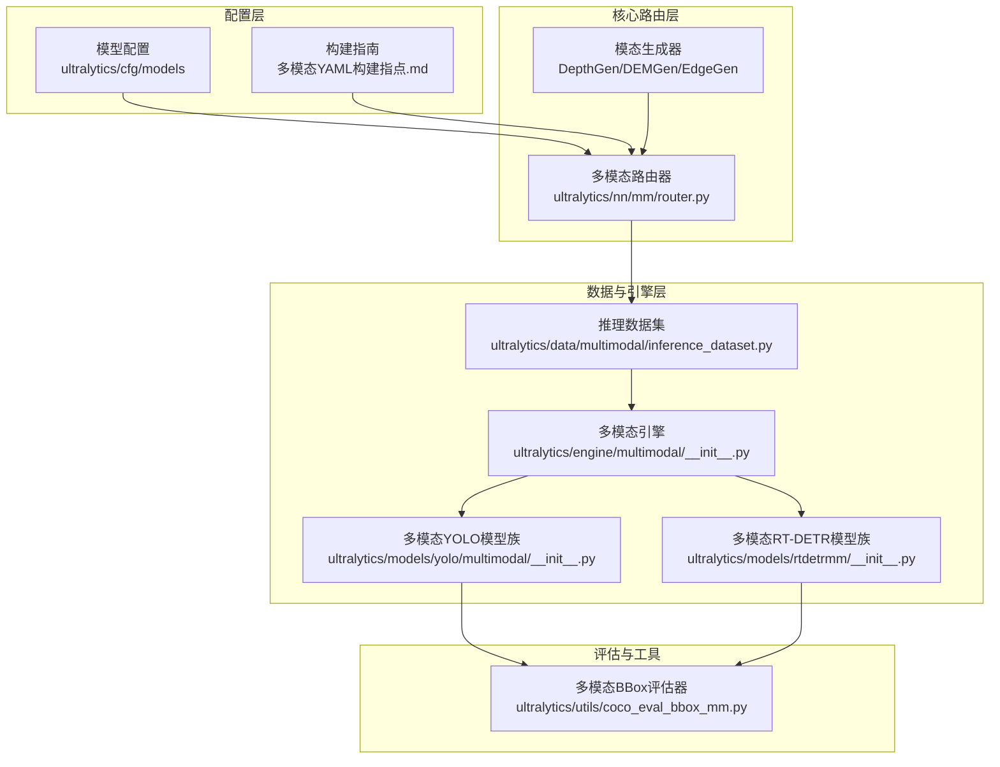
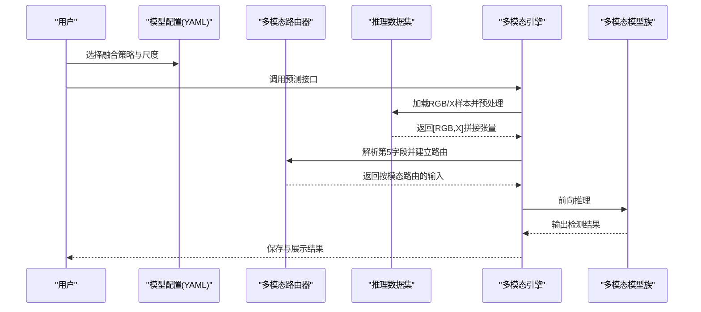
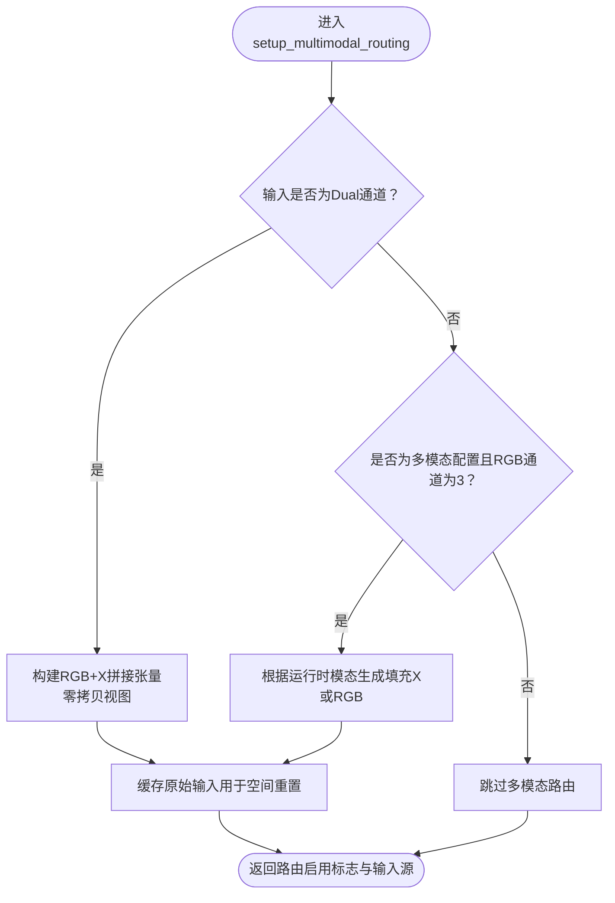
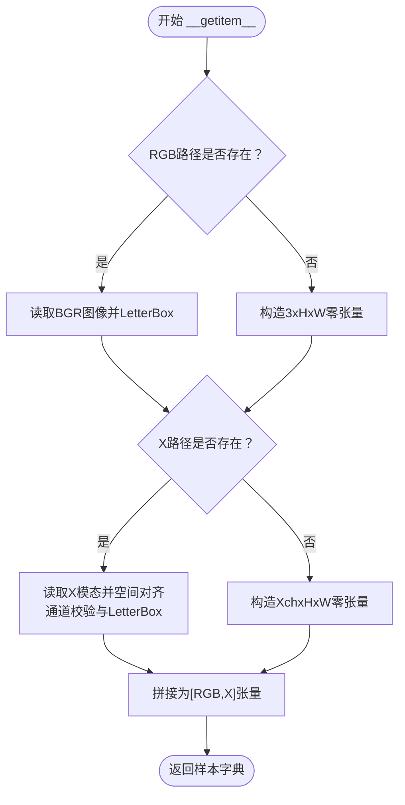
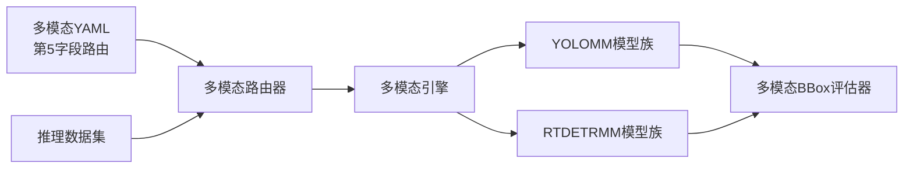

# 项目介绍

<cite>
**本文档引用的文件**
- [ultralytics/__init__.py](file://ultralytics/__init__.py)
- [ultralytics/cfg/models/README.md](file://ultralytics/cfg/models/README.md)
- [ultralytics/cfg/models/多模态YAML构建指点.md](file://ultralytics/cfg/models/多模态YAML构建指点.md)
- [ultralytics/data/multimodal/__init__.py](file://ultralytics/data/multimodal/__init__.py)
- [ultralytics/engine/multimodal/__init__.py](file://ultralytics/engine/multimodal/__init__.py)
- [ultralytics/nn/mm/router.py](file://ultralytics/nn/mm/router.py)
- [ultralytics/nn/mm/__init__.py](file://ultralytics/nn/mm/__init__.py)
- [ultralytics/models/yolo/multimodal/__init__.py](file://ultralytics/models/yolo/multimodal/__init__.py)
- [ultralytics/models/rtdetrmm/__init__.py](file://ultralytics/models/rtdetrmm/__init__.py)
- [ultralytics/utils/coco_eval_bbox_mm.py](file://ultralytics/utils/coco_eval_bbox_mm.py)
- [ultralytics/data/multimodal/inference_dataset.py](file://ultralytics/data/multimodal/inference_dataset.py)
- [trainMM.py](file://trainMM.py)
- [predictMM.py](file://predictMM.py)
- [valMM.py](file://valMM.py)
</cite>

## 目录
1. [简介](#简介)
2. [项目结构](#项目结构)
3. [核心组件](#核心组件)
4. [架构总览](#架构总览)
5. [详细组件分析](#详细组件分析)
6. [依赖关系分析](#依赖关系分析)
7. [性能考量](#性能考量)
8. [故障排查指南](#故障排查指南)
9. [结论](#结论)
10. [附录](#附录)

## 简介
本项目是一个面向计算机视觉的多模态目标检测系统，核心价值在于将可见光（RGB）与其它模态（如深度、热成像、激光雷达等）进行统一建模与高效融合，形成“RGB+X”的通用多模态检测范式。项目通过“配置驱动 + 第5字段路由”的YAML设计，结合智能模态路由、零拷贝优化、多尺度特征融合等关键技术，显著降低多模态模型的构建与部署门槛，同时在工业检测、安防监控、自动驾驶等场景具备明确的应用价值。

技术特色概览：
- 智能模态路由：在模型配置中以第5字段标识输入来源（RGB/X/Dual），由路由器在前向过程中按需选择与重定向输入，实现“同一套配置适配不同模态组合”。
- 零拷贝优化：在多模态输入拼接与路由时采用张量视图（view）操作，避免不必要的数据复制，降低内存与带宽压力。
- 多尺度特征融合：提供早期/中期/晚期三种融合策略模板，支持在骨干网络不同层级进行跨模态特征融合，兼顾速度与精度。
- 统一数据与推理管线：提供多模态推理数据集、配对解析器与结果保存器，确保RGB与X模态在预处理、推理与后处理流程中的协同一致。

## 项目结构
项目采用“模型配置 + 核心路由 + 数据与引擎适配 + 评估工具”的分层组织方式，核心目录与职责如下：
- ultralytics/cfg/models：多模态模型配置模板与构建指南，覆盖YOLO与RT-DETR系列。
- ultralytics/nn/mm：多模态路由器与生成器等核心模块，支撑零拷贝路由与模态填充。
- ultralytics/data/multimodal：多模态数据加载与预处理，支持推理与训练场景。
- ultralytics/engine/multimodal：多模态训练/验证/预测引擎组件。
- ultralytics/models/yolo/multimodal 与 ultralytics/models/rtdetrmm：多模态YOLO与RT-DETR模型族的训练/验证/预测入口。
- ultralytics/utils：评估工具与辅助函数，如多模态BBox评估器。

**图表来源**
- [ultralytics/cfg/models/多模态YAML构建指点.md:1-239](file://ultralytics/cfg/models/多模态YAML构建指点.md#L1-L239)
- [ultralytics/nn/mm/router.py:1-471](file://ultralytics/nn/mm/router.py#L1-L471)
- [ultralytics/data/multimodal/inference_dataset.py:1-252](file://ultralytics/data/multimodal/inference_dataset.py#L1-L252)
- [ultralytics/engine/multimodal/__init__.py:1-9](file://ultralytics/engine/multimodal/__init__.py#L1-L9)
- [ultralytics/models/yolo/multimodal/__init__.py:1-152](file://ultralytics/models/yolo/multimodal/__init__.py#L1-L152)
- [ultralytics/models/rtdetrmm/__init__.py:1-13](file://ultralytics/models/rtdetrmm/__init__.py#L1-L13)
- [ultralytics/utils/coco_eval_bbox_mm.py:1-441](file://ultralytics/utils/coco_eval_bbox_mm.py#L1-L441)

**章节来源**
- [ultralytics/cfg/models/README.md:1-66](file://ultralytics/cfg/models/README.md#L1-L66)
- [ultralytics/cfg/models/多模态YAML构建指点.md:1-239](file://ultralytics/cfg/models/多模态YAML构建指点.md#L1-L239)

## 核心组件
- 多模态路由器（MultiModalRouter）：负责解析YAML第5字段、识别模态来源、在前向过程中按需路由输入、处理X模态新输入起点的空间重置，并提供零拷贝缓存与通道适配能力。
- 模态生成器（DepthGen/DEMGen/EdgeGen）：用于在单模态训练/推理时生成对应X模态的填充数据，保障RGB与X通道数一致。
- 多模态推理数据集（MultiModalInferenceDataset）：严格校验RGB与X模态的存在性与通道一致性，执行LetterBox对齐与张量化，支持单模态零填充。
- 多模态引擎（MultiModalPredictor/Results/Saver）：封装推理流程，提供结果保存与可视化支持。
- 多模态模型族（YOLOMM/RTDETRMM）：提供训练、验证、预测入口，支持不同融合策略与尺度配置。

**章节来源**
- [ultralytics/nn/mm/router.py:11-471](file://ultralytics/nn/mm/router.py#L11-L471)
- [ultralytics/nn/mm/__init__.py:1-78](file://ultralytics/nn/mm/__init__.py#L1-L78)
- [ultralytics/data/multimodal/inference_dataset.py:16-252](file://ultralytics/data/multimodal/inference_dataset.py#L16-L252)
- [ultralytics/engine/multimodal/__init__.py:1-9](file://ultralytics/engine/multimodal/__init__.py#L1-L9)
- [ultralytics/models/yolo/multimodal/__init__.py:1-152](file://ultralytics/models/yolo/multimodal/__init__.py#L1-L152)
- [ultralytics/models/rtdetrmm/__init__.py:1-13](file://ultralytics/models/rtdetrmm/__init__.py#L1-L13)

## 架构总览
下图展示了从配置到推理的端到端流程，强调了“配置驱动路由”和“零拷贝输入拼接”的关键路径。

**图表来源**
- [ultralytics/cfg/models/多模态YAML构建指点.md:20-64](file://ultralytics/cfg/models/多模态YAML构建指点.md#L20-L64)
- [ultralytics/nn/mm/router.py:157-240](file://ultralytics/nn/mm/router.py#L157-L240)
- [ultralytics/data/multimodal/inference_dataset.py:94-183](file://ultralytics/data/multimodal/inference_dataset.py#L94-L183)
- [ultralytics/engine/multimodal/__init__.py:1-9](file://ultralytics/engine/multimodal/__init__.py#L1-L9)

## 详细组件分析

### 多模态路由器（智能模态路由与零拷贝）
- 功能要点
  - 解析YAML第5字段，识别RGB/X/Dual输入来源，动态设置模块属性以便路由。
  - 在setup_multimodal_routing阶段，根据输入通道数判断是否启用多模态，并进行RGB/X的零拷贝拼接或填充。
  - 在route_layer_input阶段，依据模块属性将输入重定向到指定模态，支持X模态新输入起点的空间重置。
  - 提供缓存original_inputs，用于后续空间重置与调试日志。
- 关键优化
  - 零拷贝：通过张量视图（view）与切片操作，避免重复分配内存。
  - 通道适配：在RGB/X通道不一致时，动态调整X通道数以满足Dual输入要求。
  - 日志与可诊断性：在profile模式下输出路由日志，便于定位通道不匹配与空间重置问题。

**图表来源**
- [ultralytics/nn/mm/router.py:157-240](file://ultralytics/nn/mm/router.py#L157-L240)

**章节来源**
- [ultralytics/nn/mm/router.py:11-471](file://ultralytics/nn/mm/router.py#L11-L471)

### 多模态推理数据集（严格校验与统一预处理）
- 功能要点
  - 从配对解析器提供的样本规格构建可迭代数据集，严格校验RGB与X模态文件存在性与可读性。
  - 执行LetterBox对齐与张量化，支持单模态零填充（RGB缺失或X缺失时自动补零）。
  - 动态适配X通道数（Xch），确保与路由器配置一致。
- 设计原则
  - 推理模式不走标签缓存，不要求标签目录存在。
  - 严格输入契约：不做自动填充/降级，避免掩盖数据质量问题。

**图表来源**
- [ultralytics/data/multimodal/inference_dataset.py:94-183](file://ultralytics/data/multimodal/inference_dataset.py#L94-L183)

**章节来源**
- [ultralytics/data/multimodal/inference_dataset.py:16-252](file://ultralytics/data/multimodal/inference_dataset.py#L16-L252)

### 多模态模型族（YOLOMM/RTDETRMM）
- YOLOMM：提供多模态检测的训练、验证、预测入口，支持OBB等扩展任务。
- RTDETRMM：独立的RT-DETR多模态模型族，不依赖传统RT-DETR模块，适配多模态融合策略。
- 统一API：通过YOLOMM/RTDETRMM暴露统一的训练/验证/预测接口，便于快速切换与对比。

**章节来源**
- [ultralytics/models/yolo/multimodal/__init__.py:1-152](file://ultralytics/models/yolo/multimodal/__init__.py#L1-L152)
- [ultralytics/models/rtdetrmm/__init__.py:1-13](file://ultralytics/models/rtdetrmm/__init__.py#L1-L13)

### 多模态BBox评估器（COCO评估对齐）
- 功能要点
  - 移植COCO BBox评估逻辑，支持面积分桶、Top-K裁剪、crowd规则与稳定排序。
  - 提供每类指标与扩展面积分桶指标，便于多模态场景下的细粒度分析。
- 应用场景
  - 在多模态数据集上进行客观、可复现的性能评估，支持早期/中期/晚期融合策略对比。

**章节来源**
- [ultralytics/utils/coco_eval_bbox_mm.py:27-441](file://ultralytics/utils/coco_eval_bbox_mm.py#L27-L441)

## 依赖关系分析
- 配置驱动：多模态YAML通过第5字段声明输入来源，路由器据此解析并注入模块属性，实现“同一配置适配不同模态”。
- 数据与路由：推理数据集负责严格校验与预处理，路由器负责运行时路由与空间重置，二者协作确保输入一致性。
- 引擎与模型：多模态引擎封装训练/验证/预测流程，模型族提供具体实现，评估器提供客观指标。

**图表来源**
- [ultralytics/cfg/models/多模态YAML构建指点.md:20-64](file://ultralytics/cfg/models/多模态YAML构建指点.md#L20-L64)
- [ultralytics/nn/mm/router.py:90-156](file://ultralytics/nn/mm/router.py#L90-L156)
- [ultralytics/data/multimodal/inference_dataset.py:94-183](file://ultralytics/data/multimodal/inference_dataset.py#L94-L183)
- [ultralytics/engine/multimodal/__init__.py:1-9](file://ultralytics/engine/multimodal/__init__.py#L1-L9)
- [ultralytics/utils/coco_eval_bbox_mm.py:27-441](file://ultralytics/utils/coco_eval_bbox_mm.py#L27-L441)

**章节来源**
- [ultralytics/cfg/models/多模态YAML构建指点.md:1-239](file://ultralytics/cfg/models/多模态YAML构建指点.md#L1-L239)
- [ultralytics/nn/mm/router.py:11-471](file://ultralytics/nn/mm/router.py#L11-L471)
- [ultralytics/data/multimodal/inference_dataset.py:16-252](file://ultralytics/data/multimodal/inference_dataset.py#L16-L252)

## 性能考量
- 零拷贝优化：在多模态输入拼接与路由中尽量使用张量视图，减少内存分配与数据搬运，降低CPU/GPU带宽压力。
- 通道适配与形状推导：通过路由器动态适配X通道数与Dual输入形状，避免因通道不匹配导致的反复重建与错误。
- 融合策略选择：早期融合（速度优先）、中期融合（精度与速度平衡）、晚期融合（鲁棒性优先），按任务需求选择合适策略。
- 数据预处理一致性：推理数据集严格对齐与归一化，减少前处理误差与不一致带来的性能波动。

## 故障排查指南
- 通道不匹配
  - 现象：报错提示期望X通道但得到Y通道。
  - 排查：检查数据配置中的Xch是否与真实X模态一致；确认YAML第5字段标注是否正确；仅在输入起点使用Dual。
- 模块未导入
  - 现象：在YAML中使用了未导出的模块时报错。
  - 排查：确认模块已在相应__init__.py中导出，或在extra_modules中注册。
- 结果融合
  - 说明：示例中的DecisionFusion为占位注释，需自行实现或在推理/后处理阶段进行结果融合。
- 运行确认
  - 使用profile=True查看路由器的日志，确认RGB/X/Dual的形状与空间重置信息是否符合预期。

**章节来源**
- [ultralytics/cfg/models/多模态YAML构建指点.md:206-225](file://ultralytics/cfg/models/多模态YAML构建指点.md#L206-L225)

## 结论
本项目通过“配置驱动 + 智能路由 + 零拷贝优化 + 多尺度融合”的技术体系，实现了RGB与X模态的高效统一建模。其标准化的配置模板、严格的推理数据管线与可扩展的评估工具，使得多模态目标检测在工业检测、安防监控、自动驾驶等场景具备良好的工程落地潜力。对于初学者，建议从“多模态YAML构建指点”入手，掌握第5字段路由与三种融合策略，再结合推理数据集与路由器行为进行实践验证。

## 附录
- 快速上手
  - 训练：参考训练脚本，选择合适的多模态配置与数据集，设置epochs与batch等超参。
  - 推理：使用YOLOMM/RTDETRMM的预测接口，传入RGB与X模态路径，或单模态时自动零填充。
  - 验证：通过验证接口加载权重与数据集，输出评估指标并与基线模型对比。
- 应用场景
  - 工业检测：可见光与深度/热成像联合检测缺陷与异常。
  - 安防监控：夜间/低能见度场景下，热成像与可见光互补增强目标检测。
  - 自动驾驶：激光雷达/毫米波与可见光融合，提升复杂场景下的目标感知鲁棒性。

**章节来源**
- [trainMM.py:1-15](file://trainMM.py#L1-L15)
- [predictMM.py:1-40](file://predictMM.py#L1-L40)
- [valMM.py:1-22](file://valMM.py#L1-L22)