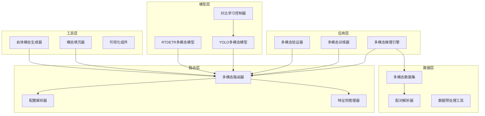
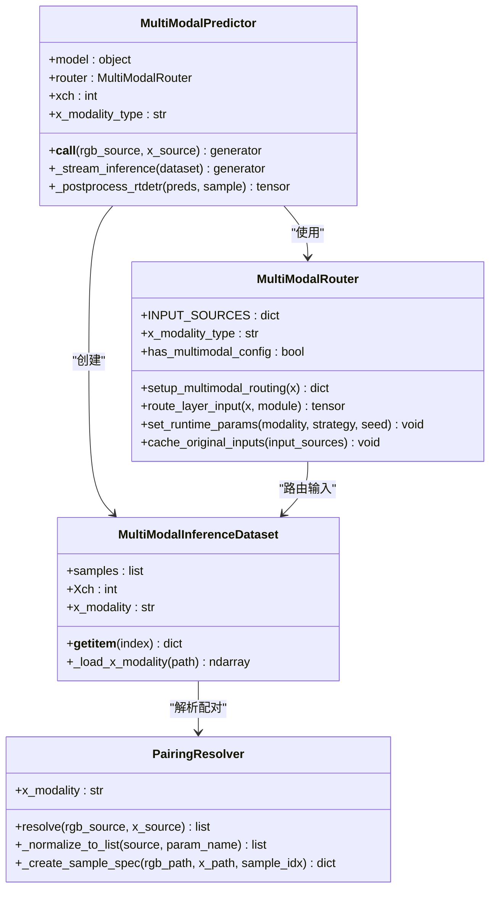
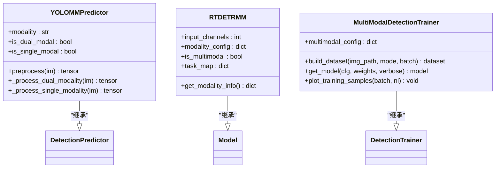
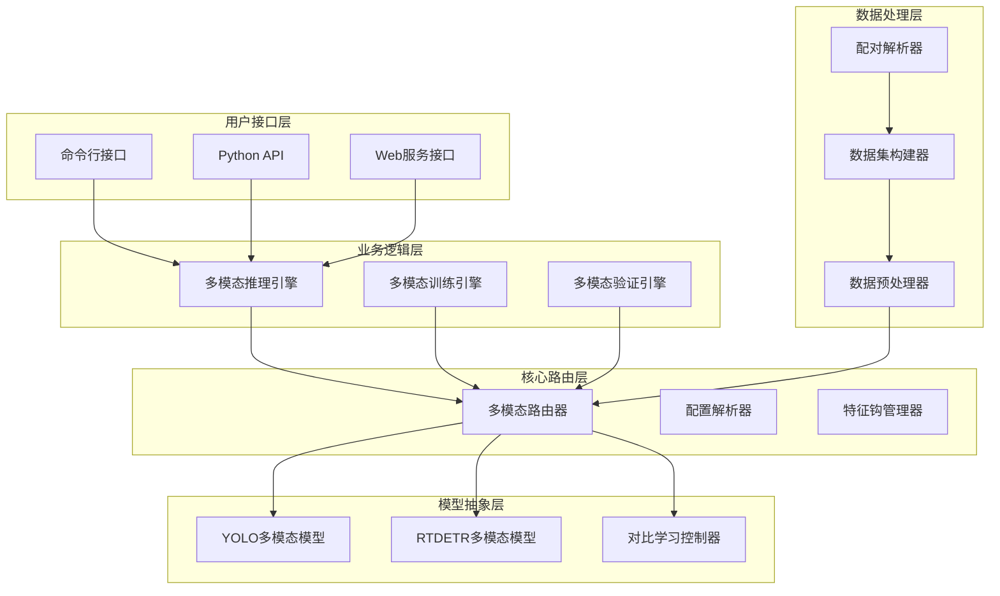
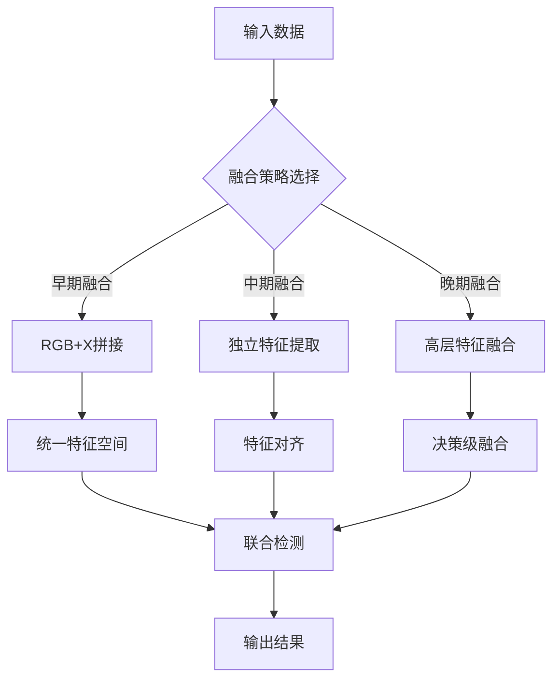
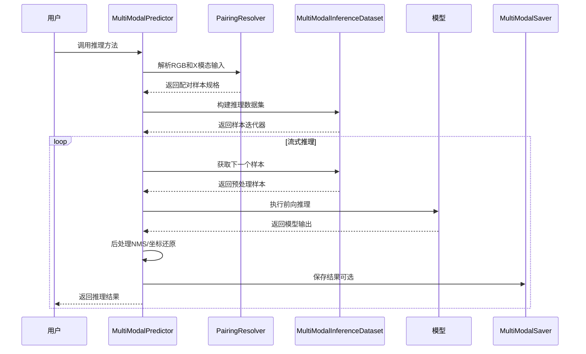
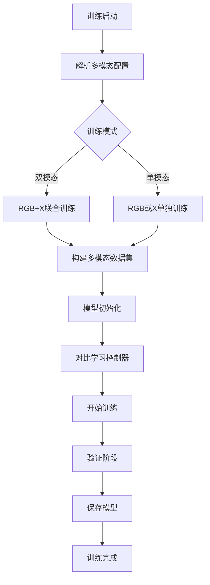
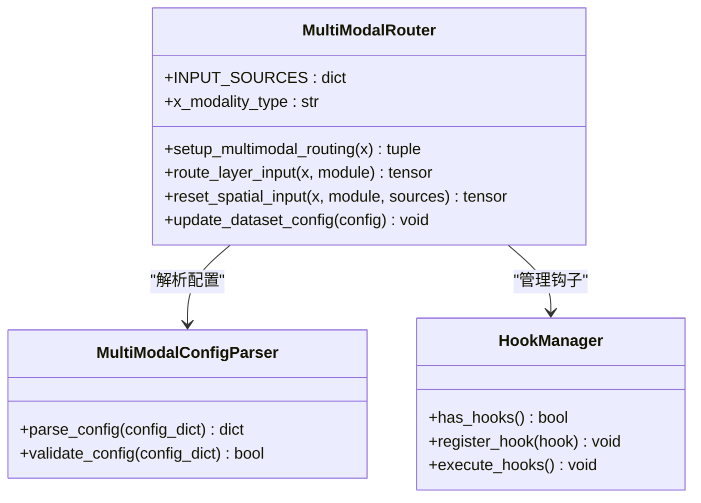
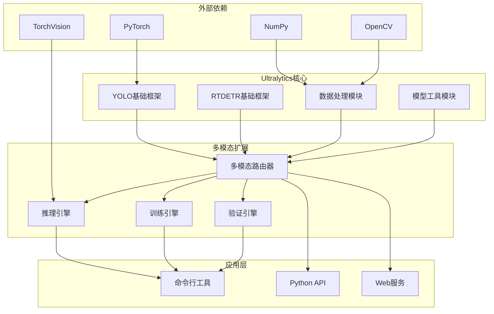

# 项目概述

<cite>
**本文档引用的文件**
- [ultralytics/__init__.py](file://ultralytics/__init__.py)
- [ultralytics/data/multimodal/__init__.py](file://ultralytics/data/multimodal/__init__.py)
- [ultralytics/engine/multimodal/__init__.py](file://ultralytics/engine/multimodal/__init__.py)
- [ultralytics/models/rtdetrmm/__init__.py](file://ultralytics/models/rtdetrmm/__init__.py)
- [ultralytics/data/multimodal/inference_dataset.py](file://ultralytics/data/multimodal/inference_dataset.py)
- [ultralytics/engine/multimodal/predictor.py](file://ultralytics/engine/multimodal/predictor.py)
- [ultralytics/data/multimodal/pairing.py](file://ultralytics/data/multimodal/pairing.py)
- [ultralytics/nn/mm/router.py](file://ultralytics/nn/mm/router.py)
- [ultralytics/models/yolo/multimodal/train.py](file://ultralytics/models/yolo/multimodal/train.py)
- [ultralytics/models/yolo/multimodal/predict.py](file://ultralytics/models/yolo/multimodal/predict.py)
- [ultralytics/models/rtdetrmm/model.py](file://ultralytics/models/rtdetrmm/model.py)
</cite>

## 目录
1. [项目简介](#项目简介)
2. [项目结构](#项目结构)
3. [核心组件](#核心组件)
4. [架构概览](#架构概览)
5. [详细组件分析](#详细组件分析)
6. [依赖关系分析](#依赖关系分析)
7. [性能考量](#性能考量)
8. [故障排除指南](#故障排除指南)
9. [结论](#结论)

## 项目简介

本项目是一个基于Ultralytics YOLO框架的多模态目标检测系统，专注于RGB与X模态（深度、热成像、激光雷达等）的联合目标检测能力。项目实现了从数据预处理、模型训练、推理到结果可视化的完整流水线，支持多种X模态的灵活组合和配置。

### 核心价值与技术特色

**多模态融合能力**
- 支持RGB与任意X模态的联合检测，包括深度图、热红外、激光雷达、合成孔径雷达等
- 提供早期融合、中期融合、晚期融合等多种融合策略
- 实现零拷贝张量路由，确保高效的多模态数据流处理

**统一的推理引擎**
- 独立的多模态推理引擎，不依赖传统BasePredictor
- 支持真正的流式推理，边迭代边产出结果
- 提供RGB单模态、X模态单模态和双模态推理模式

**灵活的配置系统**
- 基于配置驱动的多模态路由系统
- 支持运行时模态消融和参数调整
- 动态通道数适配，支持任意X模态通道数

## 项目结构

项目采用模块化架构设计，主要分为以下几个层次：

**图表来源**
- [ultralytics/__init__.py:14-85](file://ultralytics/__init__.py#L14-L85)
- [ultralytics/data/multimodal/__init__.py:4-20](file://ultralytics/data/multimodal/__init__.py#L4-L20)
- [ultralytics/engine/multimodal/__init__.py:4-8](file://ultralytics/engine/multimodal/__init__.py#L4-L8)

**章节来源**
- [ultralytics/__init__.py:14-85](file://ultralytics/__init__.py#L14-L85)
- [ultralytics/data/multimodal/__init__.py:4-20](file://ultralytics/data/multimodal/__init__.py#L4-L20)
- [ultralytics/engine/multimodal/__init__.py:4-8](file://ultralytics/engine/multimodal/__init__.py#L4-L8)

## 核心组件

### 多模态路由器系统

多模态路由器是整个系统的核心，负责RGB与X模态之间的数据路由和转换：

**图表来源**
- [ultralytics/nn/mm/router.py:11-471](file://ultralytics/nn/mm/router.py#L11-L471)
- [ultralytics/data/multimodal/pairing.py:11-203](file://ultralytics/data/multimodal/pairing.py#L11-L203)
- [ultralytics/data/multimodal/inference_dataset.py:16-252](file://ultralytics/data/multimodal/inference_dataset.py#L16-L252)
- [ultralytics/engine/multimodal/predictor.py:16-494](file://ultralytics/engine/multimodal/predictor.py#L16-L494)

### 模型架构支持

项目同时支持YOLO和RTDETR两种主流检测架构的多模态扩展：

**图表来源**
- [ultralytics/models/yolo/multimodal/predict.py:15-800](file://ultralytics/models/yolo/multimodal/predict.py#L15-L800)
- [ultralytics/models/rtdetrmm/model.py:25-269](file://ultralytics/models/rtdetrmm/model.py#L25-L269)
- [ultralytics/models/yolo/multimodal/train.py:16-757](file://ultralytics/models/yolo/multimodal/train.py#L16-L757)

**章节来源**
- [ultralytics/nn/mm/router.py:11-471](file://ultralytics/nn/mm/router.py#L11-L471)
- [ultralytics/models/yolo/multimodal/predict.py:15-800](file://ultralytics/models/yolo/multimodal/predict.py#L15-L800)
- [ultralytics/models/rtdetrmm/model.py:25-269](file://ultralytics/models/rtdetrmm/model.py#L25-L269)

## 架构概览

项目采用分层架构设计，确保各组件职责清晰、耦合度低：

**图表来源**
- [ultralytics/engine/multimodal/predictor.py:99-143](file://ultralytics/engine/multimodal/predictor.py#L99-L143)
- [ultralytics/models/yolo/multimodal/train.py:472-509](file://ultralytics/models/yolo/multimodal/train.py#L472-L509)

### 多模态融合策略

项目提供了多种融合策略，每种策略都有其适用场景：

**图表来源**
- [ultralytics/models/yolo/multimodal/train.py:18-27](file://ultralytics/models/yolo/multimodal/train.py#L18-L27)

## 详细组件分析

### 多模态推理引擎

多模态推理引擎是项目的核心组件，提供了完整的推理流水线：

**图表来源**
- [ultralytics/engine/multimodal/predictor.py:99-243](file://ultralytics/engine/multimodal/predictor.py#L99-L243)
- [ultralytics/data/multimodal/pairing.py:37-125](file://ultralytics/data/multimodal/pairing.py#L37-L125)
- [ultralytics/data/multimodal/inference_dataset.py:94-183](file://ultralytics/data/multimodal/inference_dataset.py#L94-L183)

**章节来源**
- [ultralytics/engine/multimodal/predictor.py:16-494](file://ultralytics/engine/multimodal/predictor.py#L16-L494)
- [ultralytics/data/multimodal/inference_dataset.py:16-252](file://ultralytics/data/multimodal/inference_dataset.py#L16-L252)
- [ultralytics/data/multimodal/pairing.py:11-203](file://ultralytics/data/multimodal/pairing.py#L11-L203)

### 多模态训练器

多模态训练器提供了完整的训练流程，支持多种训练模式：

**图表来源**
- [ultralytics/models/yolo/multimodal/train.py:109-263](file://ultralytics/models/yolo/multimodal/train.py#L109-L263)
- [ultralytics/models/yolo/multimodal/train.py:472-509](file://ultralytics/models/yolo/multimodal/train.py#L472-L509)

**章节来源**
- [ultralytics/models/yolo/multimodal/train.py:16-757](file://ultralytics/models/yolo/multimodal/train.py#L16-L757)

### 多模态路由器

多模态路由器实现了灵活的路由机制，支持运行时配置：

**图表来源**
- [ultralytics/nn/mm/router.py:31-471](file://ultralytics/nn/mm/router.py#L31-L471)

**章节来源**
- [ultralytics/nn/mm/router.py:11-471](file://ultralytics/nn/mm/router.py#L11-L471)

## 依赖关系分析

项目采用了清晰的依赖层次结构，确保模块间的松耦合：

**图表来源**
- [ultralytics/__init__.py:12-19](file://ultralytics/__init__.py#L12-L19)

**章节来源**
- [ultralytics/__init__.py:12-88](file://ultralytics/__init__.py#L12-L88)

## 性能考量

项目在性能方面采用了多项优化策略：

### 内存优化
- 零拷贝张量路由，减少内存复制开销
- 流式推理机制，降低内存峰值占用
- 智能缓存机制，避免重复计算

### 计算优化
- 动态通道数适配，避免不必要的计算
- 模态消融功能，支持快速性能测试
- 多尺度特征融合，平衡精度与速度

### 并行处理
- 批量推理支持
- 多线程数据加载
- GPU加速推理

## 故障排除指南

### 常见问题及解决方案

**模型加载失败**
- 检查模型文件完整性
- 验证多模态配置文件格式
- 确认X模态通道数配置正确

**推理结果异常**
- 检查输入数据格式和尺寸
- 验证多模态路由器配置
- 确认后处理参数设置

**性能问题**
- 检查GPU内存使用情况
- 调整批处理大小
- 优化数据预处理流程

**章节来源**
- [ultralytics/engine/multimodal/predictor.py:66-68](file://ultralytics/engine/multimodal/predictor.py#L66-L68)
- [ultralytics/data/multimodal/inference_dataset.py:185-246](file://ultralytics/data/multimodal/inference_dataset.py#L185-L246)

## 结论

本多模态目标检测项目通过精心设计的架构和丰富的技术特性，为RGB与X模态的联合目标检测提供了完整的解决方案。项目的主要优势包括：

**技术创新性**
- 独特的零拷贝张量路由系统
- 灵活的多模态融合策略
- 运行时配置和模态消融功能

**实用性**
- 支持多种X模态（深度、热红外、激光雷达等）
- 提供完整的训练、推理、验证流水线
- 良好的性能表现和易用性

**扩展性**
- 模块化设计，便于功能扩展
- 配置驱动的架构，支持灵活定制
- 清晰的API接口，便于集成

该项目为多模态目标检测领域提供了有价值的参考实现，既适合初学者理解多模态检测的基本概念，也为专业开发者提供了深入的技术细节和实践指导。